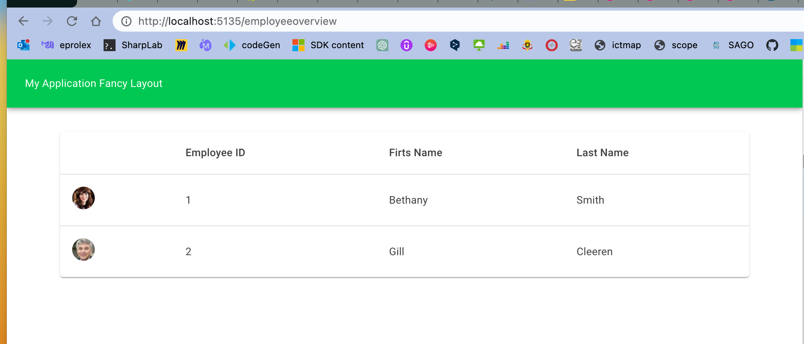

# 04 `Layout`

C'est un `component` qui hérite de `LayoutComponentBase`.


## Création d'un `Layout`

`FancyLayout.razor`

```html
@inherits LayoutComponentBase

<MudThemeProvider/>
<MudDialogProvider/>
<MudSnackbarProvider/>

<MudLayout>
    <MudAppBar Color="Color.Success">
        My Application Fancy Layout
    </MudAppBar>

    <MudMainContent>
        <MudContainer MaxWidth="MaxWidth.Medium" class="pt-8">
            @Body
        </MudContainer>
    </MudMainContent>
</MudLayout>
```


## Utilisation avec `@layout`

Pour utiliser un `layout`,  on utilise la directive `@layout`:

```asp
@page "/employeeoverview"
@layout FancyLayout

@if(Employees is null)
{
    <div class="d-flex my-4 align-center gap-2">
    // ...    
```




## Configurer le `Layout` par défaut

C'est dans le `Router` du fichier `App.razor`:

```html
<Router AppAssembly="@typeof(App).Assembly">
    <Found Context="routeData">
        <RouteView RouteData="@routeData" DefaultLayout="@typeof(MainLayout)" />
        <FocusOnNavigate RouteData="@routeData" Selector="h1" />
    </Found>
    // ...
```

`DefaultLayout="@typeof(MainLayout)"`