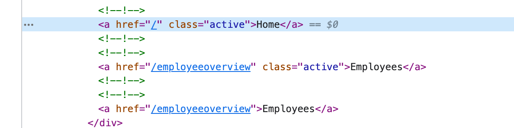
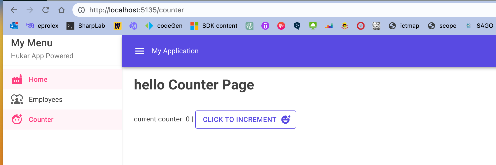
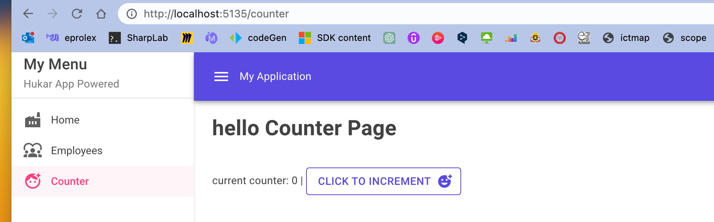

# 05 `Navigation`


## `NavLink`

C'est un `component` fourni par `Blazor` permettant de naviguer dans l'`application`:

```html
<NavLink href="/">Home</NavLink>
<NavLink href="/employeeoverview">Employees</NavLink>
```

Il fonctionne comme la balise `<a>` 

```html
<a href="/employeeoverview">Employees</a>
```

mais ajoute une classe `active` pour spécifier le lien actif:




## `MudNavMenu` et `MudNavLink`

```html
<MudNavMenu Class="mud-width-full" Color="Color.Secondary">
        <MudText Typo="Typo.h6" Class="px-4">My Menu</MudText>
        <MudText Typo="Typo.body2" Class="px-4 mud-text-secondary">Hukar App Powered</MudText>
        <MudDivider Class="my-2" />
        <MudNavLink Href="/" Icon="@Icons.Material.Filled.Factory">Home</MudNavLink>
        <MudNavLink Href="/employeeoverview" Icon="@Icons.Material.Filled.Diversity1">Employees</MudNavLink>
        <MudNavLink Href="/counter" Icon="@Icons.Material.Filled.FaceRetouchingNatural">Counter</MudNavLink>
</MudNavMenu>
```



On remarque le `bug` car l'`url` de `home` : `/`, matvhe avec toute les autres `url`, `home` conserve donc toujours la classe `active`.

On utilise la propriété `Match` pour corriger ce problème:

```html
<MudNavLink Href="/" Match="NavLinkMatch.All" Icon="@Icons.Material.Filled.Factory">Home</MudNavLink>
```

Par défaut la propriété est sur `NavLinkMatch.Prefix`.




