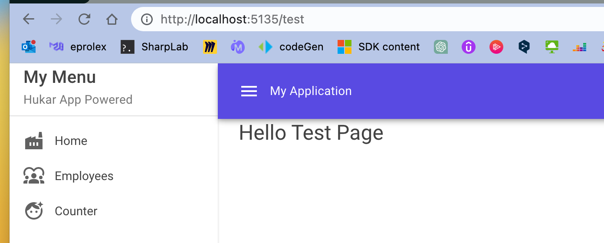
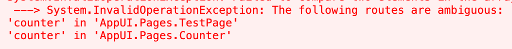
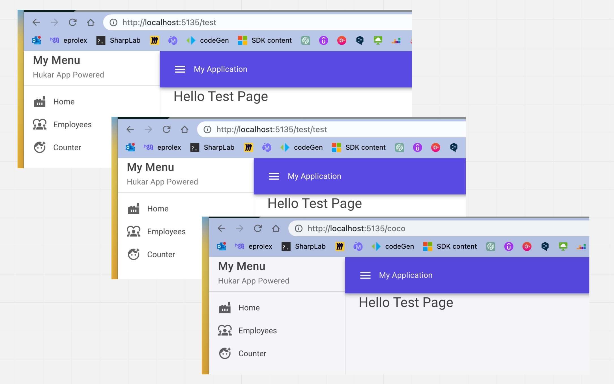
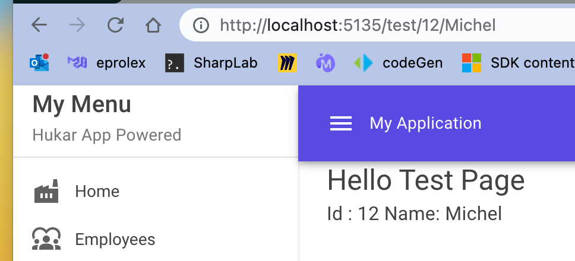
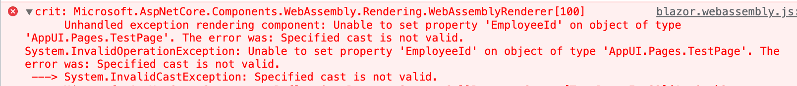
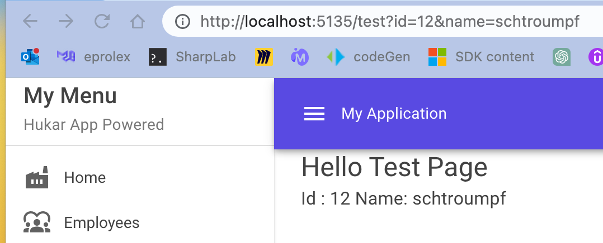
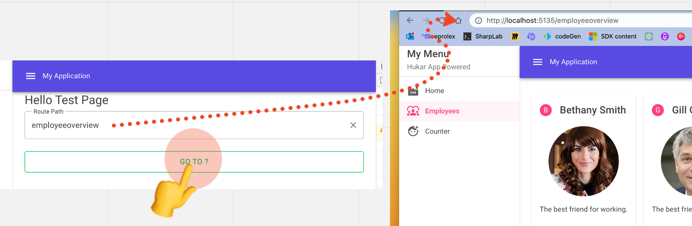

# 05 `Navigation`


## Naviguer dans une application `Blazor`

- Le `Router` dans `App.razor` est le point d'entrée
- la directive `@page` permet le `routing` vers un `component`
- Cette `directive` peut accepter des paramètres
- On peut utiliser `NavigationManager` pour une navigation `code-based`


## Le `Router` : `App.razor`

```html
<Router AppAssembly="@typeof(App).Assembly">
    <Found Context="routeData">
        <RouteView RouteData="@routeData" DefaultLayout="@typeof(MainLayout)" />
        <FocusOnNavigate RouteData="@routeData" Selector="h1" />
    </Found>
    <NotFound>
        <PageTitle>Not found</PageTitle>
        <LayoutView Layout="@typeof(MainLayout)">
            <p role="alert">Sorry, there's nothing at this address.</p>
        </LayoutView>
    </NotFound>
</Router>
```

Il définit le `DefaultLayout`.


## La directive `@page`

Elle fournit au `Router` une route vers un `component`.

Celui-ci sera rendu à la place de la directive `@body` dans le `Layout`.

```html
@page "/test"

<MudText Typo="Typo.h5">Hello Test Page</MudText>
```




### Règle pour la valeur de `@page`

Deux `component` ne peuvent pas avoir la même valeur de `@page`.

L'erreur est au `Runtime`:

```html
@page "/counter"

<MudText Typo="Typo.h5">Hello Test Page</MudText>
```




### Multiple `route` pour un `component`

Par contre un `component` peut avoir plusieurs directive `@page`, donc plusieurs `Routes`:

```html
@page "/test"
@page "/test/test"
@page "/coco"

<MudText Typo="Typo.h5">Hello Test Page</MudText>
```




### `route` paramétrée

```html
@page "/test/{EmployeeId:int}/{EmployeeName}"

<MudText Typo="Typo.h5">Hello Test Page</MudText>
<MudText Typo="Typo.body1">Id : @EmployeeId Name: @EmployeeName</MudText>

@code {
    [Parameter] public int EmployeeId { get; set; }
    [Parameter] public string? EmployeeName { get; set; }
}
```



Par défaut le `type` d'un paramètre d'`url` est `string`, il faut donc spécifier que `EmployeeId` est un `int` avec `{EmployeeId:int}`.

Si on ne le fait pas on aura une erreur `cast` au `runtime` :




### Les paramètres sont `case insensitive`

```html
@page "/test/{employeeid:int}/{employeename}"
```

```cs
@code {
    [Parameter] public int EmployeeId { get; set; }
    [Parameter] public string? EmployeeName { get; set; }
}
```


## Les `Query Parameters`

On peut aussi récupérer les `Query Parameters` grâce à l'`attribute` : `[SupplyParameterFromQuery(Name = "ParameterName")]`.

```ruby
@page "/test"

<MudText Typo="Typo.h5">Hello Test Page</MudText>
<MudText Typo="Typo.body1">Id : @EmployeeId Name: @EmployeeName</MudText>
```

```cs
@code {
    [Parameter] 
    [SupplyParameterFromQuery(Name = "id")]
    public int EmployeeId { get; set; }
    [Parameter]
    [SupplyParameterFromQuery(Name = "name")] 
    public string? EmployeeName { get; set; }
}
```




## `NavigationManager`

Pour utiliser la navigation de manière programmatique, on doit injecter le service `NavigationManager` dans son `code`, pour ce faire on utilise l'`attribute` : `[Inject]`.

```cs
[Inject] public NavigationManager NavigationManager { get; set; }
```


### Exemple : `NavigateTo(url)`

```ruby
@page "/test"

<MudText Typo="Typo.h5">Hello Test Page</MudText>

<MudTextField @bind-Value="_route" ... />
<MudButton ... OnClick="GoToUrl">Go To ?</MudButton>
```

```cs
@code {
    string _route = string.Empty;
    [Inject] public NavigationManager? NavigationManager { get; set; }

    void GoToUrl()
    {
        NavigationManager?.NavigateTo($"/{_route}");
    }
}
```




## `NavLink`

C'est un `component` fourni par `Blazor` permettant de naviguer dans l'`application`:

```html
<NavLink href="/">Home</NavLink>
<NavLink href="/employeeoverview">Employees</NavLink>
```

Il fonctionne comme la balise `<a>` 

```html
<a href="/employeeoverview">Employees</a>
```

mais ajoute une classe `active` pour spécifier le lien actif:


## `MudNavMenu` et `MudNavLink`

```html
<MudNavMenu Class="mud-width-full" Color="Color.Secondary">
        <MudText Typo="Typo.h6" Class="px-4">My Menu</MudText>
        <MudText Typo="Typo.body2" Class="px-4 mud-text-secondary">Hukar App Powered</MudText>
        <MudDivider Class="my-2" />
        <MudNavLink Href="/" Icon="@Icons.Material.Filled.Factory">Home</MudNavLink>
        <MudNavLink Href="/employeeoverview" Icon="@Icons.Material.Filled.Diversity1">Employees</MudNavLink>
        <MudNavLink Href="/counter" Icon="@Icons.Material.Filled.FaceRetouchingNatural">Counter</MudNavLink>
</MudNavMenu>
```


On remarque le `bug` car l'`url` de `home` : `/`, matvhe avec toute les autres `url`, `home` conserve donc toujours la classe `active`.

On utilise la propriété `Match` pour corriger ce problème:

```html
<MudNavLink Href="/" Match="NavLinkMatch.All" Icon="@Icons.Material.Filled.Factory">Home</MudNavLink>
```

Par défaut la propriété est sur `NavLinkMatch.Prefix`.


