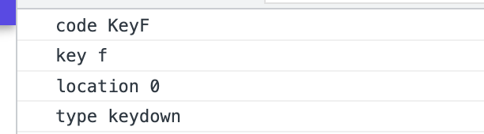
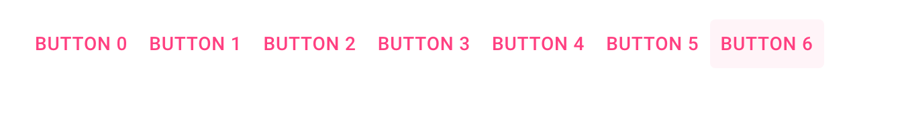
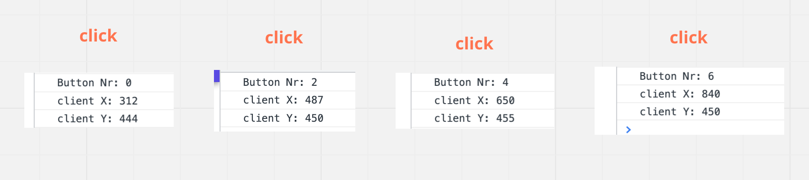
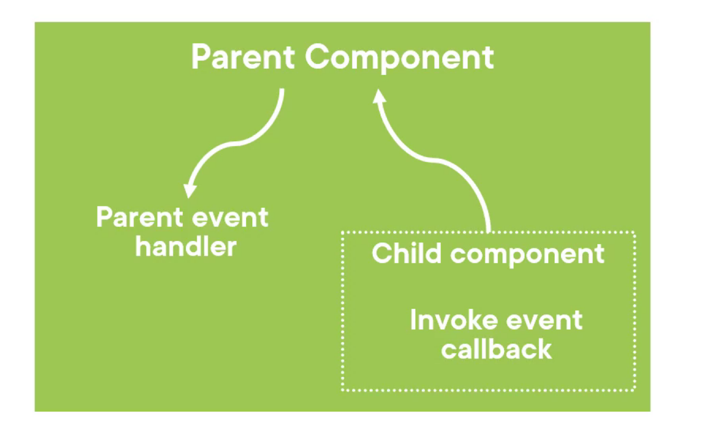

# 06 `Event`

## Syntaxe de base

### `@on{Dom Event}="Delegate"`

> Dans `MudBlazor` on a `OnClick`.

```html
<button 
    ...
    @onclick="SavePerson">Save Person</button>
```

```cs
@code {
    void SavePerson()
    {
        Console.WriteLine("hello from saving person");
    }
}
```


## `EventArgs`

On peut récupérer un objet `EventArgs` en argument de sa méthode:

`@onclick` passe un `MouseEventArgs`

`@onkeydown` passe un `KeyboardEventArgs`

```html
<button type="button" @onclick="SeeMouseEvent">See Mouse Event</button>

<input type="text" @onkeydown="SeeKeyboardEvent" />
```

```cs
void SeeMouseEvent(MouseEventArgs e)
{
    Console.WriteLine($"detail {e.Detail}");
    Console.WriteLine($"button {e.Button}");
    Console.WriteLine($"page X {e.PageX}");
    Console.WriteLine($"screen X {e.ScreenX}");
    Console.WriteLine($"type {e.Type}");
}
```


```cs
void SeeKeyboardEvent(KeyboardEventArgs e)
{
    Console.WriteLine($"code {e.Code}");
    Console.WriteLine($"key {e.Key}");
    Console.WriteLine($"location {e.Location}");
    Console.WriteLine($"type {e.Type}");
}
```




## Utiliser les `Lambda Expression` pour passer un argument en plus

```html
@for(int i = 0; i < 7; i++)
{
    var buttonNb = i;
    
    <button
    type="button" 
    class="@mudButtonClass" 
    @onclick="e => ShowButton(e, buttonNb)">Button @buttonNb</button>
}
```

> On peut rencontrer aussi cette syntaxe:
>
> ```cs
> @onclick="@(e => ShowButton(e, buttonNb))"
> ```
>
> Qui correspond à la syntaxe d'échappement.
>
> Le `Razor Engine` est suffisament intelligent, `@` n'est nécessaire que lorsqu'il s'attend à avoir du `html`.
>
> S'il s'attend à ce que ce soit du `C#`, `@` n'est plus utile, mais ne cause pas non plus de problème.

`var buttonNb = i` permet une `closure` pour encapsuler la valeur de `i` avec un `button` (en créant donc une variable de `scope`).

```cs
void ShowButton(MouseEventArgs e, int buttonNb)
{
    Console.WriteLine($"Button Nr: {buttonNb}");
    Console.WriteLine($"client X: {e.ClientX}");
    Console.WriteLine($"client Y: {e.ClientY}");
}
```






## Utiliser les `Event Callback`

On voudrait pouvoir exécuter du code dans le parent lorsque l'événement se déclenche dans le `composant` enfant.



```html
<button @onclick="TriggerCallbackToParent">Trigger parent</button>
```

```cs
@code {
    [Parameter]
    public EventCallback<MouseEventArgs> TriggerCallbackToParent { get; set; }
}
```

Dans le `parent`:

```html
<ChildEventCallback TriggerCallbackToParent="Show" />
```

```cs
void Show()
{
    Console.WriteLine("parent triggered");
}
```


### En passant un paramètre `EventCallback<TObject>`

```html
<MudButton 
           StartIcon="@Icons.Material.Filled.Face5" 
           IconClass="pink-text text-accent-3" 
           Variant="Variant.Text" 
           Color="Color.Primary" 
           OnClick="async () => await OnShowDetailsCallback.InvokeAsync(Employee)">Employee Details</MudButton>
```

```cs
@code {

    [Parameter]
    public Employee? Employee { get; set; }

    [Parameter]
    public EventCallback<Employee> OnShowDetailsCallback { get; set; }
```
>
> La syntaxe `async () => await OnShowDetailsCallback.InvokeAsync(Employee)` ne semble pas simplifiable.

Dans le `parent component`:

```html
<EmployeeCard Employee="employee" OnShowDetailsCallback="ShowDetails" />
```

```cs
@code {
    ...
void ShowDetails(Employee employee)
{
    currentEmployee = employee;
}
```

Et enfin dans le `template` du `component` parent:

```html
@if(currentEmployee is not null)
{
    <EmployeeDetail Employee="currentEmployee" CloseDetailsCallback="CloseDetails" />
}
```

