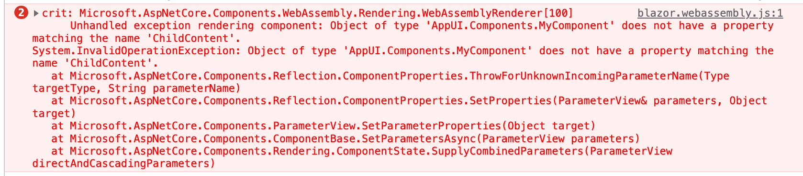
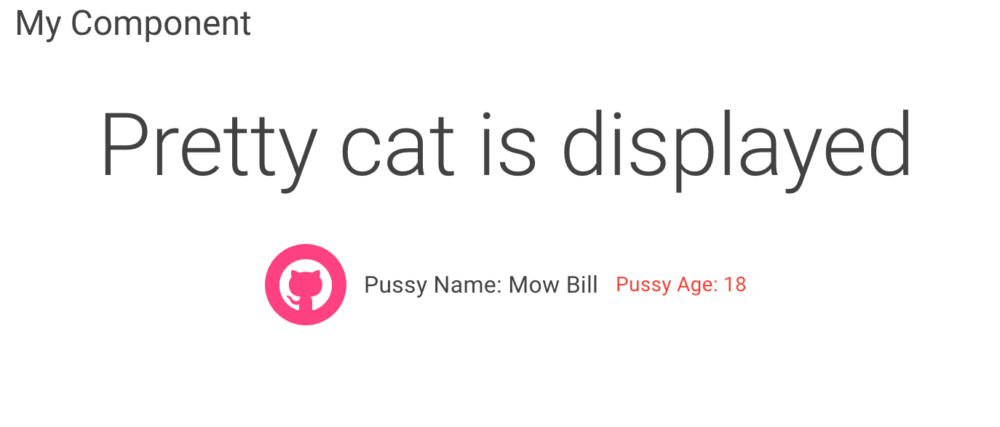

# 08 `Render Fragment`

On veut rendre le contenu entre les `balises` d'un `component`:

```cs
<MudText Typo="Typo.h5">My Component</MudText>

@ChildContent

@code {
    [Parameter]
    public RenderFragment? ChildContent { get; set; }
}
```

Il faut utiliser l'`attribute` : `[Parameter]`.

> On doit nommer la propriété `ChilContent`, si je le nomme autrement:
>
> ```cs
> <MudText Typo="Typo.h5">My Component</MudText>
> 
> @SomeFragment
> 
> @code {
>     [Parameter]
>     public RenderFragment? SomeFragment { get; set; }
> }
> ```
>
> J'obtiens une exception:
>
> 

Dans une `Page`:

```html
<MyComponent>Hey Guy, How are you</MyComponent>
```


On peut aussi lui passer un autre `component`:

```html
<MyComponent> <CatDisplay /> </MyComponent>
```

