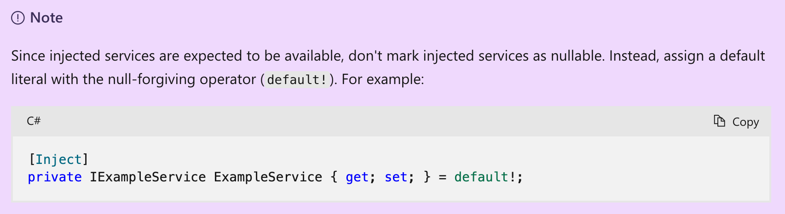

# 09 `HttpClient`

Intéragir avec l'`API`.

Le service est enregistré dans `Program.cs`:

```cs
builder.Services.AddScoped(
    sp => new HttpClient { BaseAddress = new Uri(builder.HostEnvironment.BaseAddress) }
);
```

Exemple avec une `API` sur un autre `serveur`:

```cs
builder.Services.AddScoped(
    sp => new HttpClient { BaseAddress = new Uri("http://localhost:5068") }
);
```

Pour utiliser le service dans un `component` on utilise l'`attribute` : `[Inject]`.

```cs
[Inject]
public HttpClient HttpClient { get; set; }
```

On peut alors l'utiliser dans un `life time hook` comme `OnInitializedAsync`.

Des méthodes d'extensions pour simplifier l'utilisation avec `json` sont fournies.

```cs
protected override async Task OnInitializedAsync()
{
    Employees = await HttpClient.GetFromJsonAsync<List<Employee>>("api/employee");
}
```


## Les méthodes disponibles


- `GetFromJsonAsync`
- `PostAsJsonAsync`
- `PutAsJsonAsync`
- `DeleteAsync`


## `HttpClient` et `Fetch API`

`HttpClient` est implémenté dans `Blazor Wasm` en utilisant la `Fetch API` et ses limitations (`CORS`).


## `CORS` : `Cross-Origin Resource Sharing`

Si on tente de lire les données d'une `API` ayant une autre `URL` d'origine, on obtient ce message d'erreur:


C'est un réglage qui se fait `uniquement` sur le serveur d'`API`:

```cs
builder.Services.AddCors();

app.UseCors(policy => 
    policy.WithOrigins("http://localhost:5135")
    .AllowAnyMethod()
    .WithHeaders(HeaderNames.ContentType));
```


## `IHttpClientFactory`

On veut garder son `component` le plus léger possible, on délégue à une autre classe la responsabilité des `call` vers une `API` externe.

- Utilisé pour créer et configurer une instance de `HttpClient` de manière centralisée.

- Supporte les `HttpClient` nommés et typés

- Demande d'ajouter le `package`:
  ```bash
  dotnet add package Microsoft.Extensions.Http
  ```

  ```xml
  <PackageReference Include="Microsoft.Extensions.Http" Version="7.0.0" />
  ```

  

### Enregistrer notre `service`

On utilise un `client` typé:

```cs
builder.Services.AddHttpClient<IEmployeeDataService, EmployeeDataService>(
	client => client.BaseAddress = new Uri("http://localhost:5068")
);
```

> ```ruby
> (extension) IHttpClientBuilder IServiceCollection.AddHttpClient<IEmployeeDataService, EmployeeDataService>() (+ 9 surcharges)
> ```
>
> Ajoute un '`IHttpClientFactory` et les services associés à `IServiceCollection` et configure une liaison entre le type `IEmployeeDataService` et un `HttpClient` nommé. Le nom du client correspondra au nom du type `IEmployeeDataService`.
>
> Les instances de `HttpClient` qui appliquent la configuration fournie peuvent être récupérées en utilisant `IHttpClientFactory.CreateClient(string)` et en fournissant le nom correspondant.
> Les instances d'`IEmployeeDataService` construites avec le `HttpClient` approprié peuvent être récupérées à partir de `IServiceProvider.GetService(Type)` (et des méthodes connexes) en fournissant `IEmployeeDataService` comme type de service.
>
> Retourne :
>
> Un `IHttpClientBuilder` qui peut être utilisé pour configurer le client.
>

On crée une classe pour encapsuler ce `service`

`EmployeeDataService.cs`

```cs
public class EmployeeDataService : IEmployeeDataService
{
    private readonly HttpClient _httpClient;
    
    public EmployeeDataService(HttpClient httpClient)
    {
        _httpClient = httpClient;
    }
}
```


### Implémentation

> Cela pourrait très bien être appelé `repository`.

On crée un dossier `Services` et on va définir notre interface:

`IEmployeeDataService.cs`

```cs
public interface IEmployeeDataService
{
   Task<IEnumerable<Employee>> GetAllEmployees();
   Task<Employee> GetEmployeeDetaisl(int employeeId); 
   Task<Employee> AddEmployee(Employee employeeToAdd); 
   Task UpdateEmployee(Employee employeeToUpdate); 
   Task DeleteEmployee(int employeeId); 
}
```

`EmployeeDataService.cs`

```cs
public class EmployeeDataService : IEmployeeDataService
{
    private readonly HttpClient _httpClient;

    public EmployeeDataService(HttpClient httpClient)
    {
        _httpClient = httpClient;
    }
```

On ajoute `HttpClient` par `injection de dépendance`.


### Utilisation dans un `component`

```cs
[Inject]
public IEmployeeDataService EmployeeDataService { get; set; } = default!;

protected override async Task OnInitializedAsync()
{
    Employees = await EmployeeDataService!.GetAllEmployees();
    
    Employee = await EmployeeDataService!.GetEmployeeDetails(EmployeeId);
}
```

`AddHttpClient` enregistre `EmployeeDataService` dans le conteneur de `services`.

> #### ! On déclare **toujours** le `service` par son type abstrait `IEmployeeDataService` et non pas par le type de son implémentation`EmployeeDataService`.

>Comme un `service` est attendu comme disponible, on ne le marque pas `nullable`:`public MyService ? MyService` mais plutôt on utilise `= default!`.
>
>


### `GetAllEmployees`

```cs
public async Task<IEnumerable<Employee>> GetAllEmployees()
{
    return await JsonSerializer.DeserializeAsync<IEnumerable<Employee>>(
    	await _httpClient.GetStreamAsync("employee"),
        new JsonSerializerOptions() { PropertyNameCaseInsensitive = true }
    );
}
```

Ma version plus simple:

```cs
public async Task<IEnumerable<Employee>?> GetAllEmployees() 
    => await _httpClient.GetFromJsonAsync<IEnumerable<Employee>>("/employees");
```


### `GetEmployeeDetails`

```cs
public async Task<Employee> GetEmployeeDetails(itn employeeId)
{
    return await JsonSerializer.DeserializeAsync<Employee>(
    	await _httpClient.GetStreamAsync($"/employees/{employeeId}"),
        new JsonSerializerOptions() { PropertyNameCaseInsensitive = trus}
    );
}
```

Ma version:

```cs
public async Task<Employee?> GetEmployeeDetaisl(int employeeId) 
    => await _httpClient.GetFromJsonAsync<Employee>($"/employees/{employeeId}");
```


