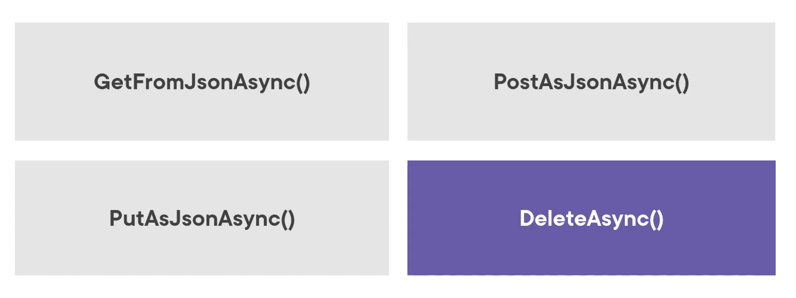

# 09 `HttpClient`

Intéragir avec l'`API`.

Le service est enregistré dans `Program.cs`:

```cs
builder.Services.AddScoped(
    sp => new HttpClient { BaseAddress = new Uri(builder.HostEnvironment.BaseAddress) }
);
```

Exemple avec une `API` sur un autre `serveur`:

```cs
builder.Services.AddScoped(
    sp => new HttpClient { BaseAddress = new Uri("http://localhost:5068") }
);
```

Pour utiliser le service dans un `component` on utilise l'`attribute` : `[Inject]`.

```cs
[Inject]
public HttpClient HttpClient { get; set; }
```

On peut alors l'utiliser dans un `life time hook` comme `OnInitializedAsync`.

Des méthodes d'extensions pour simplifier l'utilisation avec `json` sont fournies.

```cs
protected override async Task OnInitializedAsync()
{
    Employees = await HttpClient.GetFromJsonAsync<List<Employee>>("api/employee");
}
```


## Les méthodes disponibles



- `GetFromJsonAsync`
- `PostAsJsonAsync`
- `PutAsJsonAsync`
- `DeleteAsync`


## `HttpClient` et `Fetch API`

`HttpClient` est implémenté dans `Blazor Wasm` en utilisant la `Fetch API` et ses limitations (`CORS`).


## `CORS` : `Cross-Origin Resource Sharing`

Si on tente de lire les données d'une `API` ayant une autre `URL` d'origine, on obtient ce message d'erreur:


C'est un réglage qui se fait `uniquement` sur le serveur d'`API`:

```cs
builder.Services.AddCors();

app.UseCors(policy => 
    policy.WithOrigins("http://localhost:5135")
    .AllowAnyMethod()
    .WithHeaders(HeaderNames.ContentType));
```


## `IHttpClientFactory`

- Utilisé pour créer et configurer une instance de `HttpClient` de manière centralisée.

- Supporte les `HttpClient` nommés et typés

- Demande d'ajouter le `package`:
  ```bash
  dotnet add package Microsoft.Extensions.Http
  ```


### Enregistrer notre `service`

On utilise un `client` typé:

```cs
builder.Services.AddHttpClient<IEmployeeDataService, EmployeeDataService>(
	client => client.BaseAddress = new Uri("http://localhost:5068")
);
```

On crée une classe pour encapsuler ce `service`

`EmployeeDataService.cs`

```cs
public class EmployeeDataService : IEmployeeDataService
{
    private readonly HttpClient _httpClient;
    
    public EmployeeDataService(HttpClient httpClient)
    {
        _httpClient = httpClient;
    }
}
```


