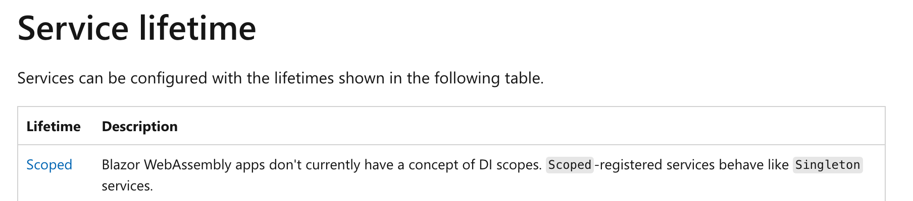

# 10 `State`

L'application tourne dans la mémoire du navigateur (du client), donc toutes les données sont stockées dans le client.

Les `component` sont détruits puis recréés lors de la navigation.


## `ApplicationState`

On peut créer une `class` dont le rôle sera de gérer ce `state`.

On injecte alors cette `class` comme `service`.

```cs
builder.Services.AddSingleton<ApplicationState>();

// ou

builder.Services.AddScoped<ApplicationService>();
```



Il n'y a pas de différence dans `Blazor Wasm` entre `Scoped` et `Singleton`.


### Dans un composant

On utilise le `service` avec `[Inject]`:

```cs
@code {
    [Inject]
    public ApplicationState ApplicationState { get; set; } = default!;
}
```


### `class` `ApplicationState`

Cette `class` contient autant de propriété que nécessaire pour conserver le `state` lors de la navigation:

```cs
public class ApplicationState
{
    public int NumberOfMessages { get; set; }
}
```


## Stocker des données localement

C'est possible à travers le navigateur en utilisant `Javascript`.

`LocalStorage` reste persistant même après que le navigateur est été fermé. Les données peuvent être partagées entre plusieurs onglets tant que cela reste le même `Domaine`.

`SessionStorage` ne conserve les données que pendant une `Session` du navigateur, une session dure jusqu'à ce que le navigateur soit fermé.

L'ouverture d'un nouvel onglet ou d'une nouvelle fenêtre crée une nouvelle `Session`.

Ces fonctionnalités sont accessible dans `Blazor Wasm` par `interopérabilité` avec `JS`.

Il existe des `package` clef en main:

`Blazored.LocalStorage` et `Blazored.SessionStorage`.


## `LocalStorage`

```bash
dotnet add package Blazored.LocalStorage
```


### Enregistrer le `service`

`Program.cs`

```csharp
using Blazored.LocalStorage;

builder.Services.AddBlazoredLocalStorage();
```


### Utilisation

```cs
@inject ILocalStorageService localStorage
    
var firstName = await localStorage.GetItemAsync<string>("EmployeeFirstName");
```


## `API` disponible principale

- `SetItemAsync()`
- `GetItemAsync()`
- `ContainKeyAsync()`
- `RemoveItemAsync()`


## Exemple

### Implémentation dans notre `ServiceData`: `EmployeeDataService`

Mise en place d'un système de `cache` grâce à `LocalStorage`.

```cs
public class EmployeeDataService : IEmployeeDataService
{
    private readonly HttpClient _httpClient;
    private readonly ILocalStorageService _localStorageService;
    
    private const string _EXPIRATION_DATE_KEY = "ExpirationDate";
    private const string _EMPLOYEES_LIST_KEY = "EmployeesList";

    public EmployeeDataService(HttpClient httpClient, ILocalStorageService localStorageService)
    {
        _httpClient = httpClient;
        _localStorageService = localStorageService;
    }
```

POur éviter les `magic string` je crée deux constantes `_EXPIRATION_DATE_KEY` et `_EMPLOYEES_LIST_KEY`.

Il y a deux méthodes `helper`:

`IsTimeExpired`

```cs
private bool IsTimeExpired(DateTime expirationDate) 
    => expirationDate < DateTime.Now;
```

Et une méthode créant ou mettant à jour les valeurs stockées dans le `LocalStorage`:

`SetValueLocalStorageAsync`

```cs
private async Task SetValueLocalStorageAsync()
{
    await _localStorageService.SetItemAsync<DateTime>(_EXPIRATION_DATE_KEY, DateTime.Now.AddSeconds(30));

    await _localStorageService.SetItemAsync<IEnumerable<Employee>?>(_EMPLOYEES_LIST_KEY, await _httpClient.GetFromJsonAsync<IEnumerable<Employee>>("/employees"));
}
```

Voici la logique de la méthode `GetAllEmployees`

```
SI
	(Le LocalStorage ne contient pas la clé _EXPIRATION_DATE_KEY
OU
	Que la date d'expiration est passée (IsTimeExpired))
FAIRE
	Créer ou mettre à jour les valeurs contenu dans LocalStorage
FIN SI

RETOURNER
	la liste des employées contenu dans LocalStorage
```

```cs
public async Task<IEnumerable<Employee>?> GetAllEmployees()
{
    if(
        await _localStorageService.ContainKeyAsync(_EXPIRATION_DATE_KEY) == false 
        || 
        IsTimeExpired(await _localStorageService.GetItemAsync<DateTime>(_EXPIRATION_DATE_KEY))
    )
    {
        await SetValueLocalStorageAsync();
    }

    return await _localStorageService.GetItemAsync<IEnumerable<Employee>>(_EMPLOYEES_LIST_KEY);
} 
```

