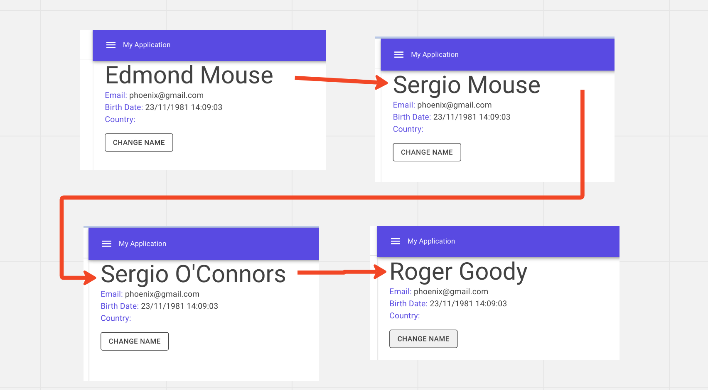
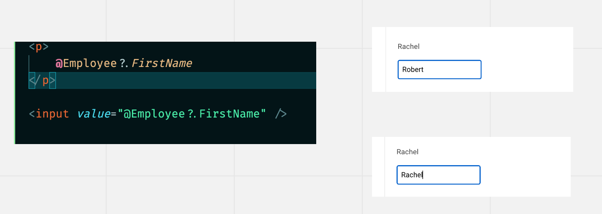
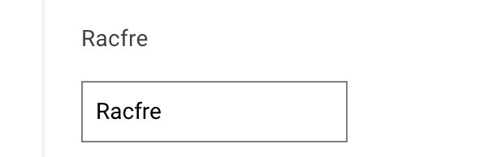
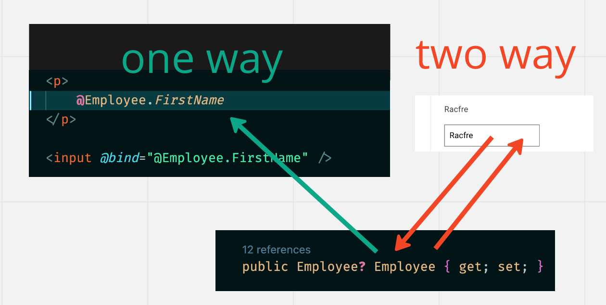
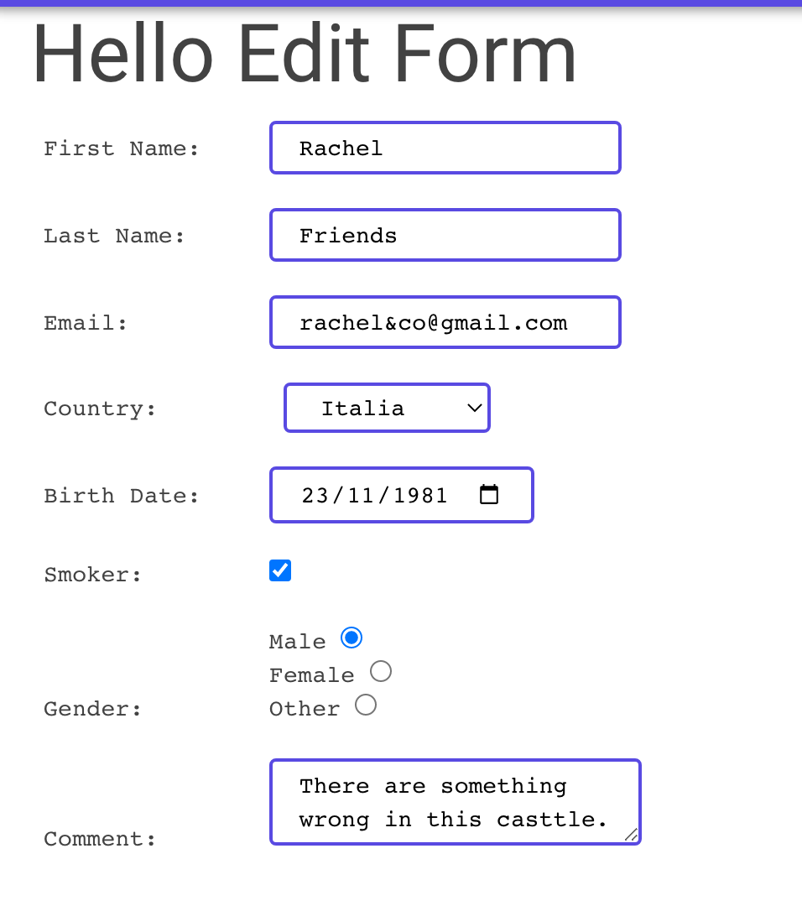

# 11 `Form`

## `@using`

Dans `_Imports.razor` on doit ajouter la librairie `Components.Forms` :

```cs
@using Microsoft.AspNetCore.Components.Forms
```


## `Model`

Voici une `class` remplaçant un `enum`:

```cs
public static class Gender
{
    public static string Male => "Male";
    public static string Female => "Female";
    public static string Other => "Other";

    public static IEnumerable<string> ListOf()
    {
        yield return Male;
        yield return Female;
        yield return Other;
    }
}
```


## `Data Binding`


### `One-way Binding`

Le `binding` va du `code` vers le `template`.

```ruby
<h1>
    Details for @FirstName @LastName
</h1>
```

```cs
public string FirstName { get; set; }
public string LastName { get; set; }
```

Si la valeur des propriétés change, l'interface graphique est automatiquement mise à jour.

```cs
<MudButton 
    Class="mt-4 d-inline-block" 
    Variant="Variant.Outlined" 
    OnClick="ChangeName">
    Change Name
</MudButton>
```

```cs
void ChangeName()
{
    var firstNames = new string[] { "Jonh", "Roger", "Edmond", "Sarah", "Jeanne", "Sergio", "Martina" };
    var lastNames = new string[] { "Goody", "Redford", "O'Connors", "Federer", "Juno", "Mouse", "Steinfield" };

    var random = new Random();

    var ifirstName = random.Next(0,6);
    var ilastnameName = random.Next(0,6);

    Employee!.FirstName = firstNames[ifirstName];
    Employee.LastName = lastNames[ilastnameName];
}
```

C'est le gestionnaire d'événement `OnClick` qui permet un noouveau rendu automatique de l'interface.

Si j'exécute `ChangeName` dans un `life cycle hook` par exemple, j'ai besoin de re-déclencher le rendu manuellement avec `StateHasChanged`:

```cs
protected async override Task OnAfterRenderAsync(bool firstRender)
{
    await Task.Delay(300);
    ChangeName();
}
```

Ne modifie pas l'interface.

```cs
protected async override Task OnAfterRenderAsync(bool firstRender)
{
    await Task.Delay(300);
    ChangeName();
    StateHasChanged();
}
```

Déclenche un rendu toutes les `300 ms`.




### Afficher une donnée dans un contrôle de `formulaire`

```ruby
<input type="text" value="@Employee?.FirstName" />
```

Mais attention dans ce sens une modification dans l'`UI` n'a aucune incidence sur la valeur de notre donnée.




### Le *vrai* `binding` : la directive `@bind`

```cs
<p>
    @Employee.FirstName
</p>

<input " @bind="@Employee.FirstName" />
```



Maintenant le changement se fait dans les deux sens, la `variable` est `liée` à l'`input`.



Pour le moment la donnée se met à jour lorsque l'on sort de l'`input`, on peut faire en sorte de changer ce comportement: `@bind-value:event="oninput"`

```html
<input 
       @bind-value="@Employee.FirstName" 
       @bind-value:event="oninput" />
```

Il faut aussi utiliser `@bind-value` au lieu de `@bind`.

La valeur de la `Property` est ici mise à jour à chaque fois que l'on tape sur une touche.


## `Form` dans `Blazor`

`Blazor` vient avec un certain nombre de composant `helper` pour les `formulaires`


### `EditForm`

```html
<EditForm Model="@Employee">

</EditForm>
```

```cs
public Employee Employee { get; set; } = new();
```

Le `EditForm` va créer un `EditContext` d'après l'objet passée en `Model`.


### `Input Component`

| `InputText`     | `InputDate`       |
| :-------------- | ----------------- |
| `InputTextArea` | `InputCheckbox`   |
| `InputNumber`   | `InputRadio`      |
| `InputSelect`   | `InputRadioGroup` |
| `InputFile`     |                   |

Ils héritent de `InputBase`.

Une `validation` basique est incluse.

Ils supporte le `Two-way Data Binding` avec une syntaxe légèrement différente.

> #### ! c'est `@bind-Value` avec un `V` majuscule !


### `InputText`

```html
<EditForm Model="@Employee">
	<InputText id="lastName"
               @bind-Value="@Employee.LastName"
               placeholder="Enter last name"></InputText>
</EditForm>
```

On utilise `@bind-Value` plutôt que `@bind`.


### `InputNumber`

```html
<InputNumber @bind-Value="Employee.age"/>
```


### `InputSelect`

```html
<InputSelect id="country" class="border-solid border-2 mud-border-primary pa-4"
     @bind-Value="@Employee.CountryId">
	
    @foreach(var country in countries)
    {
    	<option value="@country.CountryId">@country.Name</option>
    }
    
</InputSelect>
```


### `InputCheckbox`

```html
<InputCheckbox @bind-Value="@Employee.Smoker" />
```


### `InputRadioGroup`

```html
<InputRadioGroup @bind-Value="@Employee.Gender">
	@foreach(var gender in Gender.ListOf())
    {
    	<InputRadio Value="gender" />
    }
</InputRadioGroup>
```


### `InputDate`

```html
<InputDate @bind-Value="@Employee.BirthDate" />
```


### `InputTextArea`

```html
<InputTextArea @bind-Value="@Employee.Comment" />
```


### Resultat (sans `MudBlazor`)




## Soumettre le `Form`

Il y a des `Built-In Event` fournis avec `EditForm`.

- `OnValidSubmit`
- `OnInvalidSubmit`
- `OnSubmit` pour traîter la validation manuellement.

```html
<EditForm
     Model="@Employee"
     OnValidSubmit="HandleValidSubmit"
     OnInvalidSubmit="HandleInvalidSubmit">
	...
    <button type="submit">
        save Employee
    </button>
</EditForm>
```

```cs
public async Task HandleValidSubmit()
{
	if(IsCreateMode)
    {
        await EmployeeDataService.AddEmployee(Employee);
        Console.WriteLine("New Employee  created");
    }
    else
    {
        await EmployeeDataService.UpdateEmployee(Employee);
        Console.WriteLine($"Employee {EmployeeId} Updated");
    }

    Console.WriteLine("The form is submitted");
}
```

```cs
public async Task HandleInvalidSubmit()
{

}
```

