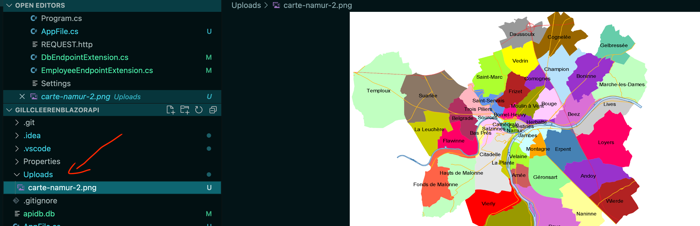

# 11.2 `InputFile`

```html
<InputFile OnChange="OnInputFileChange" />
```

```cs
void OnInputFileChange(InputFileChangeEventArgs e)
{
    selectedFile = e.File;
    StateHasChanged();
}
```

On doit ajouter au `Model Employee` de quoi stocker l'image:

```cs
public class Employee
{
    // ...
    public byte[]? ImageContent { get; set; }
    public string? ImageName { get; set; }
}
```

Dans `HandleValidSubmit`:

```cs
if(selectedFile is not null)
{
    var file = selectedFile;
    Stream stream = file.OpenReadStream();
    MemoryStream ms = new();
    await stream.CopyToAsync(ms);
    stream.Close();
    
    Employee.ImageName = file.Name;
    Employee.ImageContent = ms.ToArray();
}
```

En réception dans l'`API`:

```cs
string currentUrl = HttpContext.Request.Host.Value;
var path = $"{WebHostEnvironment.WebRootPath}/uploads/{employee.ImageName}";
var fileStream = File.Create(path);

fileStream.Write(employee.ImageContent, 0, employee.ImageContent.Length);
fileStream.Close();

employee.ImageName = $"http://{currentUrl}/upload/{employee.ImageName}";

// enregistrer l'employee en DB
```


## Version simple

### `Model`

`AppFile.cs`

```cs
public class AppFile
{
    public string Path { get; set; } = string.Empty;
    public byte[] Content { get; set; } = default!;
}
```


### `Page`

`UploadFile.razor`

```cs
@page "/fileupload"

<EditForm Model="AppFile" OnValidSubmit="OnValidSubmitHandle">
    <InputFile OnChange="OnInputFileChange" />
    <p><button type="submit">Submit File</button></p>
</EditForm>

@code {

    public AppFile AppFile { get; set; } = new();
    [Inject]
    public IEmployeeDataService EmployeeDataService { get; set; } = default!;
        
    async Task OnInputFileChange(InputFileChangeEventArgs e)
    {
        var fileUploaded = e.File;

        using Stream stream = fileUploaded.OpenReadStream();
        MemoryStream ms = new();

        await stream.CopyToAsync(ms);

        AppFile.Path = fileUploaded.Name;
        AppFile.Content = ms.ToArray();
    }

    async Task OnValidSubmitHandle() => await EmployeeDataService.AddFile(AppFile);
}
```


### `EmployeeDataService`

`AddFile`

```cs
public async Task AddFile(AppFile fileToUpload)
{
    var _file = fileToUpload;
    await _httpClient.PostAsJsonAsync("/files", _file);
}
```


### Dans l'`API`

Création d'un dossier `Uploads`

On ajoute le même `Model` : `AppFile`.

> ### Gestion des `CORS`
>
> `Program.cs`
>
> ```cs
> builder.Services.AddCors(options =>
> {
>     options.AddPolicy(name: "MyAllowSpecificOrigins",
>                       policy  =>
>                       {
>                           policy.WithOrigins("http://localhost:5135")
>                                 .AllowAnyMethod()
>                                 .WithHeaders("Content-Type");
>                       });
> });
> ```

Le `Endpoint`:

```cs
app.MapPost("/files", async (IDbConnection connection, AppFile file) => {
    var path = $"{Environment.CurrentDirectory}/Uploads/{file.Path}";

    using var fileStream = File.Create(path);
    fileStream.Write(file.Content, 0, file.Content.Length);

    var sql = @"INSERT INTO File (Path) VALUES ( @path )";

    var rowsAffected = await connection.ExecuteAsync(sql, new { path });
});
```


