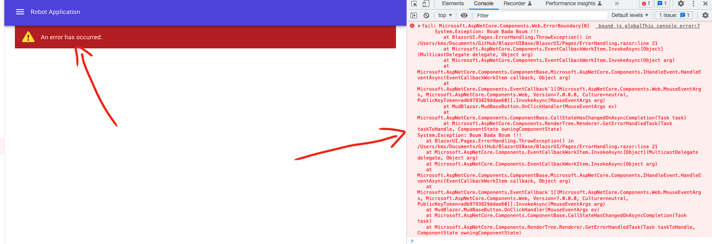
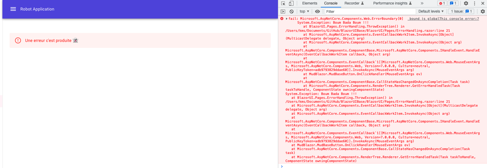

# 12 La gestion des erreurs


## `ErrorBundary`


De base en cas d'erreur (d'`exception` lancée), on voit apparaître une barre jaune en bas et un message d'erreur dans la console.

Avec le `tag` `<ErrorBoudary>` on va changer cela.

Je le place directement dans `MainLayout.razor` pour qu'il englobe tous les composants.

```cs
<ErrorBoundary>
	@Body
</ErrorBoundary>
```

On a maintenant une boxe rouge:




## `ChildContent` et `ErrorContent`

On peut gérer soit même le `template` d'erreur affiché grâce à l'ajout de ces deux `component`:

```html
<ErrorBoundary>
    <ChildContent>
        @Body
    </ChildContent>
    <ErrorContent>
        <MudAlert
            Class="mt-12"
            Variant="Variant.Text"
            Severity="Severity.Error">
            Une erreur c'est produite 👻
        </MudAlert>
    </ErrorContent>
</ErrorBoundary>
```




