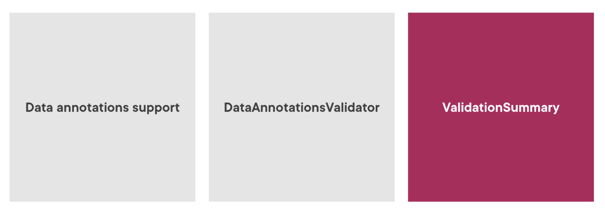
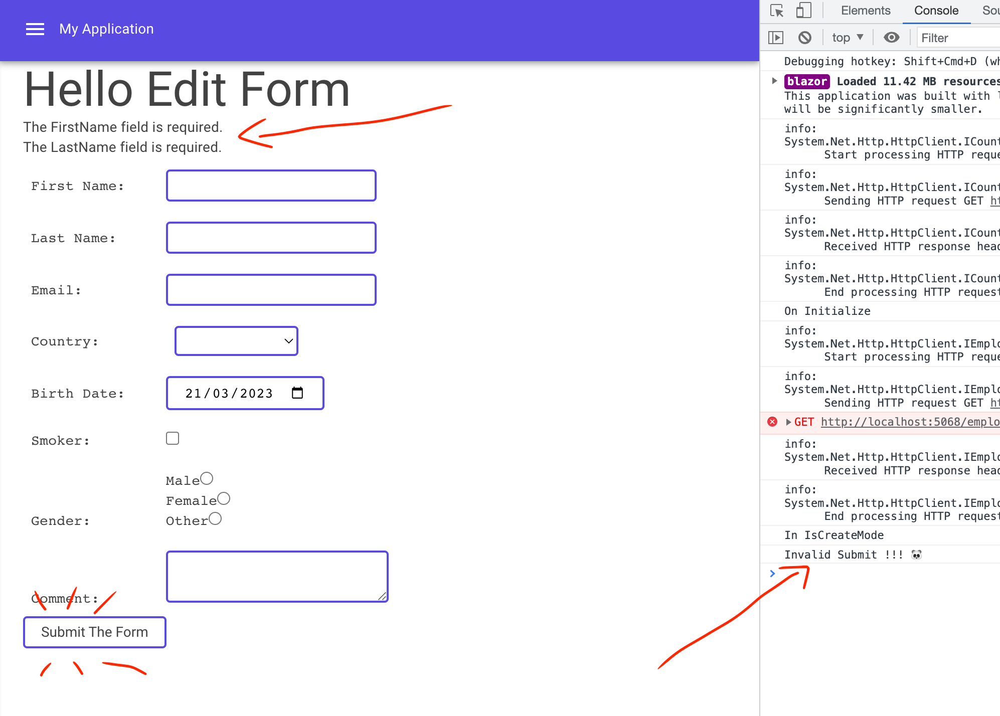
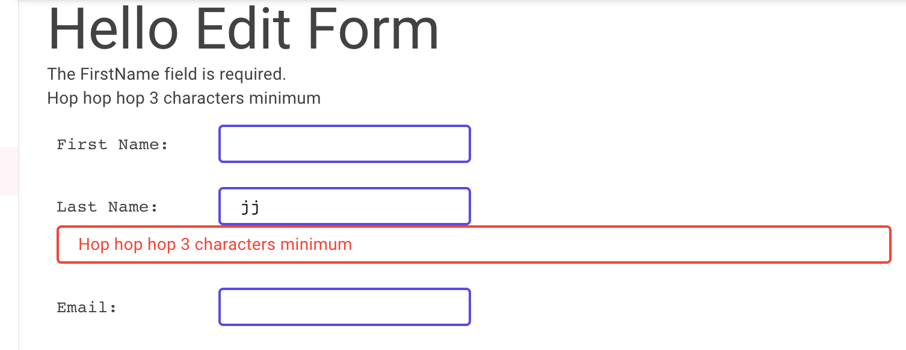
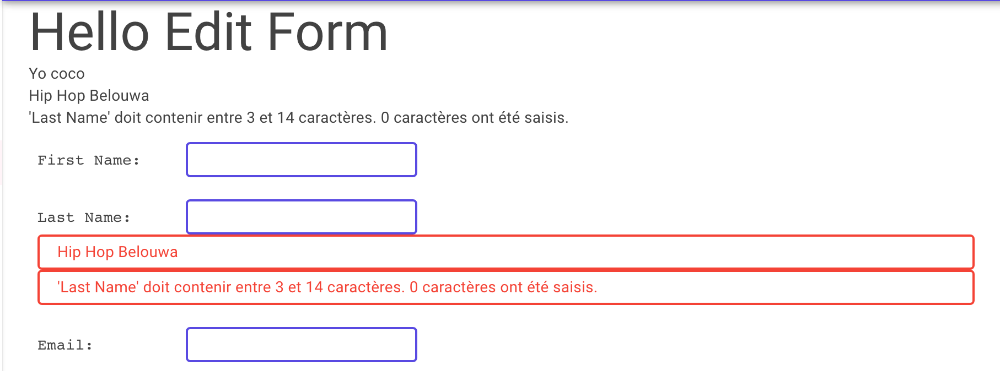

## 12 `Validation` dans `EditForm`


## `Data Annotations`



```cs
public class Employee
{
    [Required]
    [StringLength(50, ErrorMessage = "Last Name is too long!!!")]
    public string LastName { get; set; } = string.Empty;
}
```

On applique directement les `Data Annotations` au `Model`.


### `DataAnnotationsValidator` et `ValidationSummary`

On ajoute ce `component` dans notre `EditForm`:

```html
<EditForm Model="@Employee" 
          OnValidSubmit="@HandleValidSubmit"
          OnInvalidSubmit="@H	andleInvalidSubmit">
	<DataAnnotationsValidator />
    <ValidationSummary />
    ...
</EditForm>
```

`ValidationSummary` est un `component` chargé d'afficher les erreurs.

```cs
public async Task HandleInvalidSubmit()
{
    await Task.Delay(500);
    Console.WriteLine("Invalid Submit !!! 🐼");
}
```




### `ValidationMessage`

On peut aussi rendre le message de `validation` directement proche du `Input Component` concerné:

```html
<p class="pa-2 mt-1">
    <pre>Last Name: &#9;<InputText class="@_classInput" @bind-Value="@Employee.LastName" /></pre>
    <ValidationMessage Class="@_classValidation" For="() => Employee.LastName" />
</p>
```




## `Fluent Validation`

On va s'aider du package `Blazored.FluentValidation`:

```bash
> dotnet add package Blazored.FluentValidation
> dotnet add package FluentValidation
```

On l'ajoute pour l'application dans `_Imports.razor`:

```ruby
@using Blazored.FluentValidation
```


### Dans `EditForm` : `<FluentValidationValidator />`

```html
<EditForm
    Model="@Employee"
    OnValidSubmit="HandleValidSubmit"
    OnInvalidSubmit="HandleInvalidSubmit">
    
    <FluentValidationValidator />
    <ValidationSummary />
```


### Création d'un `validator`

```cs
public class EmployeeValidator : AbstractValidator<Employee>
{
    public EmployeeValidator()
    {
        RuleFor(e => e.FirstName).NotEmpty().WithMessage("Yo coco");
        RuleFor(e => e.LastName)
            .NotEmpty().WithMessage("Hip Hop Belouwa")
            .Length(3, 14);
    }
}
```

On peut le mettre où on veut car il sera trouvé par `scanning`.


### `ValidationMessage`

Comme pour `DataAnnotationsValidator`:

```html
<pre>
	Last Name: &#9;<InputText class="@_classInput" @bind-Value="@Employee.LastName" />
</pre>
        <ValidationMessage Class="@_classValidation" For="() => Employee.LastName"></ValidationMessage>
```

`&#9;` représente une `Tab`.




### Valider manuellement avec `@ref`

```html
<FluentValidationValidator @ref="_fluentValidationValidator"/>

<button type="button" class="@_classInput" @onclick="ValidateFormByHand">
    Validate The Form
</button>
```

```cs
@code {
    private FluentValidationValidator? _fluentValidationValidator;
    
    // ...
    
    void ValidateFormByHand()
    {
        if (_fluentValidationValidator!.Validate())
        {
            Console.WriteLine("Validation is OK");
        }
        else
        {
            Console.WriteLine("Validation failed");
        } 
    }
```


