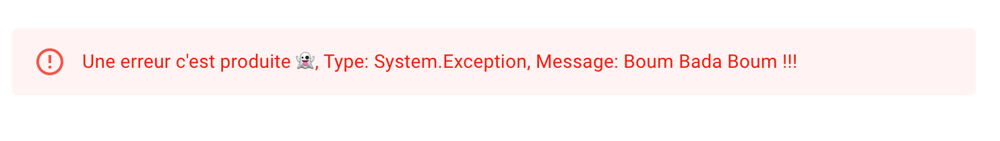
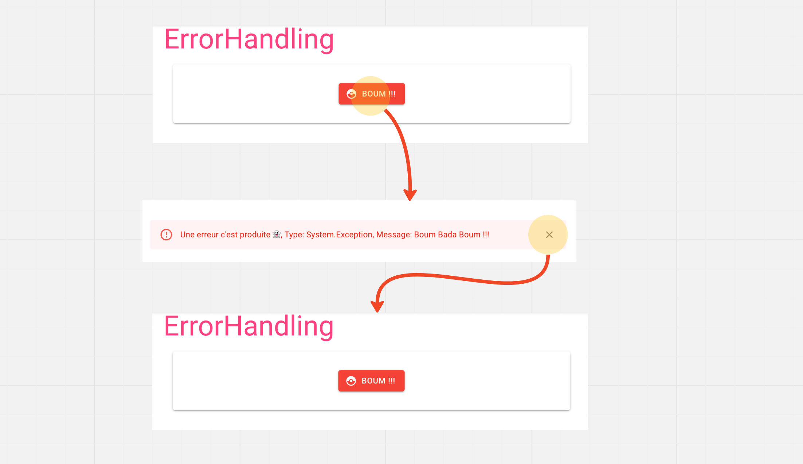
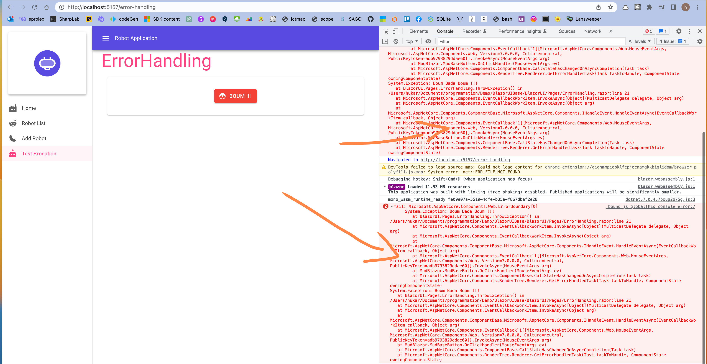

# 12 La gestion des erreurs

## Page lançant une `Exception`

```cs
@page "/error-handling"


<MudText Typo="Typo.h3" Color="Color.Secondary">ErrorHandling</MudText>

<MudPaper Elevation="2" Class="ma-4 py-8 d-flex">
    <MudButton 
        Class="mx-auto"
        Variant="Variant.Filled" 
        Color="Color.Error" 
        StartIcon="@Icons.Material.Filled.CatchingPokemon"
        OnClick="ThrowException">
        BOUM !!!
    </MudButton>
</MudPaper>

@code {
    private void ThrowException() =>throw new Exception("Boum Bada Boum !!!");
}
```


## `ErrorBundary`


De base en cas d'erreur (d'`exception` lancée), on voit apparaître une barre jaune en bas et un message d'erreur dans la console.

Avec le `tag` `<ErrorBoudary>` on va changer cela.

Je le place directement dans `MainLayout.razor` pour qu'il englobe tous les composants.

```cs
<ErrorBoundary>
	@Body
</ErrorBoundary>
```

On a maintenant une boxe rouge:


## `ChildContent` et `ErrorContent`

On peut gérer soit même le `template` d'erreur affiché grâce à l'ajout de ces deux `component`:

```html
<ErrorBoundary>
    <ChildContent>
        @Body
    </ChildContent>
    <ErrorContent>
        <MudAlert
            Class="mt-12"
            Variant="Variant.Text"
            Severity="Severity.Error">
            Une erreur c'est produite 👻
        </MudAlert>
    </ErrorContent>
</ErrorBoundary>
```


## Obtenir le type d'`exception`

```cs
<ErrorBoundary Context="Exception">
    <ChildContent>
        @Body
    </ChildContent>
    <ErrorContent>
        <MudAlert
            Class="mt-12"
            Variant="Variant.Text"
            Severity="Severity.Error">
            Une erreur c'est produite 👻, 
            Type: @Exception.GetType(),
            Message: @Exception.Message
        </MudAlert>
    </ErrorContent>
</ErrorBoundary>
```

On utilise le `Context` de `ErrorBoundary` (Voire Template Components : https://learn.microsoft.com/en-us/aspnet/core/blazor/components/templated-components?view=aspnetcore-3.1 ).




## Retourner au `state` de départ

Une fois que l'`exception` est lancée, la page d'origine n'apparaît plus.

On peut utiliser la méthode `Recover` de `ErrorBundary` pour retourner à l'état d'avant l'exception.

On utilise une référence sur la balise avec `@ref`.

```cs
<ErrorBoundary @ref="_errorBoundary" Context="Exception">
    
    // ...
       
<MudAlert ... CloseIconClicked="ErrorRecovering">
    
@code {
    void ErrorRecovering() => _errorBoundary.Recover();
```

`CloseIconClicked` étant tout simplement le `OnClick` pour le composant `MuAlert`.




## Supprimer le code d'erreur de la console du navigateur



On va créer un `component` (en fait ici juste la partie `class`) `CustomErrorBundary`:

```cs
using Microsoft.AspNetCore.Components.Web;
using Microsoft.AspNetCore.Components.WebAssembly.Hosting;

public class CustomErrorBoundary : ErrorBoundary
{
    [Inject] public IWebAssemblyHostEnvironment Environment { get; set; }
    
    protected override Task OnErrorAsync(Exception exception)
    {
        return Environment.IsDevelopment() 
            ? base.OnErrorAsync(exception) 
            : Task.CompletedTask;
    }
}
```

Et dans `MainLayout`, on utilise `CustomErrorBoundary` à la place de `ErrorBoundary`:

```html
<CustomErrorBoundary @ref="_errorBoundary" Context="Exception">
    <ChildContent>
        @Body
    </ChildContent>
    <ErrorContent>
        // ...
    </ErrorContent>
</CustomErrorBoundary>
```

```cs
@code {
    bool _drawerOpen = true;

    CustomErrorBoundary _errorBoundary = default!;
    // ...
```


