# AA `Flexbox`

Kevin Powell

https://www.youtube.com/watch?v=u044iM9xsWU&ab_channel=KevinPowell


## `List` pour un `menu`

```html
<ul>
    <li><a href="#">Home</a></li>
    <li><a href="#">About Us</a></li>
    <li><a href="#">Service ICT</a></li>
    <li><a href="#">Management</a></li>
    <li><a href="#">Personnel & Organisation</a></li>
    <li><a href="#">Contact</a></li>
</ul>
```

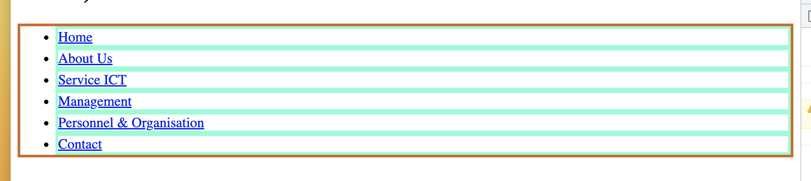

En ajoutant la propriété `display: flex` sur le conteneur:

```html
<ul class="nav-list">
```

```css
.nav-list {
    display: flex;
}
```

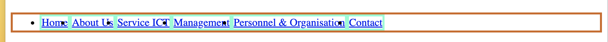

Si on `reset` les `margin` et `padding` de `ul`et des `li`:

```css
li {
  border: 3px solid cornflowerblue;
  
  margin: 0;
  padding: 0;
  list-style: none;
}

ul {
  border: 3px solid violet;
  margin: 0;
  padding: 0;
}
```

On a l'affichage par défaut des `flex-item`:

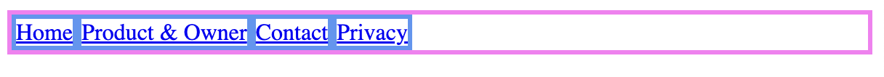

> ## Remarque
>
> On ne peut pas `overload` le comportement des `flex-item` avec:
>
> ```css
> li {
>   display: block;
> ```
>
> ou
>
> ```css
> li {
>   display: inline-block;
> ```

Par défaut un `flex-item` saute à la ligne pour chaque mot s'il n'y a plus la place:


## `flex-shrink` : Rétrécir

Par défaut cette valeur vaut `1`.

Si on la met à `0`, la ligne ne va pas se casser par mot, mais rester tel quel et le contenu va sortir de la liste `ul`:

###  `flex-shrink: 0;`

```css
.nav-link {
  display: flex;
}

.nav-link li {
  flex-shrink: 0;
}
```

 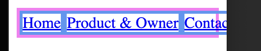

### `flex-shrink: 1`

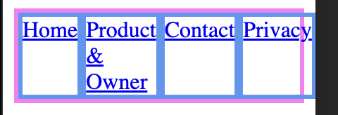


## `flex-grow` : Grandir

Par défaut cette valeur est à `0`:

### `flex-grow: 0;`

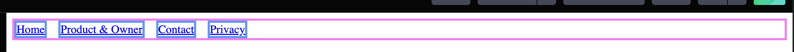

> ## Remarque
>
> Pour créer un espace ebtre les `flex-item`, on utilise `gap`:
>
> ```css
> .nav-link {
>   display: flex;
>   gap: 1rem;
> }
> ```

### `flex-grow: 1;`

```css
.nav-link li {
  flex-grow: 1;
  flex-shrink: 1;
}
```

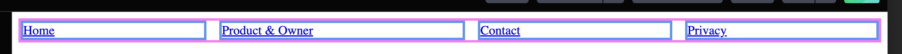

L'espace est répartie de manière égale pour remplir la largeur du contenant (`display: flex;`).

Et quand on réduit la largeur:

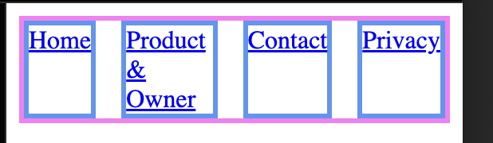

#### ! Les éléments n'ont pas forcemment la même taille, c'est l'espace restant qui est répartit:

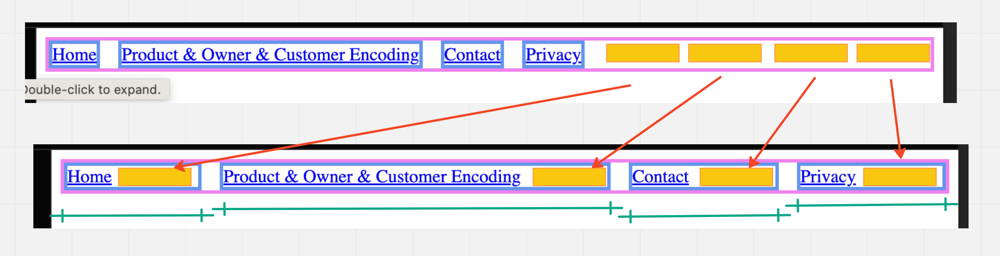


## `flex-wrap` : gestion du passage à la ligne

C'est une propriété du conteneur.

### `flex-wrap: nowrap;`

Par défaut on a `flex-wrap: nowrap` ce qui signifie que le contenu va sortir du conteneur plutôt que de passer à la ligne:

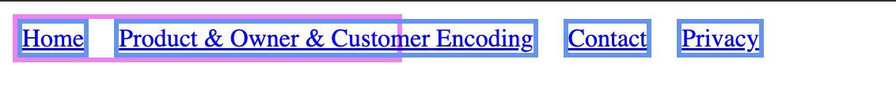

### `flex-wrap: wrap;`

```css
.nav-link {
  display: flex;
  gap: 1rem;
  flex-wrap: wrap;
}
```

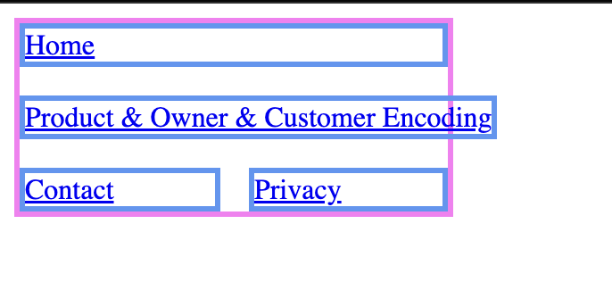

Le contenu sera ajusté au mieux en sautant à la ligne quand c'est nécessaire.

Chaque ligne a sa propre répartition de l'espace entre les `flex-item`.


## Repartition de l'espace

Par défaut les `flex-item` auront une taille proportionnelle à la taille de leur contenu:

```html
<section>  
    <article>
      Lorem ipsum dolor sit amet consectetur adipisicing elit. adipisicing elit. Ipsum omnis aut nostrum ad, consequuntur doloremque quo necessitatibus  sed?</article>
  <article>  Lorem ipsum, dolor sit amet consectetur Sed suscipit possimus harum maiores nostrum perspiciatis similique  a aut! </article>
  <article>
    Lorem, ipsum dolor sit amet  elit. Accusantium provident qui tenetur quis totam dignissimos.
  </article>
</section>
```

```css
article {
  padding: 12px;
  margin-bottom: 12px;
  background-color: yellow;
}
```

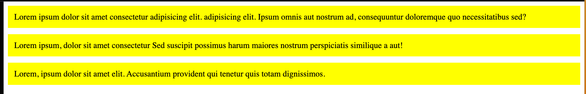

Maintenant on ajoute:

```css
section {
  display: flex;
  gap: 12px;
}
```

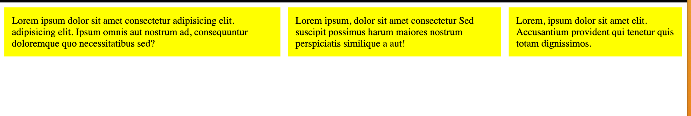


### Colonnes de même longueur : `flex: 1`

```css
article {
  padding: 12px;
  margin-bottom: 12px;
  background-color: yellow;
  flex: 1;
}
```

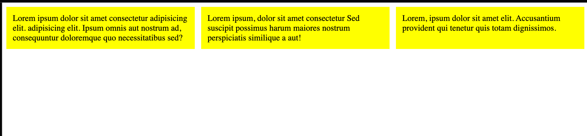

`flex` est la raccourci pour `3` propriété :

- `flex-grow`
- `flex-shrink`
- `flex-basis`

```css
flex: 1;
```

Est équivalent à :

```css
flex-grow: 1;
flex-shrink: 0;
flex-basis: 0;
```

C'est le `flex-basis` à `0` qui détermine une taille égale pour les trois `flex-item`.

De base on a `flex-basis: auto`:

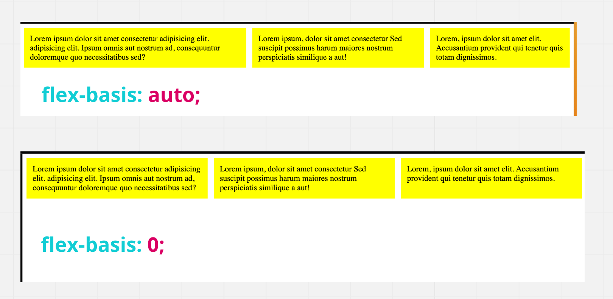

`flex-basis` fonctionne un peu comme `width` mais pas tout à fait.

Je mets les autres valeurs à `0`:

```css
article {
  flex-grow: 0;
  flex-shrink: 0;
```

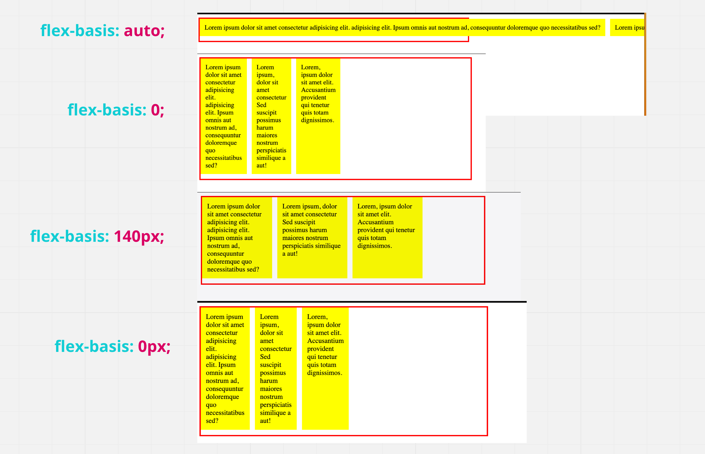

`flex-basis: 0` va essayer de fonctionner avec la plus petite taille possible (le plus grand mot).

À ce moment si on passe `flex-grow` à `1`, l'espace restant sera partagé entre les colonnes.

Mais si les plus petites colonnes de base ne sont pas de même longueur, `flex-grow: 1` ne donnera pas des colonnes équivalente.

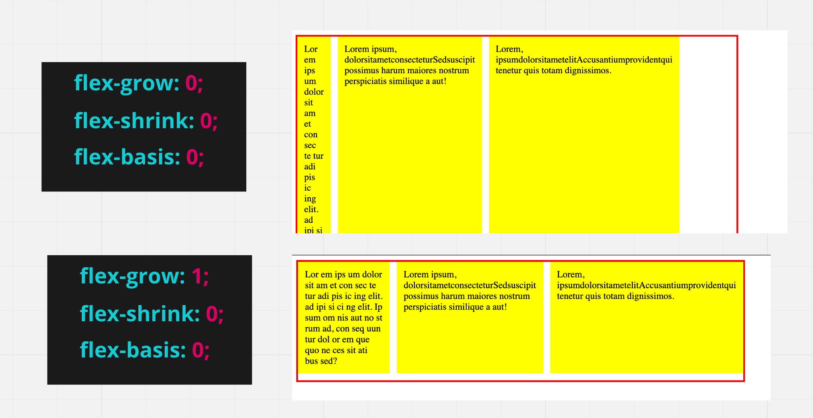

> ## Remarque
>
> Avec `flex: 1`, pour que les colonnes soit de même taille, il faut que la taille du mot le plus long soit la même dans les différents `flex-item`.


## `flex` et `media query` : responsive design

On veut changer la `flex-direction`:

- `column` lorsque l'écran est petit (`< 600px`)
- `row` lorsque l'écran est agrandi

```css
article {
  flex-grow: 1;
  flex-shrink: 0;
  flex-basis: 0;
}
section {
  display: flex;
  flex-direction: column;
  gap: 12px;
}
@media (min-width: 600px) {
  section {
    flex-direction: row;
  }
}
```

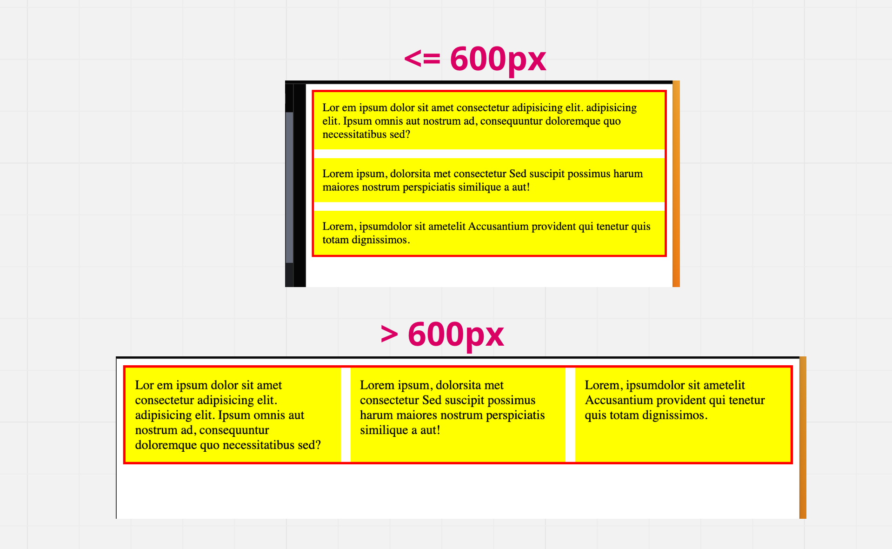


## `justify-content`

```html
<ul>
  <li><a href="#">Home</a></li>
  <li><a href="#">Contact</a></li>
  <li><a href="#">Personnel and Organization</a></li>
  <li><a href="#">History</a></li>
</ul>
```

```css
ul {
  display: flex;
  gap: 12px;
  justify-content: center;
}
```

### `justify-content: center;`


### `justify-content: flex-start;`

Valeur par défaut.

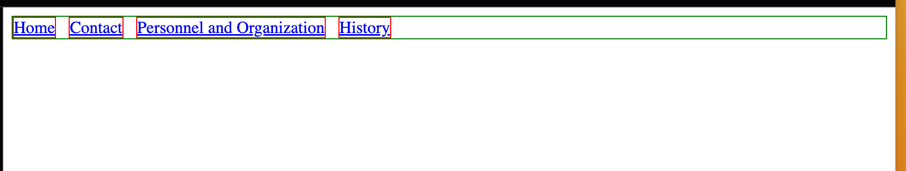


### `justify-content: flex-end;`

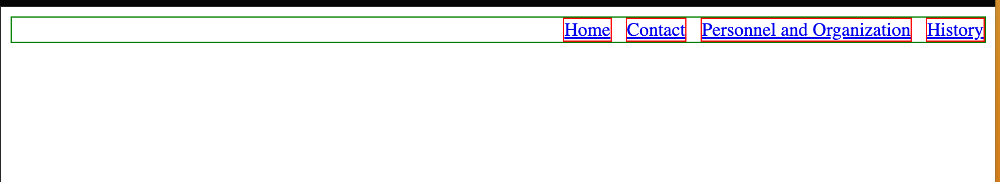


### `justify-content: space-between;`

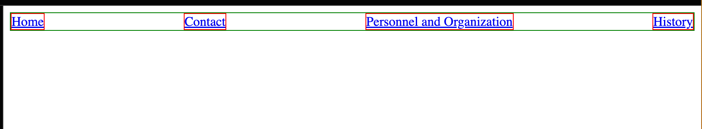


### `justify-content: space-around;`

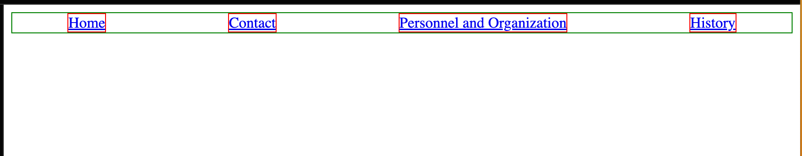

Un espace plus petit est laissé avant et après.


### `justify-content: space-evenly;`

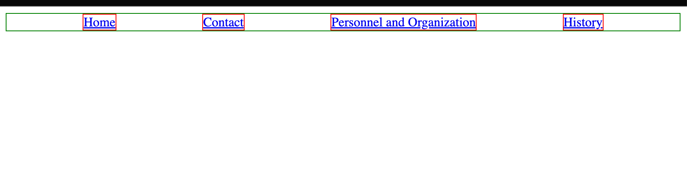

Le même espace est distribué partout.

> ## Remarque:
>
> Avec `flex-grow: 1`, `justify-content` n'a plus vraiment d'effet:
>
> 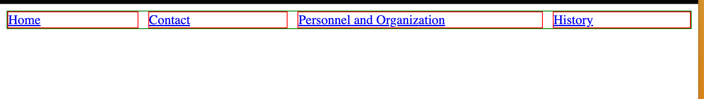
>
> Quelque soit la valeur de `justify-content`, cela ne change rien.
>
> ### `flex-basis: 0`
>
> 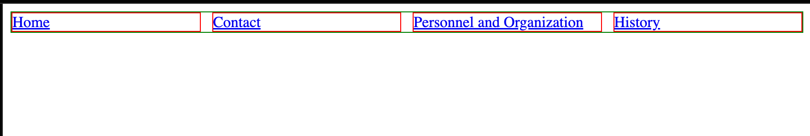


## `align-items`

### `align-item: stretch;`

C'est la valeur par défaut, toutes les boîtes ont la même hauteur.

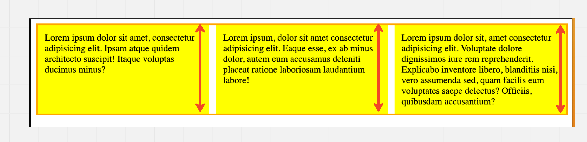


### `align-items: flex-start;`

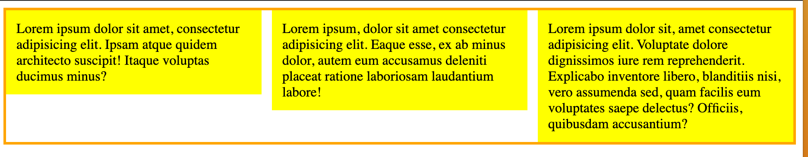


### `align-items: flex-end;`

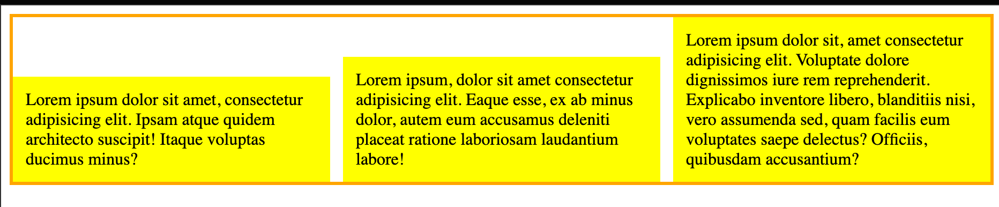


### `align-items: center;`

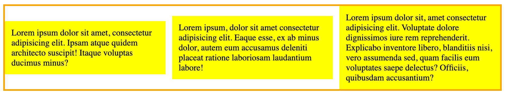


## `align-self`

On peut contrôler `align-items` sur un seul élément avec `align-self`:

```css
article:nth-child(2) {
    background: pink;
    align-self: flex-start;
}
```

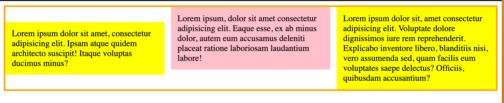

> ## Remarque:
>
> `justify-self` n'existe pas, car les espaces entre les `items` sont calculés pour **tous** et redistribué  fonction de **tous**.
>
> Un comportemnt individuel n'est donc pas possible.
>
> ## Pousser un élément avec `margin-left: auto;`
>
> Pour pousser un élément en absence d'un `justify-self`, on peut utiliser les propriété `margin-left` et `margin-right` avec la valeur `auto`.
>
> ```css
> ul {
>   display: flex;
>   gap: 12px;
>   justify-content: space-start;
> }
> li:nth-child(4) {
>   background: pink;
>   margin-left: auto;
> }
> ```
>
> 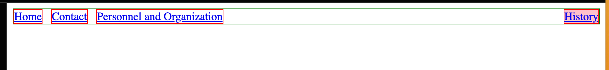
>
> ```css
> ul {
>   display: flex;
>   gap: 12px;
>   justify-content: space-end;
> }
> li:nth-child(1) {
>   background: pink;
>   margin-right: auto;
> }
> ```
>
> 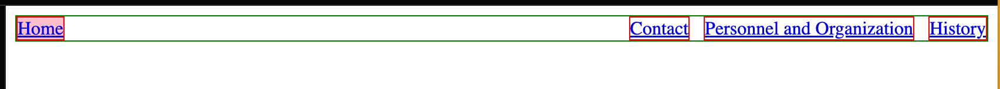


