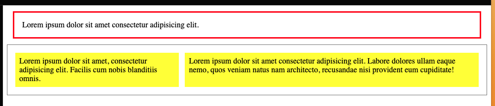
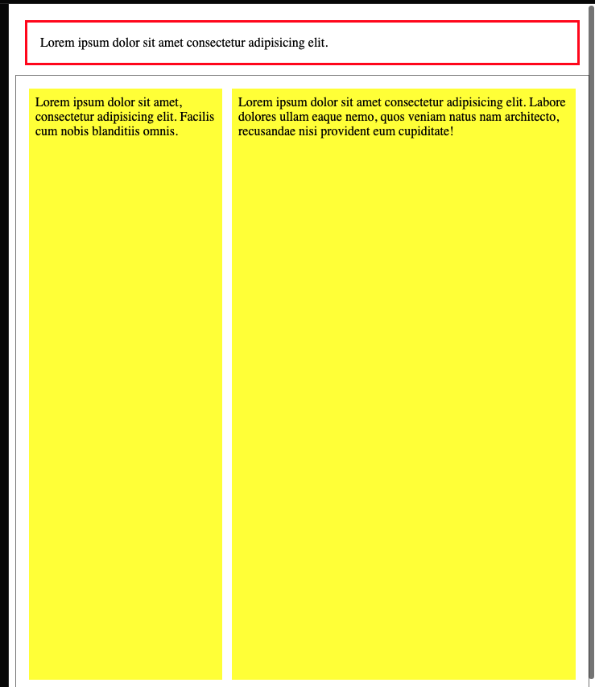

# BB Unités `css`

## `font`: `rem` 

Relatif à la taille des `fonts`, engénéral par défaut `16px`.

```css
body {
    font-size: 1rem;
}
```

C'est intéressant car les tailles sont alors toutes relatives au choix par défaut de chaque navigateur (et des réglages de l'utilisateur).

Le problème c'est qu'il n'est pas facile de réfléchir en base `16` (taille par défaut), on peut alors faire ceci:

```css
html {
    font-size: 62.5%; // => 10px
}
body {
    font-size: 2.1rem; // => 21px
}
```

##  `width` : `ch`
C'est la taille d'un character:


Il peut être intéressant de définir la `width` avec cette unité, pour avoir par exemple `maximum` `75` caractères par ligne (règle typographique de lisibilité).

```css
p {
    width: 75ch;
}
```


## `height`

Si on doit définir une `height`, alors il vaut mieux une `min-height` pour éviter que le contenu `overflow` de son conteneur.

On peut utiliser `%` ou `vh` (viewport height attention sur les `mobile`).

### Sans définir `height`

```css
nav {
  margin: 12px;
  padding: 16px;
  border: 3px solid red;
}
section {
  border: 1px solid grey;
  display: flex;
  gap: 12px;’
  padding: 16px;
}
article {
  max-width: 75ch;
  padding: 8px;
  background: yellow;
}
```




## Colonnes occupants la totalité de l'espace restant



Pour obtenir ceci on utilise `100vh` (`svh` si mobile friendly) et les `Flexbox`:

```html
<div class="application-content">
    <nav>
    	Lorem ... 
    </nav>

    <section>
        <article>
        	Lorem ...
        </article>
        <article>
        	Lorem ...
        </article>
    </section>
</div>
```

```css
.application-content {
  display: flex;
  flex-direction: column;
  height: 100vh;
}
nav {
  margin: 12px;
  padding: 16px;
  border: 3px solid red;
}
section {
  border: 1px solid grey;
  display: flex;
  gap: 12px;
  padding: 16px;
  flex-grow: 1;
}
article {
  max-width: 75ch;
  padding: 8px;
  background: yellow;
}
```

On créé une colonne `flex` et on utilise `flex-grow: 1` sur l'élément devant remplir l'espace restant.

On doit aussi définir la taille d'un élément englobant à `100vh` car par défaut les élément ont `height` sur `auto`, c'est à dire la taille de leur contenu.


