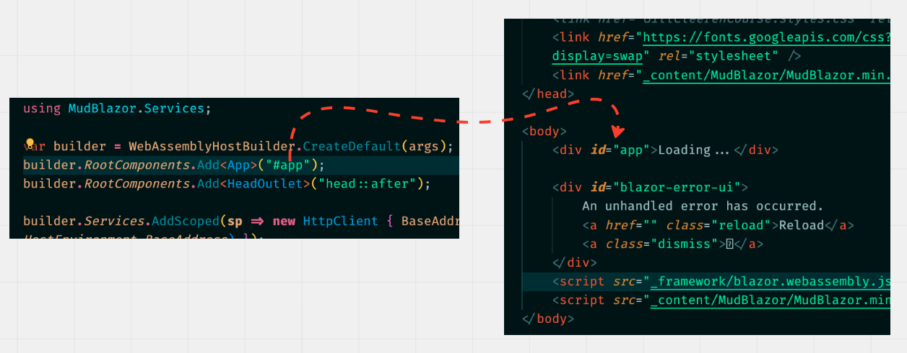
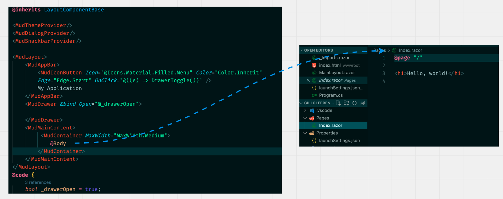
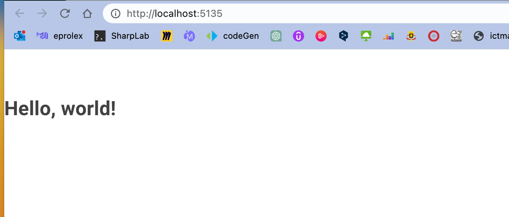
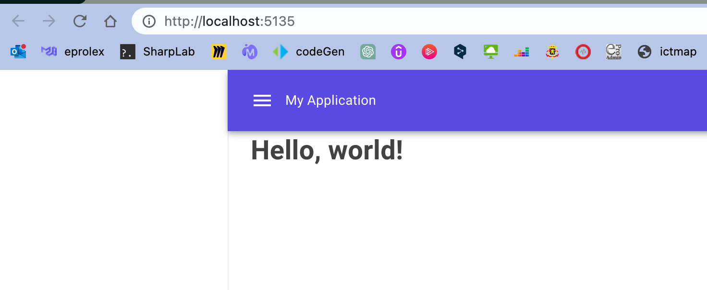
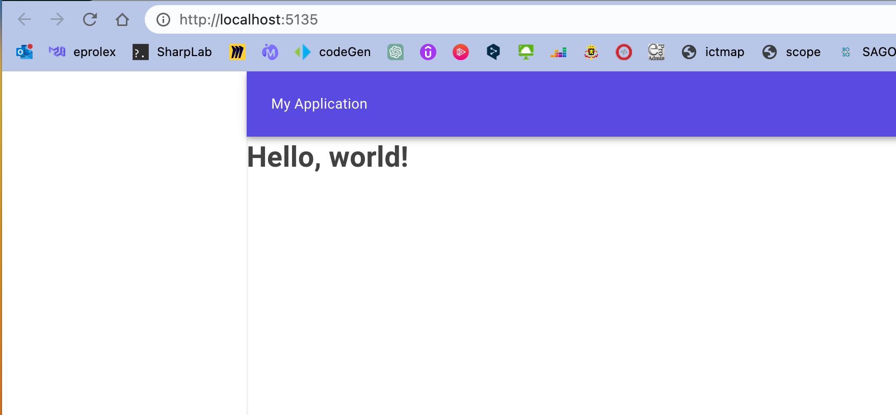
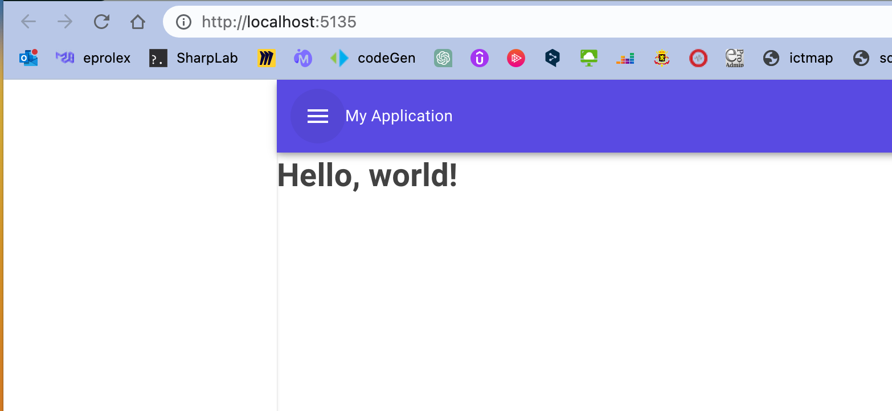

# mud-00 `Blazor` project avec `MudBlazor`

## Création du projet en `.net 7` avec `MudBlazor`

```bash
dotnet new blazorwasm-empty
```

Pour ne pas avoir `Bootstrap` et les `Pages` d'exemple.

On ajoute manuellement `Mudblazor`:

```bash
dotnet add package mudblazor
```

Dans `_Imports.razor`

```cs
@using MudBlazor
```

Dans `index.html`

```html
<link href="https://fonts.googleapis.com/css?family=Roboto:300,400,500,700&display=swap" rel="stylesheet" />
<link href="_content/MudBlazor/MudBlazor.min.css" rel="stylesheet" />

<!-- ... -->

	<script src="_framework/blazor.webassembly.js"></script>
    <script src="_content/MudBlazor/MudBlazor.min.js"></script> // <-
</body>
```

Dans `Program.cs`

```cs
using MudBlazor.Services;

builder.Services.AddMudServices();
```

Dans `MainLayout.razor`

```html
@inherits LayoutComponentBase

<MudThemeProvider/>
<MudDialogProvider/>
<MudSnackbarProvider/>
```


## `index.html`

C'est le point d'entrée de l'application dans le navigateur. Il utilise du `javascript` pour charger le code `Blazor` de l'application :

```html
<script src="_framework/blazor.webassembly.js"></script>
```

L'application `Blazor` sera chargée dans cette page (`SPA` car il n'y a qu'un fichier `.html`).

## `Program.cs`

C'est le point d'entrée de l'application `Blazor`.

C'est ici que l'on définit le lien avec `index.html` grâce à `builder.RootComponents.Add`:




## `App.razor`

Contient le `Router` et défini le `component layout`.


## `MainLayout.razor`

C'est depuis ce `component` que les `pages` et les autres `component` seront afficher.



L'emplacement des pages est représenté par `@Body`.

## Choix et ajout du `template`

### De base:

```html
<MudLayout>
    <MudMainContent>
        @Body
    </MudMainContent>
</MudLayout>
```



### Centrer le contenu `MudContainer`

```html
<MudMainContent>
    <MudContainer MaxWidth="MaxWidth.Medium">
        @Body
    </MudContainer>
</MudMainContent>
```




### Avec une `AppBar` et un `Drawer`:

```html
<MudLayout>
    <MudAppBar>
        My Application
    </MudAppBar>
    <MudDrawer Open="true">

    </MudDrawer>
    <MudMainContent>
         <MudContainer MaxWidth="MaxWidth.Medium">
            @Body
        </MudContainer>
    </MudMainContent>
</MudLayout>
```




### Avec un bouton `hamburger`:

```ruby
<MudLayout>
    <MudAppBar>
        <MudIconButton Icon="@Icons.Material.Filled.Menu" Color="Color.Inherit" Edge="Edge.Start" OnClick="@((e) => DrawerToggle())" />
        My Application
    </MudAppBar>
    <MudDrawer @bind-Open="@_drawerOpen">
        
    </MudDrawer>
    <MudMainContent>
         <MudContainer MaxWidth="MaxWidth.Medium">
            @Body
        </MudContainer>
    </MudMainContent>
</MudLayout>
@code {
    bool _drawerOpen = true;

    void DrawerToggle()
    {
        _drawerOpen = !_drawerOpen;
    }
}
```




