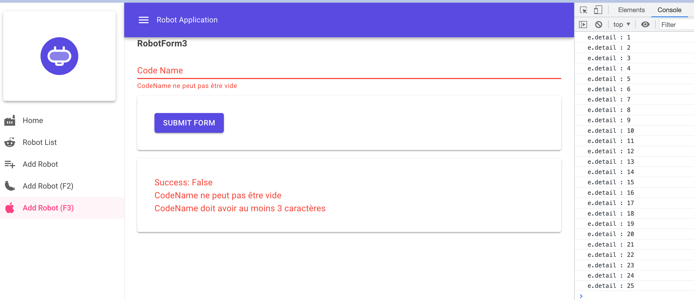
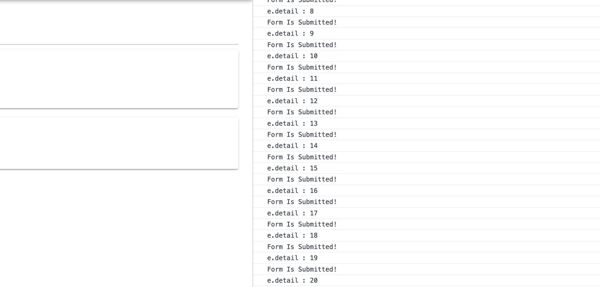
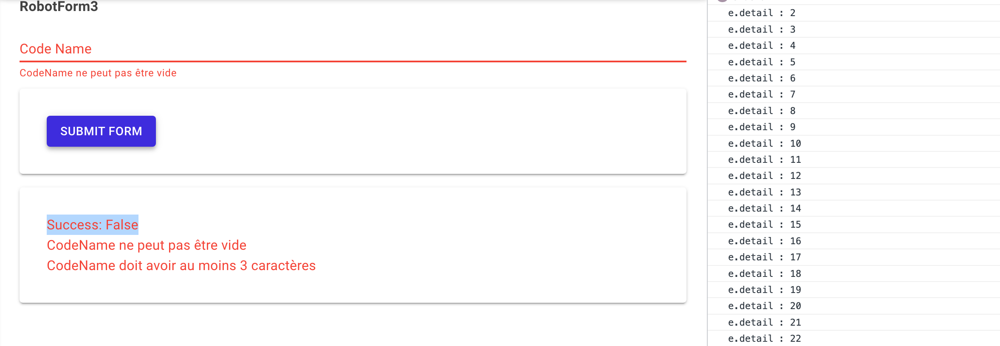
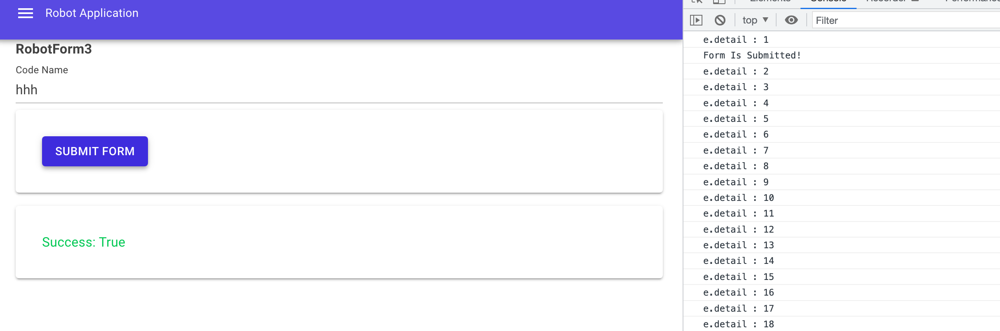
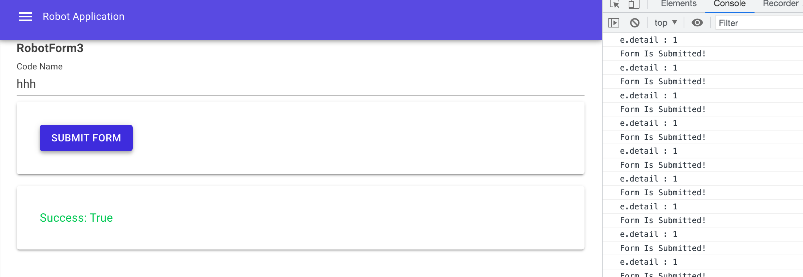

# Mud-02.5 Prévenir les clicks intempestifs


## `e.Detail`

Dans la classe `MouseEventArgs` il existe la propiété `Detail`:

> Nombre de clics consécutifs survenus dans un court laps de temps, incrémenté d'une unité.



Et si le `form` est valide:



C'est autant de fois que le formulaire sera soumis.

On peut s'en servir pour éviter les clicks non voulus:

```ruby
<MudButton OnClick="async (MouseEventArgs e) => await SubmitForm(e)">
    Submit Form
</MudButton>
```

```cs
private async Task SubmitForm(MouseEventArgs e)
{
    Console.WriteLine($"e.detail : {e.Detail}");
    if (e.Detail > 1) return;
    
    await _form!.Validate();

    if (_form.IsValid)  Console.WriteLine("Form Is Submitted!");
}
```



Si le bouton est cliqué plusieurs fois de suite, la méthode sort avant de relancer une `validation` inutile.



Dans le cas d'un formulaire `valide`, il est soumis lors du premier click uniquement.



Malgré tout, si une personne tape lentement, de nouveau le formulaire sera soumis plusieurs fois.


## `e.Button`

On peut vouloir contraindre le bouton à ne fonctionner qu'avec le click gauche.

On a pour cela la propriété `Button`:

> Le numéro du bouton qui a été pressé lorsque l'événement souris a été déclenché :
>
> - Bouton gauche = `0`,
> -  bouton du milieu = `1` (si présent),
> - bouton droit = `2`.
> 
> Pour les souris configurées pour les gauchers, dans lesquelles les actions des boutons sont inversées, les valeurs sont lues de droite à gauche.

On a aussi `e.Buttons` qui lui observe le click de plusieurs boutons en même temps.

```cs
if(e.Button != 0) return;
```

Cependant sur Mac avec mon trackpad, je ne déclenche de toute manière rien d'autre qu'un click gauche. Le click droit est intercepté par le navigateur et n'arrive pas jusqu'à mon application `Blazor`.


## `Disable` le bouton pendant le temps de la tâche

```xml
<MudButton
    Disabled="_formBeingProcessed"
    OnClick="async (MouseEventArgs e) => await SubmitForm(e)">
    Submit Form
</MudButton>
```

```cs
@code {
    private bool _formBeingProcessed;
    // ...
    
    private async Task SubmitForm(MouseEventArgs e)
    {
        _formBeingProcessed = true;
        
        await _form!.Validate();

        if (_form.IsValid)
        {
            Snackbar!.Add("Form Is Submitted!");
            Console.WriteLine("Form Is Submitted!");
            // DO CALL API
            await Task.Delay(5000);
        }

        _formBeingProcessed = false;
    }
```

Ici il y a une attente forcée de `5s` avant de pouvoir re-soumettre le formulaire.

La solution est agréable pour l'utilisateur et très visuelle.


On peut cummuler avec la solution `1` pour éviter des validations inutiles:


```cs
private async Task SubmitForm(MouseEventArgs e)
{
    if (e.Detail > 1) return;
    
    _formBeingProcessed = true;
    await _form!.Validate();
    Console.WriteLine("Form Validate");

    if (_form.IsValid)
    {
        Snackbar!.Add("Form Is Submitted!");
        Console.WriteLine("Form Is Submitted!");
        await Task.Delay(3000);
        _form.Reset();
    }

    _formBeingProcessed = false;
}
```

En plus je remets le `Form` à zéro avec `_form.Reset()` ce qui rend impossible une soumission juste après (on doit au moins remplir le formulaire pour qu'il soit valide).