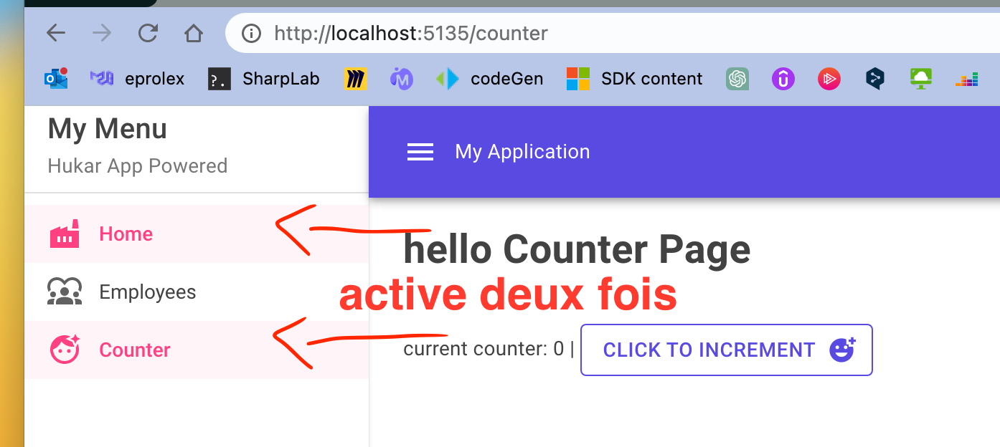
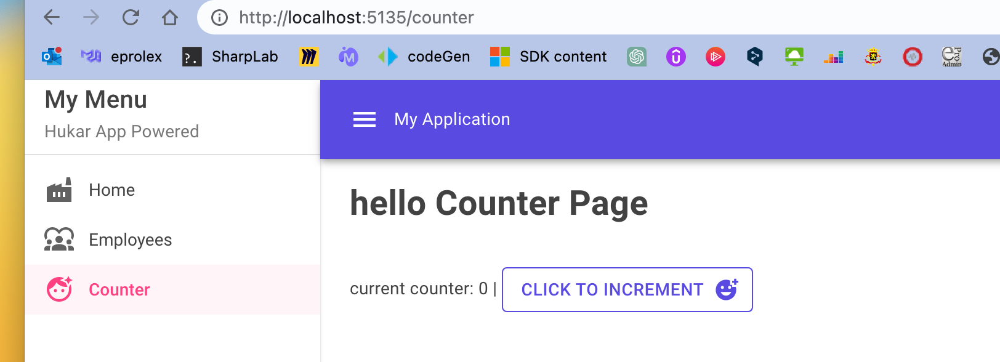

# Mud-03 `MudNavMenu`


## `Home url` : matcher de manière strict `"/"`

On peut avoir un problème avec l'`url` : `"/"` qui sera `active` avec toutes les `urls` par défaut (en mode `Match.Prefix`).

```ruby
<MudNavMenu Class="mud-width-full" Color="Color.Secondary">
    // ...
    <MudNavLink Href="/" Icon="@Icons.Material.Filled.Factory">Home</MudNavLink>
    <MudNavLink Href="/employeeoverview" Icon="@Icons.Material.Filled.Diversity1">Employees</MudNavLink>
    <MudNavLink Href="/counter" Icon="@Icons.Material.Filled.FaceRetouchingNatural">Counter</MudNavLink>
</MudNavMenu>
```



Pour corriger ce problème il faut changer la valeur par défaut de `Match` à `Match.All` qui précise que l'`url` doit matcher avec l'entiéreté du `Href` (chemin) précisé:

```ruby
<MudNavLink Href="/" Match="NavLinkMatch.All" Icon="@Icons.Material.Filled.Factory">Home</MudNavLink>
```

