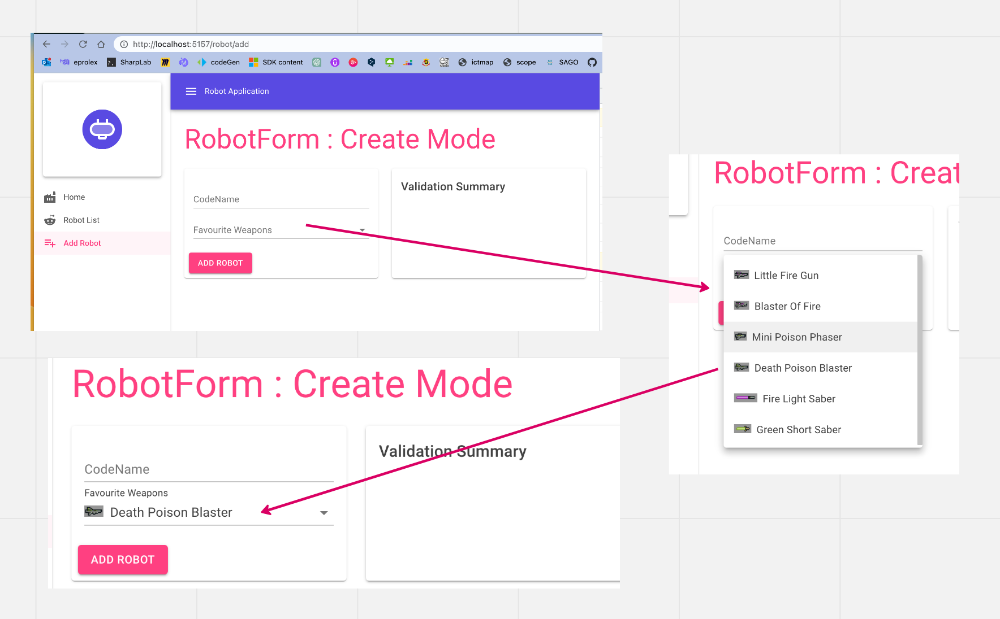
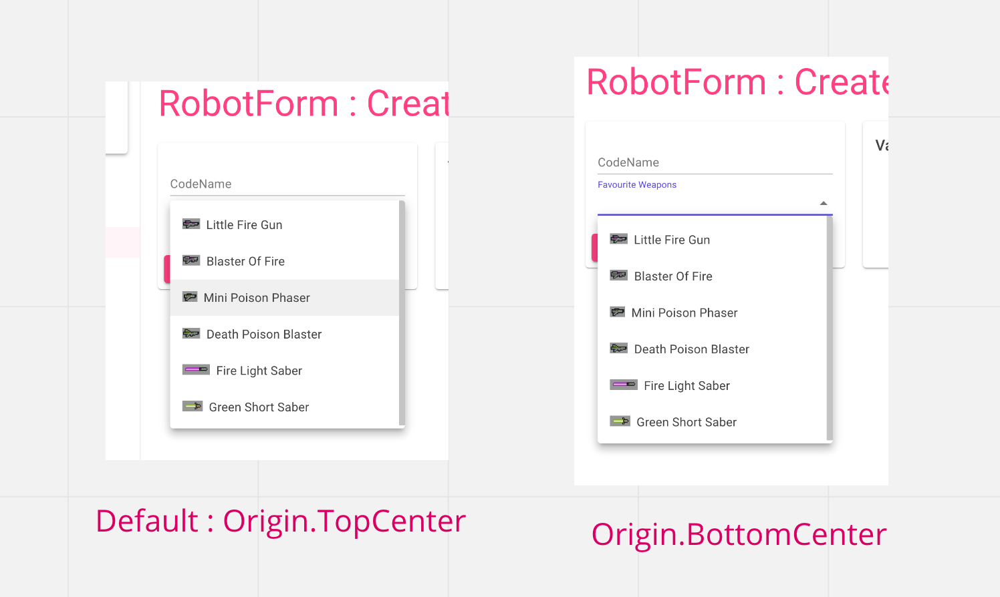
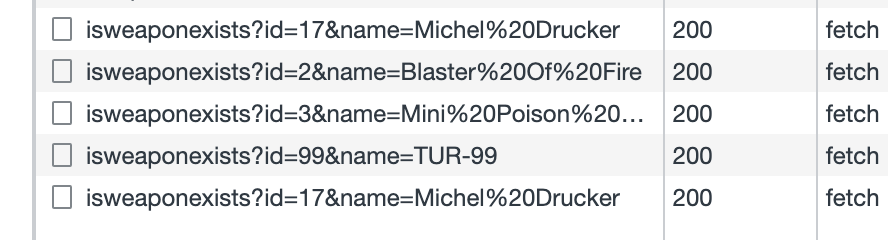
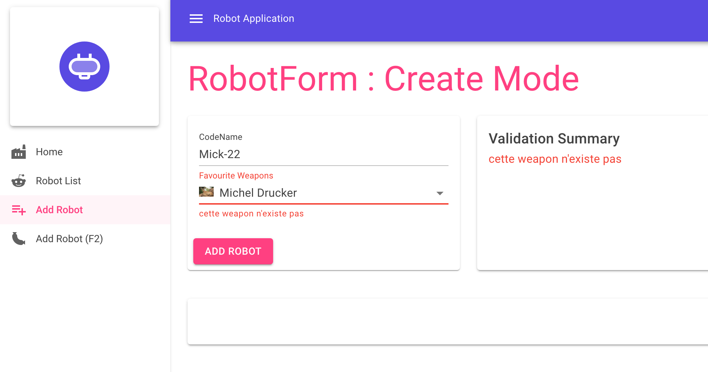
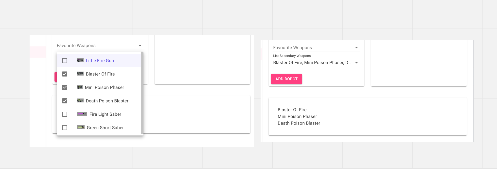

# Mud-05 `MudSelect`

## Mise en place

Pour qu'une classe puisse être utilisée dans un `MudSelect` comme `type` de donnée, il faut `overrider` 3 méthodes : `Equals`, `GetHashCode` et `ToString` (pour l'affichage du texte dans le `select`).

```cs
namespace Domain;

public class Weapon
{
    public int Id { get; set; }
    public string Name { get; set; } = string.Empty;
    public int RobotId { get; set; }
    
    // Note: c'est important pour que MudSelect puisse comparer les Weapons
    public override bool Equals(object? o)
    {
        var other = o as Weapon;
        return other?.Name == Name;
    }

    // Note: c'est important aussi !
    public override int GetHashCode() => Name?.GetHashCode() ?? 0;
    
    // Implémenter pour que les Weapons s'affiche correctement dans le MudSelect
    public override string ToString() => Name;
}
```


## Simple `MudSelect` : avec image

```ruby
<MudSelect 
    Label="Favourite Weapons" 
    @bind-Value="@Robot.FavouriteWeapon">
    @foreach (var weapon in _weapons)
    {
        <MudSelectItem Value="@weapon">
             @weapon.Name
        </MudSelectItem>
    }
</MudSelect>
            
@code {
    [Inject]
    public IRobotRepository Repo { get; set; } = default!;
    
    public Robot Robot { get; set; } = new();
    
    IEnumerable<Weapon> _weapons = default!;
    
    protected override async Task OnInitializedAsync()
    {
        _weapons = await Repo.GetAllWeapons();
    }
```



On peut ajouter un attribut `AnchorOrigin` pour déterminer comment apparait le `Pop-Over`:

```ruby
<MudSelect 
    Label="Favourite Weapons" 
    @bind-Value="@Robot.FavouriteWeapon"
    AnchorOrigin="Origin.BottomCenter">
```




## `MudSelect` et `FluentValidation`

> Cette exemple ne fonctionne qu'avec un `MudSelect` simple (sans `MultiSelection`).

```ruby
<EditForm Model="@Robot" OnSubmit="SubmitFormAsync">
	<FluentValidationValidator @ref="_fluentValidationValidator"/>

	@if (_weapons is not null)
    {
        <MudSelect
            Label="Favourite Weapons"
            @bind-Value="@Robot.FavouriteWeapon"
            AnchorOrigin="Origin.BottomCenter"
            For="() => Robot.FavouriteWeapon">

            @foreach (var weapon in _weapons)
            {
                <MudSelectItem Value="@weapon">
                    @weapon.Name
                </MudSelectItem>
            }
        </MudSelect>
    }

    <MudButton ButtonType="ButtonType.Submit">
        Add Robot
    </MudButton>
</EditForm>
```

`<FluentValidationValidator @ref="_fluentValidationValidator"/>` est un composant venant du `package` : `Blazored.FluentValidation` et utilise `FluentValidation` comme base pour la validation automatique.

Il suffit de désigner le message d'erreur lié à une `Property` avec `For="() => Robot.FavouriteWeapon"`.

On utilise un `validator async` :

`RobotValidator`

```cs
public class RobotValidatorAsync : AbstractValidator<Robot>
{
    private readonly IRobotRepository _repo;

    public RobotValidator(IRobotRepository repo)
    {
        _repo = repo;

        RuleFor(r => r.FavouriteWeapon)
            .NotEmpty().WithMessage("Une arme est obligatoire")
            .MustAsync(IsWeaponExist).WithMessage("cette weapon n'existe pas");
    }

    private async Task<bool> IsWeaponExist(Robot robot,
        Weapon? weapon, ValidationContext<Robot> context, CancellationToken token)
     => await _repo.IsWeaponExists(weapon);
}
```

Le fait d'utiliser un `async validator` n'autorise plus l'utilisation de `OnValidSubmit` et `OnInvalidSubmit` car alors le formulaire est toujours valide.

Il faut utiliser `OnSubmit` et gérer soit même la validation.

C'est pour cela qu'on place une `#ref` sur `FluentValidationValidator` : `@ref="_fluentValidationValidator"`.

Le code dans `RobotRepository`

```cs
 public async Task<bool> IsWeaponExists(Weapon weapon)
        => await _httpClient.GetFromJsonAsync<bool>(
            $"/robots/isweaponexists?id={weapon.Id}&name={weapon.Name}"
        );
```

Les caractères spéciaux (comme les espaces `%20`) seront `URL encoded` automatiquement par `HttpClient`:



La validation est exécutée grâce à la référence vers `FluentValidationValidator` et dans une `partial class` pour séparer le `code` du `template`:

`RobotForm.cs`

```cs
public partial class RobotForm
{
    [Inject] private IRobotRepository? _repo { get; set;  }

    private Robot Robot { get; set; } = new() { CodeName = "Mick-22"};

    private IEnumerable<Weapon> _weapons = default!;
    private FluentValidationValidator? _fluentValidationValidator;

    private bool _isSuccess = false;

    protected override async Task OnInitializedAsync()
    {
        _weapons = await _repo!.GetAllWeapons();
    }

    private async Task SubmitFormAsync()
    {
        if (await _fluentValidationValidator!.ValidateAsync())
        {
            // Code for valid form
            _isSuccess = true;
        }
        else
        {
            // Code for invalid form
            _isSuccess = false;
        }
    }
}
```

Dans `Blazor` l'injection de dépendance se fait avec `[Inject]`, il ne faut pas soi-même créer un constructeur (on a alors une erreur comme quoi il faut un constructeur sans arguments).

Avec un `validator async`, on utilise `ValidateAsync`.




## `MultiSelection` avec `MudSelect`

`MultiSelection="true"`

```ruby
<MudSelect
    Label="List Secondary Weapons" 
    MultiSelection="true"
    @bind-SelectedValues="@Robot.Weapons">
    @foreach (var weapon in _weapons)
    {
        <MudSelectItem Value="@weapon">
             @weapon.Name
        </MudSelectItem>
    }
</MudSelect>
```

Dans la classe `Robot.cs`

```cs
public class Robot
{
    // ...
    public IEnumerable<Weapon> Weapons { get; set; } = new HashSet<Weapon>();
    // ...
```

`Weapons` doit **obligatoirement** être déclaré comme `IEnumerable`.

On utilise un `HashSet` pour ne pas avoir deux éléments identiques, mais cela peut très bien fonctionner avec une `List<T>`:

```cs
public IEnumerable<Weapon> Weapons { get; set; } = new List<Weapon>();
```

Cela peut même fonctionner sans instance directe de l'`IEnumerable`:

```cs
 public IEnumerable<Weapon> Weapons { get; set; } // = new List<Weapon>();
```

Il faut alors mettre une condition dans le `template`:

```ruby
<MudPaper Elevation="2" Class="pa-8 mt-4">
    @if (Robot.Weapons is not null)
    {
        @foreach (var weapon in Robot.Weapons)
        {
            <MudText Typo="Typo.body1">@weapon.Name</MudText>
        }
    }
</MudPaper>
```

Et cela fonctionne:



Ce n'est peut-être malgré tout pas une bonne pratique de laisser un `IEnumerable` non initialisé.


