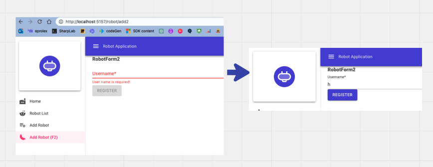
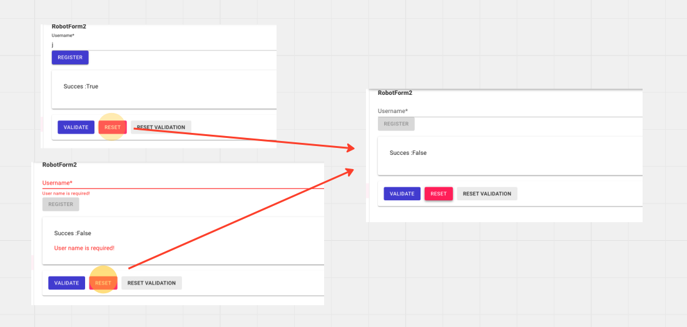
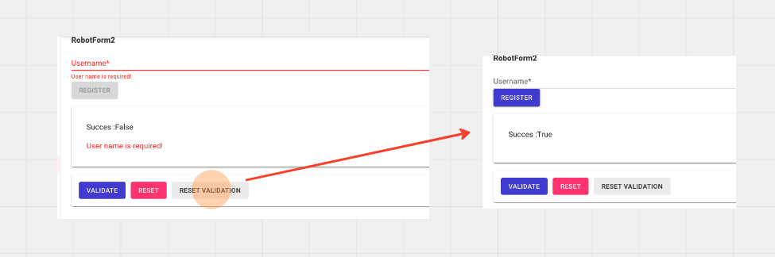
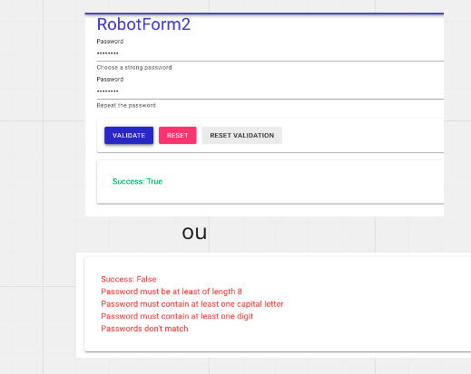
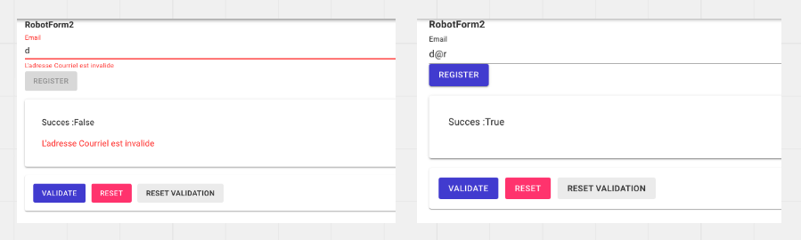
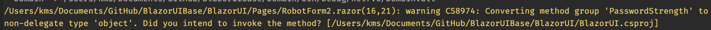
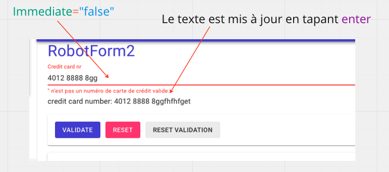
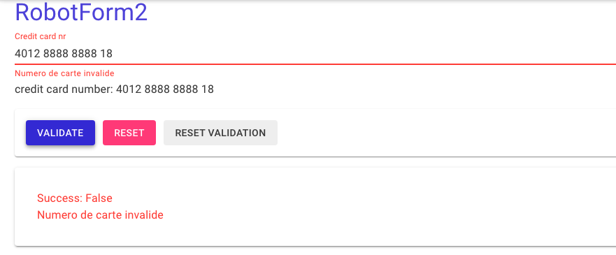
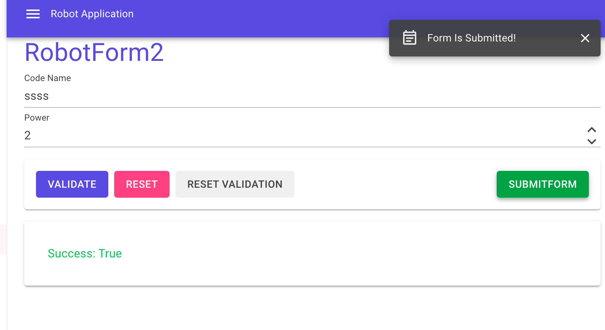

# Mud 06 `MudForm`

> Pour un `MudForm`, on ne doit pas utiliser un bouton avec `ButtonType="ButtonType.Submit"`


## Validation Simple: `Required` et `RequiredError`

```cs
<MudForm @ref="form" @bind-IsValid="success" @bind-Errors="errors">
	<MudTextField 
    	T="string" 
    	Label="Username" 
    	Required="true" 
    	RequiredError="User name is required!"/>
    
    <MudButton Disabled="@(!success)">Register</MudButton>
</MudForm>
```

```cs
bool success;
string[] errors = { };

MudForm form;
```




## Déclencher la validation programmatiquement

On va ajouter trois `Button` pour contrôler notre `Form`:

### `Validate Form`: `form.Validate()`

```ruby
<MudButton OnClick="@(()=>form.Validate())">Validate</MudButton>
```


### `Reset Form`: `form.Reset()`

```cs
<MudButton OnClick="@(()=>form.Reset())" Class="mx-2">Reset</MudButton>
```

`success` reste ou passe à `false`, les champs sont vidés et `errors` est vidé aussi.




### `Reset Validation`: `form.ResetValidation()`

```ruby
<MudButton OnClick="@(()=>form.ResetValidation())">Reset Validation</MudButton>
```

Vide `errors` et met `success` à `true`.




## `Helper` pour afficher la validation

```ruby
<MudPaper Elevation="2" Class="mt-4 pa-8">
    <MudText Typo="Typo.body1" Color="@(_success ? Color.Success : Color.Error)">
        Success: @_success
    </MudText>
    @foreach (var error in _errors)
    {
        <MudText Typo="Typo.body1" Color="Color.Error">
            @error
        </MudText>
    }
</MudPaper>
```




## Validation d'une adresse `mail` avec la propriété `Validation` et les attributs `DataAnnotations`

 Peut recevoir un attribut de validation (notre exemple) ou une fonction de validation.

Les attributs de validation sont fournis par la librairie `System.ComponentModel.DataAnnotations`.

```html
@using System.ComponentModel.DataAnnotations
    
<MudForm @ref="form" @bind-IsValid="success" @bind-Errors="errors">
	<MudTextField 
		T="string" 
		Label="Email"
		Validation="@(new EmailAddressAttribute() {
				ErrorMessage = "The email address is invalid"
		})"/>
</MudForm>
```

### Ici les attributs de validation sont passés sous forme d'une instance de `System.ComponentModel.DataAnnotations.ValidationAttribute` :  `new MyValidationAttribute()`.




## Validation d'un `password` en passant une `Func` à la propriété `Validation`

Voici la listes des `Func` acceptées:

Les types pris en charge sont:
- `Func<T, bool>` ... affichera le message d'erreur standard "Invalid" s'il est `false`
- `Func<T, string>` ... affiche le résultat en tant que message d'erreur, pas d'erreur si `null`
- `Func<T, IEnumerable<string>>` ... affiche tous les messages d'erreur retournés, pas d'erreur s'il est vide
- `Func<object, string, IEnumerable<string>>`  input de `Form.Model`, `Full Path` du `Member` ... affiche tous les messages d'erreur retournés, pas d'erreur s'il est vide

Et les versions `async`:

- `Func<T, Task<bool>>` 
- `Func<T, Task<string>>` 
- `Func<T, Task<IEnumerable<string>>>` 
- `Func<object, string, Task<IEnumerable<string>>>`

```html
<MudTextField 
    T="string" 
    Label="Password" 
    HelperText="Choose a strong password" 
    @ref="pwField1"
    InputType="InputType.Password"
    Validation="@(new Func<string, IEnumerable<string>>(PasswordStrength))" />
<MudTextField 
    T="string"
    Label="Password" 
    HelperText="Repeat the password" 
    InputType="InputType.Password"
    Validation="@(new Func<string, string>(PasswordMatch))" />
```

On créé une référence sur le `TextField` avec `@ref="pwField1"`.

Pour utiliser les `expressions régulières` on doit ajouter ce `using`:

```ruby
@using System.Text.RegularExpressions
```

On a ici `Func<T, IEnumerable<string>>` et ensuite `Func<T, string>` avec `T=string`.

```cs
@code {
    // ...
    MudTextField<string> pwField1;

    private IEnumerable<string> PasswordStrength(string pw)
    {
        if (string.IsNullOrWhiteSpace(pw))
        {
            yield return "Password is required!";
            yield break;
        }
        if (pw.Length < 8)
            yield return "Password must be at least of length 8";
        if (!Regex.IsMatch(pw, @"[A-Z]"))
            yield return "Password must contain at least one capital letter";
        if (!Regex.IsMatch(pw, @"[a-z]"))
            yield return "Password must contain at least one lowercase letter";
        if (!Regex.IsMatch(pw, @"[0-9]"))
            yield return "Password must contain at least one digit";
    }

    private string PasswordMatch(string arg)
    {
        if (pwField1.Value != arg)
            return "Passwords don't match";
        return null;
    }
```


### Simplification de la syntaxe

On peut simplifier :

```ruby
<MudTextField 
    ...
    Validation="@(new Func<string, IEnumerable<string>>(PasswordStrength))" />
```

en

```ruby
<MudTextField
        ...
        Validation="PasswordStrength"/>
```

On a alors un `Warning`:



On peut désactiver ce `warning` dans le fichier `.csproj`:

```xml
	...
	<PropertyGroup>
    	<NoWarn>8974</NoWarn>
  	</PropertyGroup>

</Project>
```


## Exemple simple avec `FluentValidation` : `ccValidator`

```ruby
@using FluentValidation

<MudForm>
    <MudTextField 
        @bind-Value="creditCardNr" 
        Validation="@ccValidator.Validation" 
        Immediate="true" 
        Label="Credit card nr" />
</MudForm>
    
<MudText>credit card number: @_creditCardNr</MudText>
```

`Immediate`: Si `true` l'élément `input` met à jour la `Value` immédiatement lorsqu'on tape. Si c'est à `false`, la `Value` est mise à jour uniquement si on tape `Enter`.




### Version simple



```ruby
<MudForm @ref="_form" @bind-IsValid="_success" @bind-Errors="_errors">
    <MudTextField
        @bind-Value="_creditCardNr" 
        Validation="ValidateCreditCard" 
        Immediate="true" 
        Label="Credit card nr" />
</MudForm>
```

```cs
@code {
    // ...

    // This is a valid Visa test card number
    private string _creditCardNr = "4012 8888 8888 1881";

    CreditCardValidator ccValidator = new CreditCardValidator();

    public IEnumerable<string> ValidateCreditCard(string creditCard)
    {
        var result = ccValidator.Validate(creditCard);

        if (result.IsValid) return new string[] { };

        return result.Errors.Select(error => error.ErrorMessage);
    }
}
```

On créé ici une méthode compatible avec le type `Func<T, IEnumerable<string>>`.

Comme notre type à valider est juste un `string`, on a `Func<string, IEnumerable<string>>`.

Si c'est `valid` on renvoie un `array` vide.

Et le `Validator`:

```cs
public class CreditCardValidator : AbstractValidator<string>
{
    public CreditCardValidator()
    {
        RuleFor(cc => cc)
            .NotEmpty().WithMessage("Ne soit pas null Credit Card ni vide")
            .Length(1, 100)
            .CreditCard().WithMessage("Numero de carte invalide");
    }
    
}
```

Il suffit que la méthode de validation `ValidateCreditCard` respecte les signatures authorisées pour la propriété `Validation`, ici comme annoncé plus haut,  `Func<string, IEnumerable<string>>`.


### Version perfectionnée et générique

On va créer une classe qui permet d'instancier un `validator` particulier en lui passant directement les règles de validation:

```cs
// dans la doc de MudBlazor
// https://mudblazor.com/components/form#using-fluent-validation
public class FluentValueValidator<T> : AbstractValidator<T>
{
    public FluentValueValidator(Action<IRuleBuilderInitial<T, T>> rule)
    {
        rule(RuleFor(x => x));
    }

    private IEnumerable<string> ValidateValue(T arg)
    {
        var result = Validate(arg);
        if (result.IsValid)
            return new string[0];
        return result.Errors.Select(e => e.ErrorMessage);
    }

    public Func<T, IEnumerable<string>> Validation => ValidateValue;
}
```

Ensuite il suffit de créer un `validator` particulier:

```cs
FluentValueValidator<string> ccValidator = new (
    x => x.NotEmpty().Length(1,100).CreditCard()
);
```

Puis de l'utiliser dans notre champ de formulaire:

```ruby
<MudForm>
        <MudTextField 
			@bind-Value="creditCardNr" 
			Validation="@ccValidator.Validation" // <- ici 
			Immediate="true" 
			Label="Credit card nr" />
    </MudForm>
```


## Validation `async` avec `Fluentvalidation`

Cette fois `MudForm` prend un `Model` et une méthode de validation:

```ruby
<MudForm 
	Model="@robot" 
	@ref="@form" 
	Validation="@(robotValidator.ValidateValue)" 
	ValidationDelay="0">
```

On créé un `validator` standard avec une méthode `ValidateValue`:

```cs
public class Robot2Validator : AbstractValidator<Robot2>
{
    public Robot2Validator()
    {
        RuleFor(r => r.CodeName)
            .NotNull()
            .MinimumLength(3).WithMessage("3 lettres minimum")
            .MaximumLength(8).WithMessage("8 lettres maximum");

        RuleFor(r => r.Power)
            .GreaterThanOrEqualTo(-20).WithMessage("Power >= -20")
            .MustAsync(IsOddAsync).WithMessage("Power doit être pair");
    }
    
    private async Task<bool> IsOddAsync(int power, CancellationToken cancellationToken)
    {
        await Task.Delay(5000, cancellationToken);
        return  power % 2 == 0;
    }
    
    public Func<object, string, Task<IEnumerable<string>>> ValidateValue 
        => async (model, propertyName) =>
    {
        var result = await ValidateAsync(ValidationContext<OrderModel>.CreateWithOptions((OrderModel)model, x => x.IncludeProperties(propertyName)));
        if (result.IsValid)
            return Array.Empty<string>();
        return result.Errors.Select(e => e.ErrorMessage);
    };
}
```

Dans le composant on créé une instance du `Model` et une instance du `Validator`:

```cs
@code {
    Robot robot = new();
    Robot2Validator robotValidator = new();
```

Et maintenant on associe un champ de formulaire à une propriété du `Model`:

### `For="@(() => robot.CodeName)"`

```ruby
<MudTextField 
	@bind-Value="robot.CodeName"
  	For="@(() => robot.CodeName)"
  	Immediate="true"
  	Label="Email" />
    
<MudNumericField 
	@bind-Value="robot.CodeName"
	For="@(() => robot.Power)"
	Label="Standard" 
	Variant="Variant.Text" />
```


### Ajouter une `Snackbar`

```cs
@code {
    [Inject] ISnackbar Snackbar { get; set; }
    // ...
}
```

On ajoute aussi un `Button` : `SubmitForm`

```ruby
<MudButton 
	Variant="Variant.Filled" 
	Color="Color.Primary" 
	Class="ml-auto" 
	OnClick="@(async () => await SubmitForm())">Submit Form</MudButton>
```

Et la méthode `SubmitForm`

```cs
private async Task SubmitForm()
{
    await _form.Validate();
    
    if(form.IsValid)
    {
        Snackbar.Add("Form is submitted!");
    }
}
```




