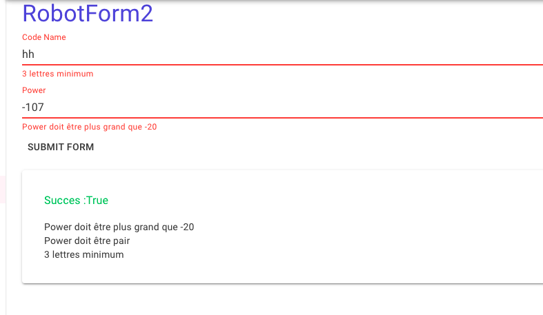
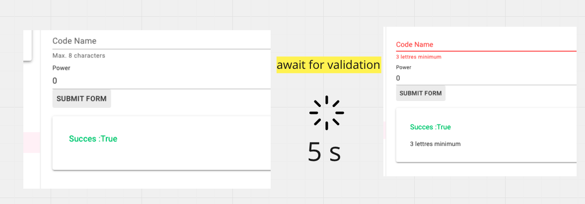
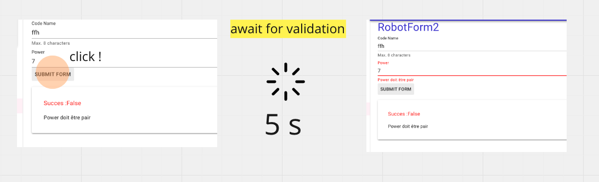

# mud 06.2 Formulaire avec `MudBlazor` et `EditForm`

> Il faut ici utiliser un `button` avec `ButtonType="ButtonType.Submit"`.


## Utiliser un `EditForm`

### Il faut absolument ajouter le `package` suivant: `Components.Forms`

`_Import.cs`

```cs
@using Microsoft.AspNetCore.Components.Forms
```


## Exemple avec `Blazored.FluentValidation`

```bash
dotnet add package Blazored.FluentValidation
```


```ruby
@using Blazored.FluentValidation

<EditForm Model="Robot2" OnValidSubmit="OnValidSubmit" OnInvalidSubmit="OnInvalidSubmit">
	<FluentValidationValidator />
	<MudTextField
		Label="Code Name" 
		HelperText="Max. 8 characters"
		@bind-Value="Robot2.CodeName"
		For="@(() => Robot2.CodeName)"/>
	<MudNumericField
		@bind-Value="Robot2.Power"
		Label="Power"
		Variant="Variant.Text"
		For="@(() => Robot2.Power)"/>

	<MudButton ButtonType="ButtonType.Submit">Submit Form</MudButton>
	<MudPaper Elevation="2" Class="mt-4 pa-8">
		<MudText Typo="Typo.body1" Color="@(success ? Color.Success : Color.Error)">
    		Succes :@success
		</MudText>
		<div class="mt-4">
			<ValidationSummary></ValidationSummary>
		</div>
	</MudPaper>


</EditForm>
```

```cs
@code {
    bool success;

    Robot2 Robot2 { get; set; } = new();

    void OnValidSubmit()
    {
        success = true;
    }

    void OnInvalidSubmit()
    {
        success = false;
    }
}
```



### Le `Validator` : `Robot2Validator.cs`

```cs
public class Robot2Validator : AbstractValidator<Robot2>
{
    public Robot2Validator()
    {
        RuleFor(r => r.CodeName)
            .NotNull()
            .MinimumLength(3).WithMessage("3 lettres minimum")
            .MaximumLength(8).WithMessage("8 lettres maximum");

        RuleFor(r => r.Power)
            .GreaterThanOrEqualTo(-20).WithMessage("Power doit être plus grand que -20")
            .Must(power => power % 2 == 0).WithMessage("Power doit être pair");
    }   
}
```

> ## `Validation` utilisant `HttpClient`
>
> On doit utliser l'`Injection de Dépendance` pour pouvoir utiliser `HttpClient`.
>
> `@inject` et `[Inject]` ne marche que dans un composant, pas dans une classe classique.
>
> ```cs
> public class RobotValidator : AbstractValidator<Robot>
> {
>     private readonly HttpClient? _client;
> 
> 
>     public RobotValidator(HttpClient client)
>     {
>         _client = client;
>         RuleFor(r => r.CodeName)
>             .NotEmpty().WithMessage("Un robot doit avoir un Code Name")
>             .Length(3, 8).WithMessage("Le Code Name ne doit être ni trop long ni trop court");
>         RuleFor(r => r.PreferredWeapon)
>             .NotEmpty().WithMessage("Une arme est obligatoire")
>             .MustAsync(IsExistingWeapon).WithMessage("Une arme se doit d'exister");
>     }
>     
>     private async Task<bool> IsExistingWeapon(Weapon weaponToCheck, CancellationToken token)
>     {
>         var query = $"/robots/isweaponexists?id={weaponToCheck.Id}&name={weaponToCheck.Name}";
>         return await _client!.GetFromJsonAsync<bool>(query, token);
>     }
> }
> ```
>
> `FluentValidationValidator` s'occupe apparemment de l'injection de `HttpClient` car le code fonctionne sans erreurs.


## Validation `Async`hrone

Si je modifie un peu mon `Validator` pour simuler une action `async` (vérification en `DB` par exemple ou via une `API`), je casse le système de validation:

```cs
RuleFor(r => r.Power)
            .GreaterThanOrEqualTo(-20).WithMessage("Power doit être plus grand que -20")
            .MustAsync(async (power, cancellationToken) =>
            {
                await Task.Delay(5000, cancellationToken);
                return  power % 2 == 0;
            }).WithMessage("Power doit être pair");
```



Le formulaire est `Valid` car en toile de fond c'est `Validator.Validate(Model)` et non `Validator.ValidateAsync(Model)`.

On doit donc lancer la validation manuellement en supprimant les événements `OnValidSubmit` et `OnInvalidSubmit` (qui lance automatiquement une validation `synchrone`) et en les remplaçant par `OnSubmit` (où on doit soi-même lancer la validation).

Pour lancer manuellement la validation, on a besoin de prendre une référence vers le `Validator`:

```ruby
<FluentValidationValidator @ref="FluentValidationValidator"/>
    
@code {    
	private FluentValidationValidator? FluentValidationValidator { get; set; } = default!;
```

Et l'utilisée dans la méthode `OnSubmit`:

```cs
async void OnSubmit()
{
    var result = await FluentValidationValidator!.ValidateAsync();

    if (result)
    {
        Console.WriteLine("Submit Valid Form");
        success = true;
    }
    else
    {
        Console.WriteLine("Invalid Form !!!");
        success = false;
    }
}
```


### Code complet

```ruby
@using Blazored.FluentValidation

<EditForm Model="Robot2" OnSubmit="OnSubmit">

    <FluentValidationValidator @ref="FluentValidationValidator"/>

    <MudTextField
        Label="Code Name" HelperText="Max. 8 characters"
        @bind-Value="Robot2.CodeName"
        For="@(() => Robot2.CodeName)"/>

    <MudNumericField
        @bind-Value="Robot2.Power"
        Label="Power"
        Variant="Variant.Text"
        For="@(() => Robot2.Power)"/>

    <MudButton ButtonType="ButtonType.Submit">Submit Form</MudButton>

    <MudText Typo="Typo.body1" Color="@(success ? Color.Success : Color.Error)">
        Succes :@success
    </MudText>

    <ValidationSummary></ValidationSummary>

</EditForm>
```

```cs
@code {
    bool success;

    private FluentValidationValidator? FluentValidationValidator { get; set; } = default!;

    Robot2 Robot2 { get; set; } = new();

    async void OnSubmit()
    {
        var result = await FluentValidationValidator!.ValidateAsync();

        if (result)
        {
            Console.WriteLine("Submit Valid Form");
            success = true;
            StateHasChanged();
        }
        else
        {
            Console.WriteLine("Invalid Form !!!");
            success = false;
            StateHasChanged(); 
        }
    }
}
```

Le comportement est celui attendu:



La validation reste `false` jusqu'au retour du `Validator Async`.

`StateHasChanged` semble nécessaire avec une `validation async` (Ce qui ne semble pas le cas avec un `Validator Synchrone`). 

> J'ai un problème quand j'utilise `MudSelect` avec `MultiSelection` et un `Validator Async` avec un `EditForm` :: Pas résolu - essaie avec `MudForm` ::


## Problème de `reset` du formulaire

```html
<EditForm
    @ref="_form"
    Model="Demandeur"
    OnSubmit="OnSubmit">

    <FluentValidationValidator @ref="_fluentValidationValidator"/>
    // ...
    
    <MudButton
        ButtonType="ButtonType.Submit"
        Disabled="!context.Validate() || !context.IsModified()">
        @ActionLabel
    </MudButton>
```

```cs
async void OnSubmit()
{

    var result = await _fluentValidationValidator!.ValidateAsync();

    if (result)
    {
       // Handle valid submit

        Demandeur = new(); // <- ici je remet le modèle à zéro
    } 
    
    // ...
    StateHasChanged();
```

Si je soumets un formulaire valide et remets à jour le `Model` avec un nouvel objet j'obtient ce résultat:


La validation se déclenche alors que c'est censé être un nouveau formulaire.

### Solution trouvée sur `StackOverflow`

https://stackoverflow.com/questions/60917323/how-to-reset-custom-validation-errors-when-using-editform-in-blazor-razor-page/63356079#63356079

L'idée est de se servir de `EditContext` et de le mettre à jour manuellement:

```html
<EditForm
    @ref="_form"
    EditContext="_editContext"
    OnSubmit="OnSubmit">
```

```cs
private EditContext? _editContext;

protected override void OnInitialized()
{
_editContext = new(State.Demandeur);
}

async void OnSubmit()
{
    var result = await _fluentValidationValidator!.ValidateAsync();

    if (result)
    {
        // Handle Valid Submit
        State.Demandeur = new();
        _editContext = new EditContext(State.Demandeur);
    } 
    
    // ...
    StateHasChanged();
```


Le formulaire est bien à jour, sans `validation` enclenchée alors qu'il n'est pas encore modifier.

Le bouton `submit` est bien `disabled` grâce à ce code:

#### `Disabled="!context.Validate() || !context.IsModified()"`

```html
<MudButton
    Disabled="!context.Validate() || !context.IsModified()">
    + Ajouter un demandeur
</MudButton>
```


