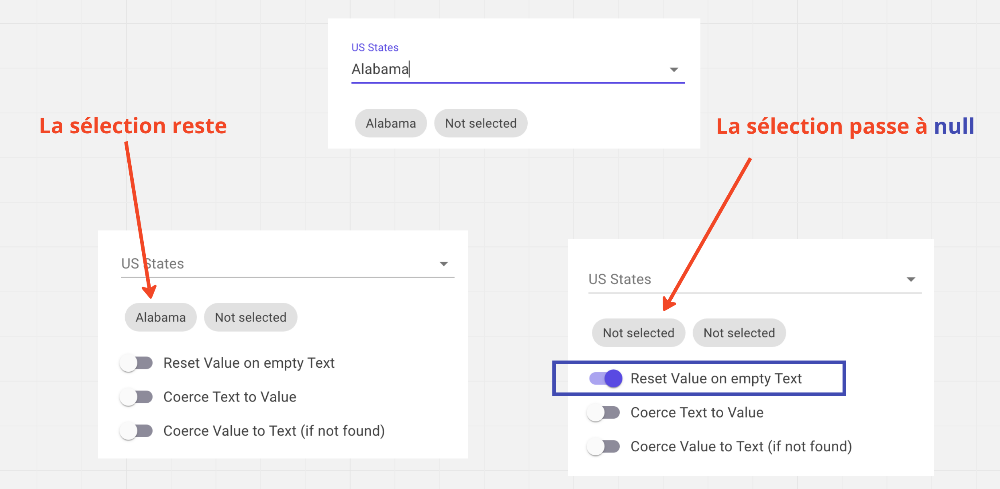
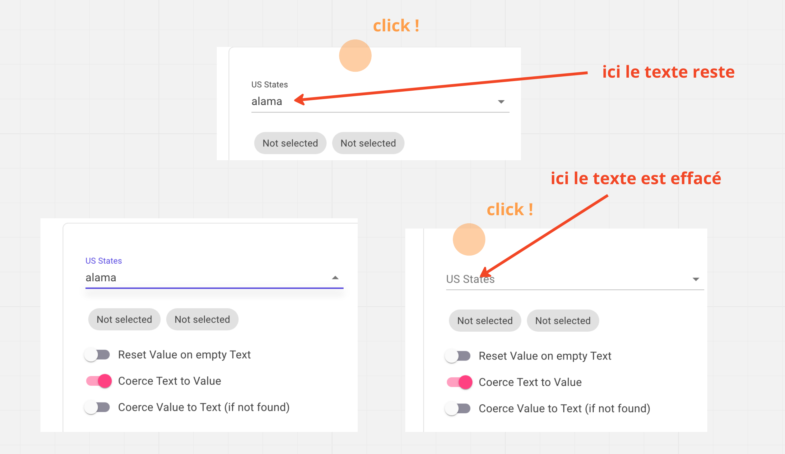
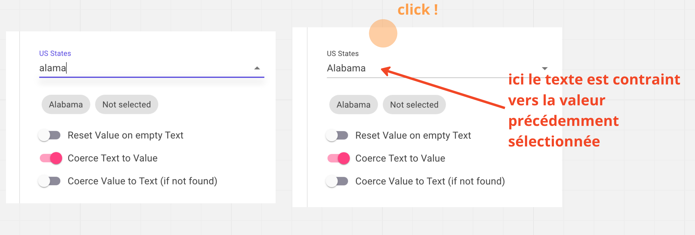
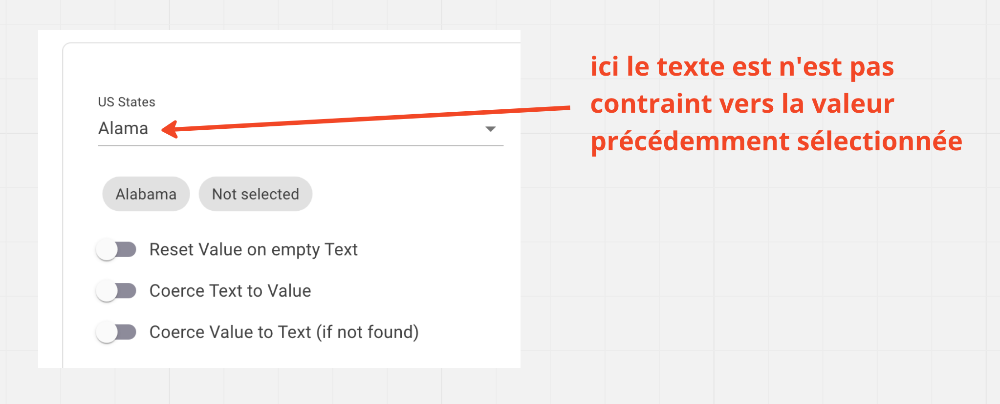
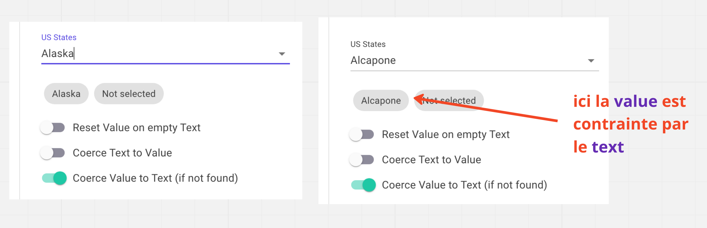

# mud-07 `Autocomplete`


## Exemple

```html
<MudAutocomplete
    T="UtilisateurSearchList"
    Label="Liste des demandeurs"
    @bind-Value="_selectedUtilisateur"
    ResetValueOnEmptyText="true"
    CoerceText="true"
    SearchFunc="@SearchUtilisateur"
    ToStringFunc="@(u => $"{u.Prenom} ({u.Nom})")"/>
```

```cs
IEnumerable<UtilisateurSearchList>? _utilisateurs;
UtilisateurSearchList? _selectedUtilisateur;

private async Task<IEnumerable<UtilisateurSearchList>> SearchUtilisateur(string value)
{
// In real life use an asynchronous function for fetching data from an api.
    await Task.Delay(5);

// if text is null or empty, show complete list
    if (string.IsNullOrEmpty(value))
        return _utilisateurs!;
    return _utilisateurs!
        .Where(
            u => $"{u.Prenom} {u.Nom}".Contains(value, StringComparison.InvariantCultureIgnoreCase)
        );
}
```

On peut aussi retourner une liste vide si `value` est vide:

```cs
if (string.IsNullOrEmpty(value))
    return new UtilisateurSearchList[0];
```


## Composant de base

```html
<MudAutocomplete 
    T="Type" 
    Label="texte affiché" 
    @bind-Value="value" 
    SearchFunc="@Search"
    ToStringFunc="@(e=> e==null?null : $"{e.Name} ({e.Sign})")" />
```

`T` le `type` lié au composant.

`Label` le texte affiché lorsque rien n'est sélectionné

`@bind-Value` défini la variable de type `T` qui est lié à la valeur sélectionnée

`SearchFunc` la fonction de recherche qui a la signature:

```cs
private async Task<IEnumerable<T>> Search(string value)
```

C'est la méthode `ToString` qui est appelée pour afficher la liste dans le composant.

On peut `overrider` ce comportement avec la propriété `ToStringFunc`:

```cs
public Func<T,string> ToStringFunc { get; set; }
```


## `ResetValueOnEmptyText`, `CoerceText` et `CoerceValue`

Ce sont trois valeurs `booléennes` contraignant le comportement (`coerce`) du composant.


### `Reset Value On Empty Text`

```html
<MudAutocomplete
    ResetValueOnEmptyText="true"
```

Si le texte de l'`autocomplete` est vide, la variable lié par `@bind-Value` est vidée (passe à `null`).




### `Coerce Text` : contraindre le texte

```html
<MudAutocomplete
    CoerceText="true"
```

Si le texte tapé ne correspond à aucun élément, il est effacé.



S'il existe déjà une `Value` choisie, un texte non valide sera contraint vers cette `Value`.






### `Coerce Value` : Contraindre la valeur

```html
<MudAutocomplete
    CoerceValue="true"
```

Ici c'est la `Value` qui est contrainte de prendre la valeur du `Text`.




