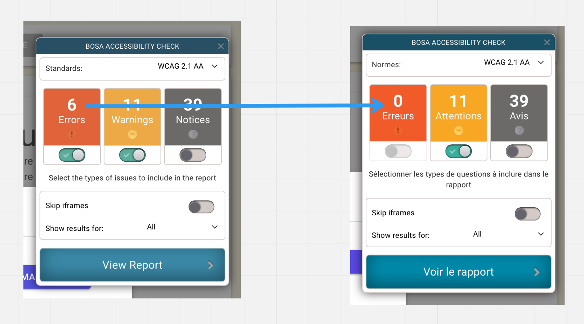

# mud-08 `Accessibility`


## BOSA Accessibility Check

https://openfed.github.io/AccessibilityCheck/




## `MudAutocomplete`

Il suffit d'ajouter un attribut `aria-label`.

```html
<MudAutocomplete
    T="UtilisateurSearchList"
    Label="Liste des demandeurs"
    @bind-Value="_selectedUtilisateur"
    ResetValueOnEmptyText="true"
    CoerceText="true"
    SearchFunc="@SearchUtilisateur"
    ToStringFunc="@(u => $"{u.Prenom} ({u.Nom})")"
    aria-label="autocomplete choix du nom et prénom d'un demandeur"/>
```


## `MudIconButton`

Il suffit d'ajouter un attribut `aria-label`.

```html
<MudIconButton 
    Icon="@Icons.Material.Outlined.Notifications"
    aria-label="affichage des notifications"/>
```


## `MudMenu` 

Il faut utiliser la forme `Custom Activator` avec les composants `ActivatorContent` et `ChildContent`.

On peut alors utiliser le composant que l'on souhaite comme `activator`, ici un `MudIconButton` où il suffit d'ajouter un attribut `aria-label`.

```html
<MudMenu
    AnchorOrigin="Origin.BottomCenter" 
    TransformOrigin="Origin.TopRight">
    <ActivatorContent>
        <MudIconButton
            Icon="@Icons.Material.Outlined.Face"
            aria-label="menu de gestion des utilisateurs"/>
    </ActivatorContent>
    <ChildContent>
        <MudMenuItem OnClick="OpenGererDemandeur">
            Gérer les Demandeurs : @_isGererDemandeurVisible
        </MudMenuItem>
        <MudMenuItem OnClick="OpenGererUtilisateurGreffe">
            Gérer les Utilisateurs du Greffe : @_isGererUtilisateurGreffeVisible
        </MudMenuItem>
    </ChildContent>
</MudMenu>
```

