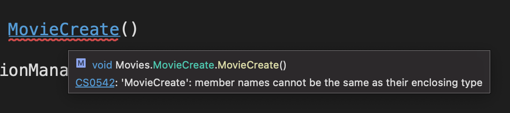

# 02  `Razor` : les directives `@something`

Les composant d'extension `.razor` utilise la syntaxe `Razor`.


## `@`

Permet d'écrire la valeur d'une expression `c#` dans le code `html`.

```cs
<p>@name</p>

@code {
    string name = "Jojo";
}
```

On parle ici d'expression `implicite`.

Parfois il n'est pas possible que l'expression soit implicite, on utilise alors les parenthèses :

```cs
<p>2 + 2 = @(2 + 3)</p>
```

C'est une expression `explicite`.

### `css` conditionnel

```cs
@for(var i = 0; i < movies.Count; i++)
{
    <div style="color: white;background-color: @(i % 2 == 0 ? "blue" : "red")">
        <p>@(i + 1) - @movies[i].Title</p>
    </div>
}
```

#### ! On remarque qu'on peut imbriquer les guillemets doubles : `"` sans erreur de compilation (mais parfois l'affichage dans l'`ide` bug un peu).


## `@page`

Permet de renseigner le composant comme `page` et de lui attribuer une route :

```cs
@page "/user"
```

C'est la seule différence entre un `composant` et une `page`.

On peut donner plusieurs routes à un seul composant `page` :

```cs
@page "/ici"
@page "/aussi/ici"
```


## `@inject`

Injecte un service dans le composant.

Le service doit être ajouté au conteneur de service dans `Program.cs`

```cs
@inject HttpClient httpClient
```


## `@using`

Permet d'importer les classes d'un `namespace` dans le composant.

```cs
@using Models
```


## `@implements`

Permet d'implémenter une interface.

```cs
@implements IDisposable
    
@code {
    void Dispose()
    {
        // ...
    }
}
```


## `@Body`

Rend à cet emplacement le composant `page` détermibé par le routeur :

```html
<MudMainContent>
  @Body
</MudMainContent>
```


## `@page`

Permet à `Blazor` d'utiliser le composant comme une page avec l'`url` fournie.

Le routeur sait qu'il devra charger ce composant à cette `url`.

```cs
@page "/todo/new"
```


## `@foreach`

Permet de boucler sur un `Enumerable`.

```cs
@foreach (var robotType in RobotType.List())
{
  <option value="@robotType.Value">@robotType.Name</option>
}
```


## `@for`

C'est la boucle classique permettant de jouer avec l'index.

```cs
@for(var i = 0; i < movies.Count; i++)
{
    <div>
        <p>@(i + 1) - @movies[i].Title</p>
    </div>
}
```


## `@if`

Pour afficher en `loader` pendant que les données chargent.

```cs
@if (movies is null)
{
    <svg>
        <circle> <animateTransform /> </circle> // svg loader
    </svg>
}
else if(movies.Count == 0)
{
  <text>There are no movie to show</text>
}
else
{
    @foreach (var movie in movies)
    {
        // do something
    }
}
```

### svg loader

https://codepen.io/nikhil8krishnan/pen/rVoXJa


## `@bind`

`@bind` fonctionne dans les deux sens : `two way binding`.

La mise à jour de la valeur se fait à la perte du focus (`onchange`) et non quand la valeur change (`oninput`). 

Dans un formulaire lie un champ avec le `Model` :

```cs
<select name="Type" id="Type" @bind="robotModel.RobotType">
  <option value="0" disabled selected>-- Select Type --</option>
  @foreach (var robotType in Enum.GetValues<RobotType>())
  {
    <option value="@robotType">@robotType</option>
  }
</select>
```

`Enum.GetValues<ModelType>()` renvois un tableau des constantes de l'énumération.

dans le `template` un type `Enum` est directement converti en texte.

### Ajouter `bind` sur un autre événement : `@bind:event`

```cs
<label for="Name">Name : @robotModel.Name</label>
        <input type="text" id="Name" 
  				@bind="robotModel.Name" 
  				@bind:event="oninput">
```

On retrouve le `two way binding` classique d'autre `framework`.


## `@code`

Contient la logique du composant :

```cs
@code {
  private WeatherForecast[]? forecasts;

  protected override async Task OnInitializedAsync()
  {
    // ...;
  }
}
```

#### ! Les membres d'un composant ne peuvent pas avoir le même nom que le composant lui-même :



Pour les `handler` (gestionnaire d'événement) on peut simplement mettre le préfixe `On` devant :

```cs
<button @onclick="OnMovieCreate">Create</button>
  
@code {
  public void OnMovieCreate()
  {
    // ...
  }
}  
```


## `@attribute`

Permet d'utiliser les attributs `C#` dans les `component`.

```cs
@attribute [Authorize]
```


