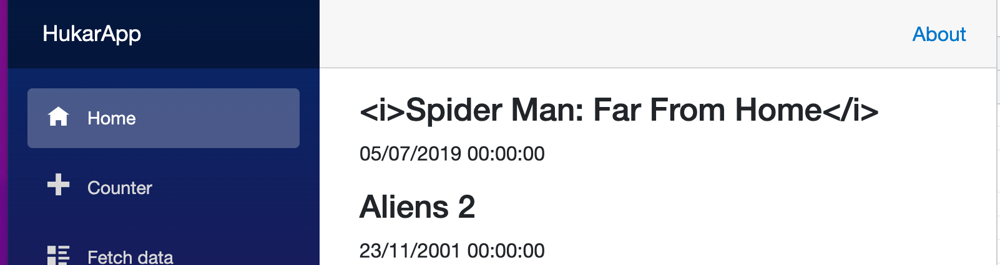
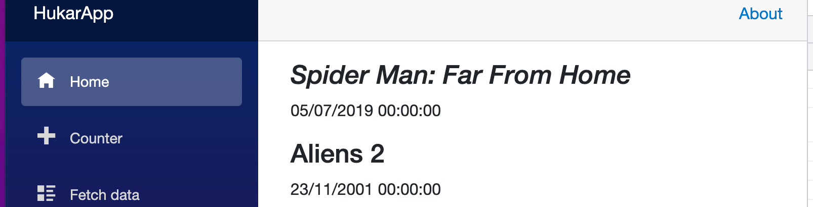

# 02.5 `MarkupString`

Par défaut les balises `html` sont échapées à l'affichage :

```cs
Title = "<i>Spider Man: Far From Home</i>",
```

```html
<h3>@movie.Title</h3>
```



Si on veut que le `html` soit interprété, on doit caster le rendu. vers `MarkupString` :

```cs
<h3>@((MarkupString)movie.Title)</h3>
```



#### ! C'est une possible source d'injection de code.

