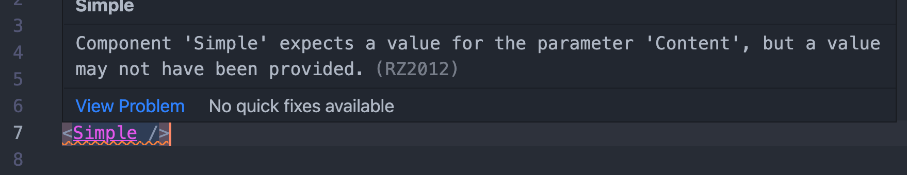

# 00 Les `composants`

Un composant est une `class`.

## Composant simple

```cs
@inject HttpClient Http @* ici les directives *@

<div>
  ici le template
</div>
  
@code {
  @* Ici les membres du composant : champ, propriété, méthodes *@
}
```


## Les membres

Par défaut les membres d'un `component` sont `private`.


## `Layout`

Le `Layout`est aussi un composant qui hérite de `LayoutComponentBase`:

`MainLayout.razor`

```cs
@inherits LayoutComponentBase
  
<div> // ... 
  
  @Body
```

### `@Body`

C'est à cet endroit que les composant routable (`Pages`) vont être rendus.


### `App.razor`

C'est `App.razor`qui définit quel `Layout`est utilisé :

```cs
<RouteView RouteData="@routeData" DefaultLayout="@typeof(MainLayout)" />
```

C'est aussi le `routeur`.


## `[Parameter]`

Trois condition pour récupérer les paramètres (depuis les attribut `html` ou l'`url`) :

1. Ajouter une annotation `[Parameter]`.
2. `[Parameter]` doit être placer devant une propriété, pas devant un simple champ (`field`).
3. Cette `property` doit être déclarée `public`.

###  Récupérer les paramètres de l'`url` :

```cs
@page "/Playground"
@page "/Playground/{ParamOne:int}"
@page "/Playground/{ParamOne:int}/{ParamTwo}"

<p>@ParamOne</p>
<p>@ParamTwo</p>

@code {
    [Parameter]
    public int ParamOne { get; set; }
    [Parameter]
    public string? ParamTwo { get; set; }
}
```

Si le paramètre n'est pas un `string` (mais un `decimal`, `bool`, `int`, `float`, ... ), on doit spécifier le type dans la directive `@page` : 

```cs
@page "/Playground/{ParamOne:int}"
```


## Passer des données `Parent => Child`

De la même manière on peut passer des données en utilisant `[Parameter]` :

Dans le `Parent.razor` :

```cs
<Child SuperData="datas" /> // <= on passe les données
  
@code {
  List<Item> datas = new();
  
  public override void OnInitialized()
  {
    datas.AddRange( ... );
  }
}
```

Dans `Child.razor`

```cs
// ...

@code {
  [Parameter] 
  public List<Item> SuperData { get; set; } = new();
}
```


## Méthode en paramètre

On peut passer une méthode en paramètre en utilisant les types `Func` ou `Action`.

On l'utilise grâce à `Invoke`.

Pour rappel :

- `Func<T, TResult>` est une méthode renvoyant un résultat de type `TResult`.
- `Action<T>` renvoie `void`.

Les `EventCallback` sont utilisé avec les gestionnaire d'événement utilise `InvokeAsync` et ne renvoie rien.

#### Dans le composant parent

```cs
<NormSelect ValidateBy="ValidateByProperty" />
  
 @code {
    public IEnumerable<string> ValidateByProperty(string property)
    {
      // ...
```

#### Dans le composant enfant

```cs
<MudSelect
    Validation="@((Norm norm) => ValidateBy!.Invoke("Norm"))"
  	// ...
  
@code {
	[Parameter] public Func<string, IEnumerable<string>>? ValidateBy { get; set; }  
```


## Paramètre obligatoire `[EditorRequired]`

Permet d'avoir dans l'éditeur un message spécifiant que le paramètre est requis.

```cs
<h2>  I'm Simple </h2>
<p>@Content</p>

@code {
    [Parameter]
    [EditorRequired]
    public string Content { get; set; } = "";
}
```



Ne provoque pas d'erreur au `Runtime`.


