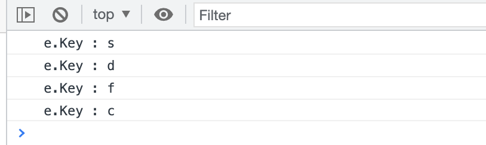
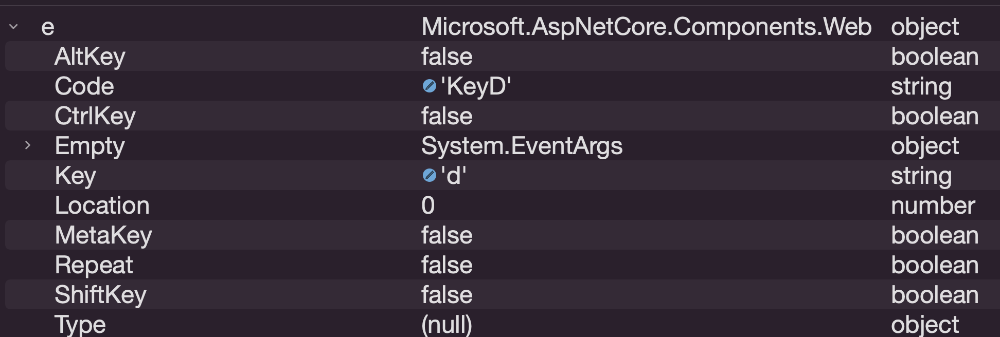

# 01 `Event`

## `@on<event>`

`bind` un événement.

```cs
<form @onsubmit="HandleFormSubmit">
```

`@onclick`, `@onchange`, `@oninput`, ...

On lui passe le nom d'une méthode.

On peut aussi mettre un `@` devant le nom :

```html
<form @onsubmit="@HandleFormSubmit">
```

On peut aussi y placer une `lambda` :

```html
<button @onclick='() => Console.WriteLine("Aye Aye")'>
  Click Me If You Can
</button>
```

Le `@on<event>` attend comme valeur une `callback`.

Si on doit passer un paramètre à la fonction `callback`, on peut utiliser une `lambda` :

```html
<button @onclick="() => DisplayLog(3)"> ... </button>
```


## `EventCallback`

On veut passer une méthode d'un parent à un enfant par les paramètres.

### Dans le parent

On implémente la méthode et on la passe en paramètre :

```cs
@foreach (var movie in Movies)
{
  <MovieItem Movie="movie" DeleteMovie="DeleteMovie"/>
}

@code {
  [Parameter] 
  public List<Movie> Movies { get; set; } = new();

  public void DeleteMovie(Movie movie)
  {
    Movies.Remove(movie);
  }
}
```


### Dans l'élément enfant

On récupère le lien vers la méthode et on l'exécute grâce à `InvokeAsync` :

```cs
<button @onclick="() => DeleteMovie.InvokeAsync(Movie)" />
  
@code {
  [Parameter] public EventCallback<Movie> DeleteMovie { get; set; }
}
```

La version générique de `EventCallback<T>` de passer un paramètre de type `T` à la méthode `callback`.


## `@onkeypress` : `KeyboardEventArgs`

On veut récupérer le caractère de la touche pressée :

```cs
<input @onkeypress="(KeyboardEventArgs e) => KeyPress(e)">
  
@code {
  public void KeyPress(KeyboardEventArgs e) 
    => Console.WriteLine($" e.Key : {e.Key}"); 
```



Voici le contenu de l'objet `e` de type `KeayboardEventArgs` :


