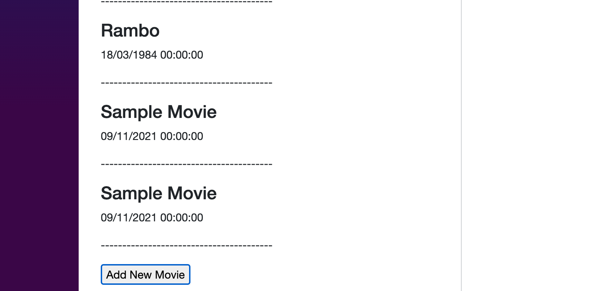
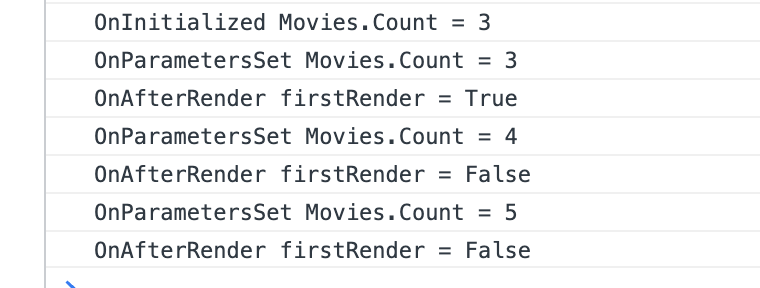
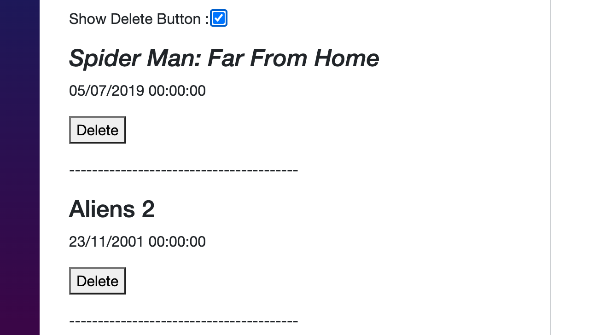
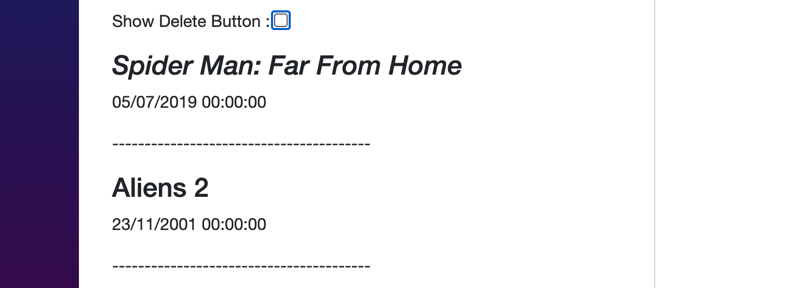
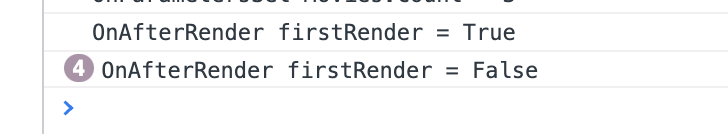
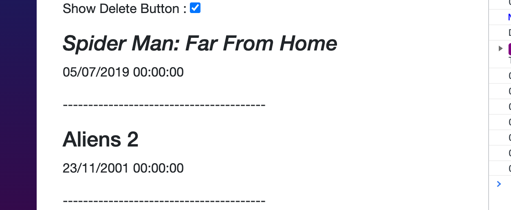

# 02 Cycle de vie

## `OnInitialized` `OnInitializedAsync`

```cs
protected override void OnInitialized()
protected override Task OnInitializedAsync()
```

Faire une requête HTTP pour obtenir les données sync ou async.
Exécuté une seule fois.

```cs
protected async override Task OnInitializedAsync()
{
  base.OnInitialized();

  await Task.Delay(3000);
  movies = new() { /% ... */ };
}
```

Ici on simule une requête avec une latence de `3000` millisecondes.


## `OnParameterSet` `OnParameterSetAsync`

```cs
protected override void OnParametersSet()
protected override Task OnParametersSetAsync()
```

Exécuté quand les paramètres change de valeur.

```cs
protected override void OnParametersSet()
{
  Console.WriteLine($"OnParametersSet Movies.Count = {Movies.Count}");
}
```

À chaque fois que j'ajoute un `movie`, cette méthode est exécutée :






## `OnAfterRender` `OnAfterRenderAsync`

```cs
protected override void OnAfterRender(bool firstRender)
protected override Task OnAfterRenderAsync(bool firstRender)
```
Exécuté chaque fois que le composant est rendu.
Les élément du `DOM` sont disponible pour être manipulés par `javascript` par exemple.

```cs
protected override void OnAfterRender(bool firstRender)
{
  Console.WriteLine($"OnAfterRender firstRender = {firstRender}");
}
```


## `ShouldRender`

```cs
protected override bool ShouldRender()
```

Défini si un composant doit être encore rendu après le premier rendu.

```cs
protected override void OnAfterRender(bool firstRender)
{
  Console.WriteLine($"OnAfterRender firstRender = {firstRender}");
}

protected override bool ShouldRender() => true;
```





Les éléments sont re-rendu si nécessaire :



On va renvoyer maintenant `false` :

```cs
protected override bool ShouldRender() => false;
```



Les éléments ne sont maintenant plus que rendu une fois.


## `SetParametersAsync`

```cs
public override Task SetParametersAsync(ParameterView parameters)
```


