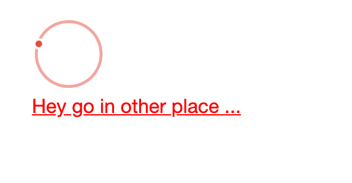

# 03 `RenderFragment`

On peut vouloir parfois passer un `Razor Component` ou du contenu `html ` à un autre `Razor Component`.

On utilise pour cela les `RenderFragment`.

```cs
@if (Movies is null)
{
    <svg> /* ... */ </svg>
    @ChildContent
}

@code {
	[Parameter] public RenderFragment ChildContent { get; set; }
```

Dans le `parent` :

```cs
@* <MoviesList Movies="movies" /> *@
<MoviesList Movies="movies">
    <p><a href="#" style="color:red;">Hey go in other place ...</a></p>
</MoviesList>
```

On peut donc placer ce qu'on veux entre les deux `tags` de notre composant, ce contenu sera affiché à l'emplacement défini par `@ChildContent`.



### Rendu conditionnel (`template` par défaut)

On souhaite afficher le `RenderFragment` s'il y en a un sinon autre chose :

```cs
if (@ChildContent != null)
{
  @ChildContent
}
else
{
  // <p>bla bla</p>
```


## Plusieurs `Fragments`

On veux pouvoir avoir plusieurs `template de fragment` utilisable pour un composant.

On va donc déclarer plusieurs `RenderFragment` et les déposer à plusieurs endroits :

```cs
@if (Movies is null)
{

    if (@NullTemplate != null)
    {
        @NullTemplate
    }
    else
    {
        <text>Wait loading ... </text>
    }
}
else if (Movies.Count == 0)
{
    @if(EmptyTemplate != null)
    {
        @EmptyTemplate
    }
    else
    {
        <text>No movie for an old man ...</text>
    }  
}
else
{
  // ...
  
@code {
  [Parameter] public RenderFragment? NullTemplate { get; set; }
  [Parameter] public RenderFragment? EmptyTemplate { get; set; }
}
```

Dans le `parent` on doit pouvoir indiquer l'emplacement dans le composant `enfant`, on utilise le nom du `RenderFragment` comme `tag` :

```cs
<MoviesList Movies="movies">
    <NullTemplate>
    	<p>Hey you must wait movies ...</p>
    </NullTemplate>
    <EmptyTemplate> 
        <p>No movie today 😥</p>
    </EmptyTemplate>   
</MoviesList>
```


## Genericité et `RenderFragment`

On veut créer un composant pouvant gérer n'importe quel type de liste :

`GenericList.razor`

```cs
@typeparam TItem

@foreach(var element in List)
{
  @ElementTemplate(element);
}
  
@code {
  [Parameter] public RenderFragment<TItem>? ElementTemplate { get; set; } 
  [Parameter] public List<TItem>? List { get; set; }
}  
```

#### ! `@` obligatoire devant `@ElementTemplate`.

Pour passer `element` au parent on utilise le `context` :

`MovieList.razor`

```cs
<GenericList List="Movies">
  <ElementTemplate>
  	<IndividualMovie Movie="context">
  </ElementTemplate>
</GenericList>
  
@code {
  [Parameter] public List<Movie> Movies { get; set; }
}
```

On peut aussi écrire le `context` de cette façon :

```cs
<ElementTemplate Context="movie">
  <IndividualMovie Movie="movie">
</ElementTemplate>
```

Cela permet de renommer son `context`.


## `Razor Syntax`à l'intérieur d'un `Render Fragment`

On peut aussi écrire des instructions `Razor`à l'intérieur de la place laissé pour le `Render Fragment`:

```cs
<Confirmation @ref="confirmation" onCancel="onCancel" onConfirm="onConfirm">
    @if (isMyFriend)
    {
        <div>Do you wish to delete @movieToDelete?.Title Guy 🐵 ?</div>
    }
    else
    {
        <div>Please delet this @movieToDelete?.Title my lord 🤖 ?</div>
    }
</Confirmation>
```

Ici un `@if` nous permet de choisir ce que l'on passe comme `Render Fragment`.


