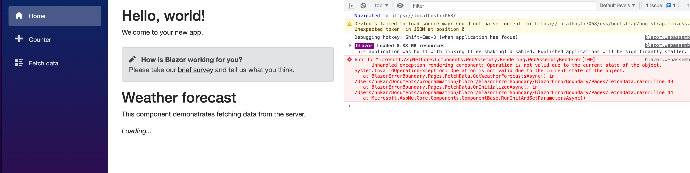
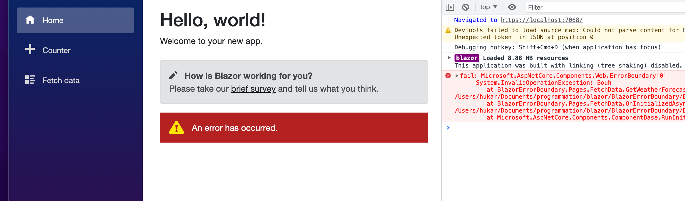
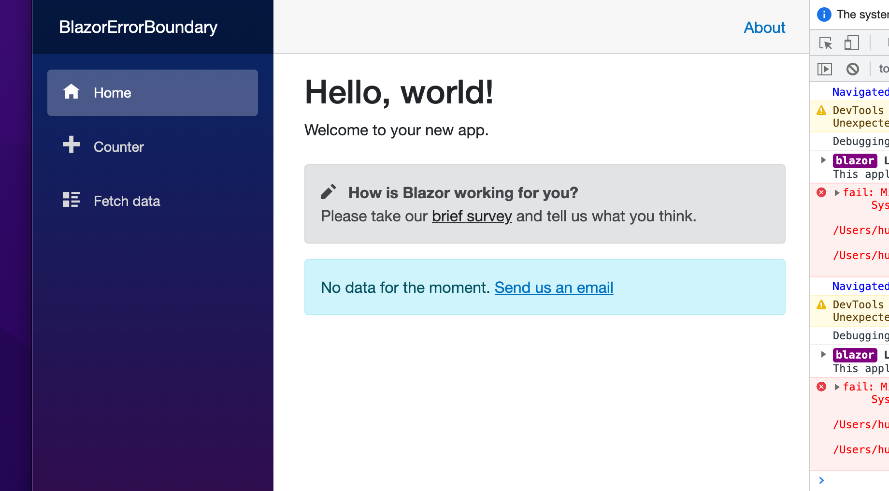

# 07 Limite des erreurs

## `<ErrorBoundary>`

En cas d'erreur dans un composant, on peut avoir un comportement non souhaité comme ce `Loading ...` qui reste figé :



On peut utiliser la balise `<ErrorBoundary>` pour gérer une erreur de composant :

```asp
<ErrorBoundary>
    <FetchData />
</ErrorBoundary>
```



On a un `template` par défaut qui annonce à l'utilisateur qu'une erreur s'est produite.


## `ChildContent` et `ErrorContent`

On peut créer son propre comportement en cas d'erreur grâce à `ChildContent` et `ErrorContent` :

```cs
<ErrorBoundary>
    <ChildContent>
        <FetchData />
    </ChildContent>
    <ErrorContent>
        <div class="alert alert-info">
            No data for the moment.
            <a href="mailto:j@h.be">Send us an email</a>
        </div>
    </ErrorContent>
</ErrorBoundary>
```



