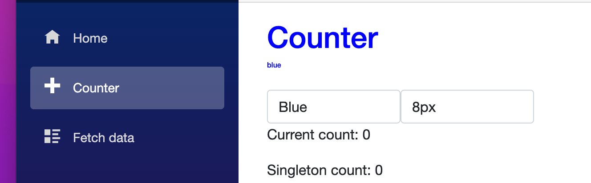

# 09 `Cascading Parameter`

Cela permet de rendre accessible des données à tous les décendants.

Si on ajoute un composant `CascadingValue` dans le `MainLayout` ses données seront accessibles dans toutes l'application.

`MainLayout.cs`

```cs
@inherits LayoutComponentBase
<!-- ... -->

<article class="content px-4">
  <CascadingValue Value="Color">
    @Body
  </CascadingValue>
</article>
  
@code {
    private string Color { get; set; } = "red";
}
```

On utilise ce `CascadingValue` grâce à l'annotation `[CascadingParameter]` :

`ChildComponent.razor`

```cs
<h3 style="color:@color">My Title</h3>
  
@code {
  [CascadingParameter] public string? Color { get; set; }
}  
```

Les `[CascadingParameter]` ne sont appliquable que sur les `Property`.


## Plusieurs `[CascadingValue]`

On peut imbriquer les `[CascadingValue]`  pour avoir plusieurs `[CascadingParameter]` 

```cs
<CascadingValue Value="Color">
  <CascadingValue Value="Size">
    @Body
  </casacadingValue>
</casacadingValue>
  
@code {
  private string Color { get; set; }
  private string Size { get; set; }
}  
```

```cs
<h1 style="color:@Color;font-size:@Size">Counter</h1>
  
@code {
  [CascadingParameter] public string? Color { get; set; }
  [CascadingParameter] public string? Size { get; set; }
}  
```


## `cascadingValue` : `Name`

On peut aussi nommer une `CascadingValue` :

```cs
<CascadingValue Value="Color" Name="FontColor">
```

```cs
<h1 style="color:@FColor;font-size:@Size">Counter</h1>
<h2>@FColor</h2>
  
@code {
  [CascadingParameter(Name = "FontColor")] public string? FColor { get; set; }
  [CascadingParameter] public string? Size { get; set; }
}  
```


## Passer une `class`

Si on veut passer plusieurs valeurs, ils est alors plus simple de passer une `class`.

`MainLayout.razor`

```cs
<CascadingValue Value="appState">
  @Body
</CascadingValue>
  
@code {
    public AppState appState { get; set; } = new AppState();

    public class AppState
    {
        public string Color { get; set; } = "green";
        public string Size { get; set; } = "8px";
    }
```


`Counter.razor`

```cs
@using static HukarApp.Client.Shared.MainLayout
  
<h1 style="color:@AppState!.Color;font-size:@AppState!.Size">Counter</h1>
<h2>@AppState!.Color</h2>
  
@code {
  [CascadingParameter] public AppState? AppState { get; set; } 
```

On peut modifier le `AppState`  en temps réel grâce à l'attribut `@bind`.

Exemple avec des `select` :

```html
<select @bind="AppState.Color">
  <option value="green">Green</option>
  <option value="red">Red</option>
  <option value="blue">Blue</option>
</select>

<select @bind="AppState.Size">
  <option value="8px">8px</option>
  <option value="12px">12px</option>
  <option value="20px">20px</option>
  <option value="30px">30px</option>
</select>
```

Et le changement sera accessible à tous les composants ayant un `[CascadingParameter]` relié à `AppState` :

`Index.razor`

```cs
@using static HukarApp.Client.Shared.MainLayout
  
<h3 style="color:@AppState!.Color">Movies List</h3>
  
@code {
  [CascadingParameter] public AppState? AppState { get; set; }
```



