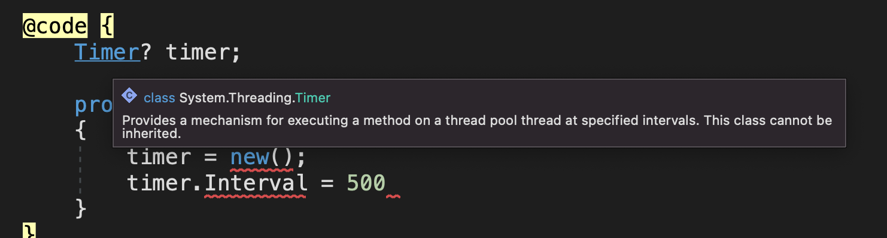
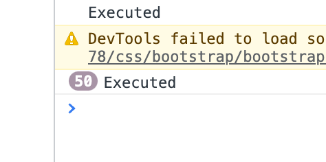

# 11 `Timers` et `IDisposable`


## `Timer`

```cs
@using System.Timers

@code {
  Timer timer;
  protected override void OnInitialized()
  {
    timer = new();
    timer.Interval = 500;
    timer.Elapsed += OnTimerElapsed;
    timer.Start();
  }
  
  private void OnTimerElapsed(object? sender, ElapsedEventArgs e)
  {
    Console.WriteLine("Executed");
  }
}
```

#### ! `@using System.Timers` est obligatoire car par défaut c'est le `Timer`de `System.Threading`qui est utilisé :



Pour le moment `OnTimerElapsed` ne s'arrête jamais, même si on change de page :



On doit *Disposer* du `Timer`: `IDisposable`.


## `IDiposable`

On doit implémenter dans le composant l'`interface`: `IDisposable`

```cs
@implements IDisposable
  
@code {
  // ...
  
  public void Dispose()
  {
    if(timer != null)
    {
      timer.Dispose();
    }
  }
}  
```

Maintenant le `Timer` s'arrête bien lorsqu'on change de page.


## `StateHasChanged`

Lorsqu'on est dans une fonction utilisée par un `Timer`, on est en dehors des cycles de vie de `Blazor`. `StateHasChanged`permet de dire à `Blazor`explicitement que quelque chose a été modifié.

```cs
protected override void OnInitialized()
{
  // ...
  timer = new();
  timer.Interval = 500;
  timer.Elapsed += OnTimerElapsed;
  timer.Start();
}

private void OnTimerElapsed(object? send, ElapsedEventArgs e)
{
  // ...
  StateHasChanged();
}
```


## `timer.Start()` et `timer.Stop()`

Il est possible d'arrêter et de relancer le `timer` avec ses deux méthodes `Start` et `Stop`.

```cs
private void SelectHand(Hand hand)
{
  timer!.Stop();
  var gameStatus = hand.PlayAgainst(opponentHand!);
  // ...
```

```cs
private void PlayAgain()
{
  timer!.Start();
  resultMessage = String.Empty;
}
```


## Une seule action : `AutoReset = false`

On peut régler le `Timer` pour qu'il ne s'exécute qu'une seule fois avec `myTimer.Autoreset = false`.

### Exemple `OneTime.razor`

```cs
@using System.Timers

<div>
    <p>Firts : @FirstContent</p>
    <p>Second : @SecondContent</p>
</div>

@code {
    string FirstContent = String.Empty;
    string SecondContent = String.Empty;

    Timer firstTimer = new Timer();
    Timer secondTimer = new Timer();

    protected override void OnInitialized()
    {
        firstTimer.Interval = 1000;
        secondTimer.Interval = 2200;
      
        firstTimer.AutoReset = false;
        secondTimer.AutoReset = false;

        firstTimer.Elapsed += SetFirstContent;
        secondTimer.Elapsed += SetSecondContent;

        firstTimer.Start();
        secondTimer.Start();
    }

    void SetFirstContent(Object? source, ElapsedEventArgs e)
    {
        FirstContent = "My First content 👻";
        StateHasChanged();
    }
    void SetSecondContent(Object? source, ElapsedEventArgs e)
    {
        SecondContent = "My First content 🍔";
        StateHasChanged();
    }
}
```

Il ne faut pas oublier d'utiliser `myTimer.Start()` pour lancer le `Timer`.

Il faut aussi mettre à jour le rendu avec `StateHasChanged()`.
