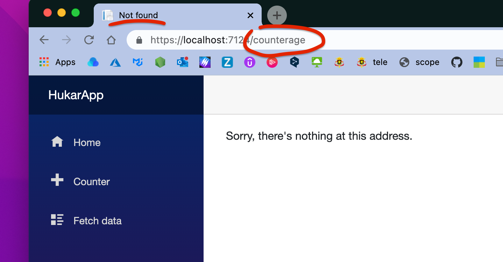
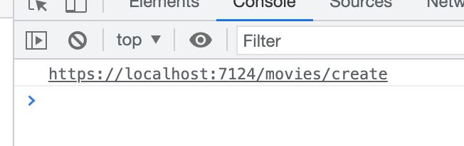
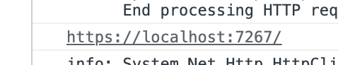
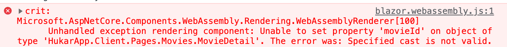
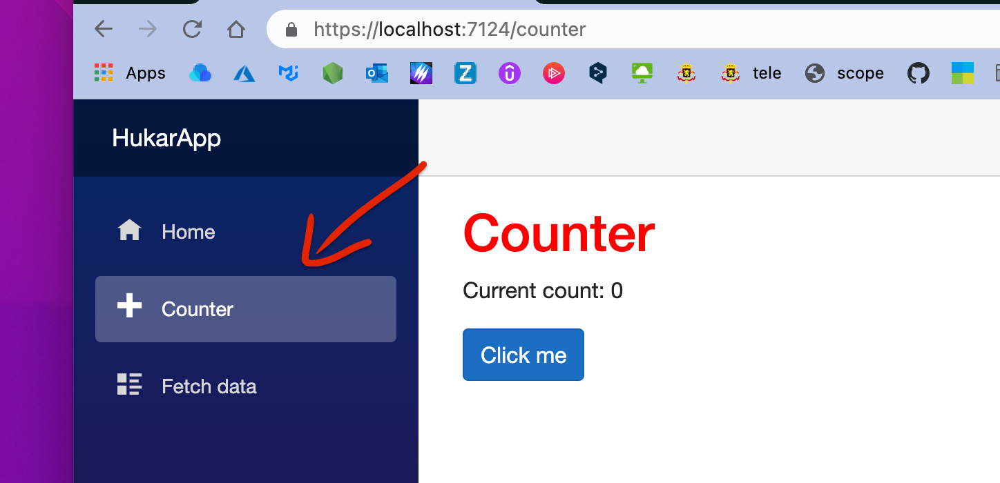
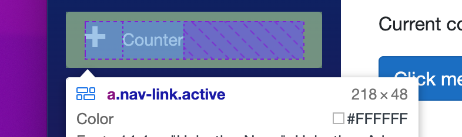
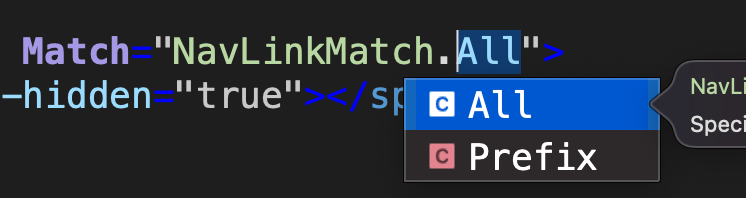
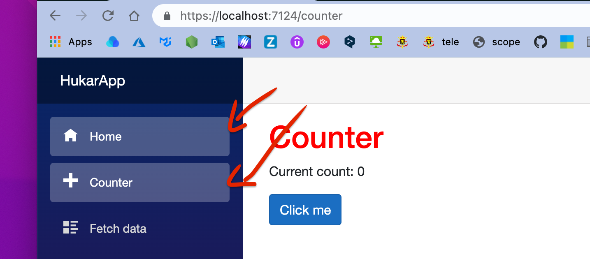
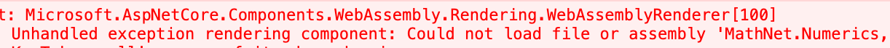
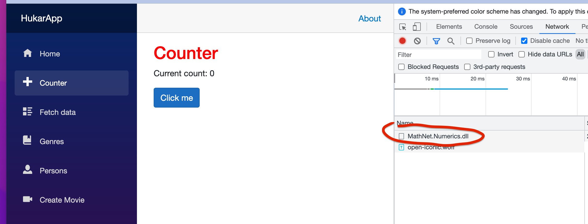

# 05 Le routage

## La directive `@page`

Définit la route pour se rendre à un composant spécifique.

```cs
@page "/myadresse"
```

L'adresse doit obligatoirement commencer par `/`.


### Plusieurs directive `@page`

Un composabt peut avoir plusieurs adresses auxquels il est accessible :

```cs
@page "/"
@page "/index"
@page "/home"  
```


## Gestion des erreurs

Si on va à une adresse érronée on obtient :



Ce message d'erreur par défaut est généré et customisable dans `App.razor` qui est le **routeur** de l'application.


## `App.razor`

On y trouve le `router` :

```cs
<Router AppAssembly="@typeof(App).Assembly">
```

Une partie si la `route`est bien trouvée : `<Found>`

```cs
<Found Context="routeData">
  <RouteView RouteData="@routeData" DefaultLayout="@typeof(MainLayout)" />
  <FocusOnNavigate RouteData="@routeData" Selector="h1" />
</Found>
```

Une partie si la `route`n'est pas trouvée : `<NotFound>`

```cs
<NotFound>
  <PageTitle>Not found</PageTitle>
  <LayoutView Layout="@typeof(MainLayout)">
  <p role="alert">Sorry, there's nothing at this address.</p>
  </LayoutView>
</NotFound>
```


### Créer un composant  `CustomNotFound`

`CustomNotFound.razor`

```cs
<p style="color:blue">Sorry, there's nothing at this address.</p>

@code {
    protected override void OnInitialized()
    {
        Console.WriteLine("Page not found");
    }
}
```

Dans `App.razor`

```cs
<NotFound>
        <PageTitle>Custom Not found</PageTitle>
        <LayoutView Layout="@typeof(MainLayout)">
            <CustomNotFound />
        </LayoutView>
    </NotFound>
```


## `NavigationManager` : navigation programmé

### Naviguer avec de simple `URL`

On peut simplement naviguer avec une balise `<a>` et une chaîne de caractère représentant l'` URL` :

```cs
<p><a href="@movieURL">@Movie.TitleBrief</a></p>
  
@code {
  string movieURL = String.Empty;

  protected override void OnInitialized()
  {
    movieURL = $"movies/";
  } 
```


### Naviguer avec `NavigationManager`

On peut naviguer depuis le code en utilisant `NavigationManager.NavigateTo(uri)`, où ` uri` est simplement un `string`.

Il faut d'abord injecter le service `NavigationManager`:

```cs
@inject NavigationManager NavigationManager
  
<input type="number" @bind="FirstValue" />  : 
<button @onclick="SetFirstValue">
  Go to Count with first vale : @FirstValue
</button>

@code {
    public int FirstValue { get; set; }

    public void SetFirstValue()
    {
        var uri = $"/counter?firstvalue={FirstValue}";
        NavigationManager.NavigateTo(uri);
    }
}
```


### Récuperer l'`URL` avec `NavigationManager.Uri`

On peut récupérer l'`URL` de l'endroit où se trouve le composant avec `NavigationManager.Uri` :

```cs
Console.WriteLine(NavigationManager.Uri);
```




### `BaseUri`

```cs
void GoToList()
{
    Console.WriteLine($"{navigationManager.BaseUri}");
    navigationManager.NavigateTo($"{navigationManager.BaseUri}{Target}");
}
```



On a déjà un `/` dans `BaseUri`.


## Paramètre de `Route`

```cs
@page "/movies/{movieId:int}"
```

On a le nom du paramètre suivi de son type entre accolade `{nameparameter:type}`.

On le récupère dans le `@code` grâce à l'`annotation` : `[Parameter]`.

```cs
@code {
    [Parameter] public int MovieId { get; set; }

    protected override void OnInitialized()
    {
        Console.WriteLine($"The movie Id is {MovieId}");
    }
```

Si un paramètre est un `string`, il n'est pas besoin d'ajouter son `type`:

```cs
@page "/movies/{MovieId:int}/{MovieName}"
```

`MovieName`sera donc attendu comme `string`.

### `type`obligatoire

Si on désire récupérer un `int`, le `type`doit obligatoirement être spécifié sinon on obtient une erreur de `cast` :



C'est une erreur au `runtime`.


## `NavLink`

Cet élément permet de mettre un style sur un élément par rapport à l'endroit où il se trouve.

Par exemple les liens vers les pages sont surlignés :



`NavLink`ajoute une classe `active` au lien :




### Syntax : `Match`et `NavLinkMatch`

```html
<NavLink class="nav-link" href="" Match="NavLinkMatch.All">
  <span class="oi oi-home" aria-hidden="true"></span> Home
</NavLink>
```



`Match`détermine comment la route doit correspondre pour attribuer la classe `active`.

`NavLinkMath.All` indique que la route doit correspondre parfaitement.

`NavLinkMatch.Prefix` indique que seul le début de la route doit correspondre.

Dans notre cas avec `Prefix`, toutes les routes ajouteraient à notre lien la classe `active` :



`Prefix` est la valeur par défaut, pas besoin de le stipuler :

```html
<NavLink class="nav-link" href="counter">
  <span class="oi oi-plus" aria-hidden="true"></span> Counter
</NavLink>
```


## `Lazy Loading`

On veut pouvoir charger dans le navigateur certaine `dll`uniquement lorsque c'est utile.

Par exemple un `Nuget package`utile seulement dans une page particulière ne devrait être chargé que lorsque cette page est demandée.


### 1. Bloquer le chargement de cette `dll`

On va bloquer le charegement de la `dll` d'un `Nuget Package` dans le fichier `.csproj` :

```cs
<ItemGroup>
  <BlazorWebAssemblyLazyLoad Include="MathNet.Numerics.dll" />
</ItemGroup>  
```

 Maintenant la `dll` n'est plus chargé et dans le composant (la `page`) qui l'utilise on a une erreur :




### Charger dynamiquement (au `runtime`) la `dll`

Dans `App.razor` on doit indiquer quand charger cette `dll` :

```cs
@inject LazyAssemblyLoader lazyLoader
@using Microsoft.AspNetCore.Components.WebAssembly.Services
@using System.Reflection
  
<Router 
  AppAssembly="@typeof(Program).Assembly"
  OnNavigateAsync="OnNavigateAsync"
  AdditionalAssemblies="lazyLoadedAssemblies">  
	// ...

@code {
  private List<Assembly> lazyLoadedAssemblies = new();
  
  private async Task OnNavigateAsync(NavigationContext args)
  {
    if(args.Path.EndsWith("counter"))
    {
      var assemblies = await lazyLoader.LoadAssembliesAsync(new List<string> { "MathNet.Numerics.dll" });
      
      lazyLoadedAssemblies.AddRange(assemblies);
    }
  }
}
```

Maintenant la `dll` n'est chargé que lorsque l'on va sur la page `Counter`l'utilisant.




## Récupération des `Query String`: `[SupplyParameterFromQuery]`

On peut facilement récupérer les paramètres de la requête de la forme :

 `?parameterName=parameterValue` grâce à l'annotation `[SupplyParameterFromQuery]`.

```cs
@code {
    [Parameter]
    [SupplyParameterFromQuery(Name = "firstValue")]
    public int BootstrapValue { get; set; }
```

L'annotation `[SupplyParameterFromQuery]` est obligatoire et si la propriété `Name`n'est pas utilisé le nom doit correspondre (`case`insensible ).
