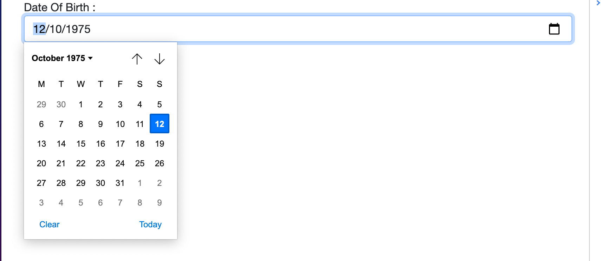
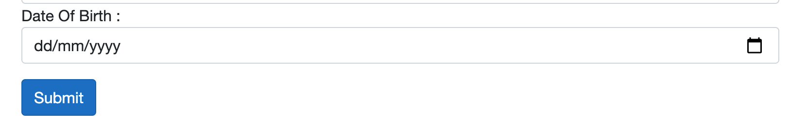
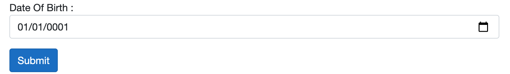

# 02 `EditForm` et les `InputSomething`

### Utilisation des composant `builtin` de formulaire.

## `EditForm`

C'est le formulaire.

### Attribut `Model`

`Model` instance d'objet utilisé pour lier le formulaire avec le modèle.

`OnValidSubmit` permet de ne soumettre le formulaire que si celui-ci est valide.

On a aussi `OnInvalidSubmit` et `OnSubmit`.

```html
<EditForm Model="robotModel" OnValidSubmit="HandleFormSubmit">
```

On va définir `robotModel` et `HandleFormSubmit` dans la partie `@code` :

```cs
@code {
  RobotModel robotModel = new();
  
  void HandleFormSubmit()
  {
    // ...
  }
}
```

On doit obligatoirement instancier l'objet modèle avec `new()`.

### `EditContext`

On peut assigner soit un `EditContext` soit un `Model` à un `EditForm`, pas les deux.

Cela permet de lier un modèle avec le formulaire.

```html
<EditForm EditContext="@editContext" ...>
```

```cs
@code {
  EditContext editContext;
  RobotModel robotModel = new();
  
  protected override void OnInitialized()
  {
    editContext = new(robotModel);
  }
```


### Exemple utilisation `OnInvalidSubmit`

```html
<EditForm EditContext="@editContext" OnValidSubmit="HandleFormSubmit" OnInvalidSubmit="HandleFormInvalid">
  @if(invalid)
  {
  <MudAlert Severity="Severity.Error">
    <ValidationSummary />
  </MudAlert>
  }
```

```cs
@code {

  bool invalid = false;

  public void HandleFormInvalid()
  {
    invalid = true;
  }
```

Cela permet de ne montrer la boîte d'erreur de validation que si le formulaire est invalide.


## `InputText`

`@bind-Value` remplace la directive `@bind` avec un `V` majuscule.

```html
<InputText type="text" id="Name" @bind-Value="robotModel.Name" />
```


## `InputTextArea`

Attention au `A` majuscule de `InputTextArea`.

```html
<InputTextArea id="Description" type="text" @bind-value="robotModel.Description" />
```


## `InputNumber`

Pour une valeur numérique (`int`, `double`, `decimal`).

```html
<InputNumber type="number" id="Speed" @bind-Value="robotModel.Speed" />
```


## `InputSelect`

```html
<InputSelect type="text" id="Type" @bind-Value="robotModel.RobotType">
  <option value="" disabled selected>-- select one type --</option>
  @foreach (var robotType in RobotType.List())
  {
  <option value="@robotType.Value.ToString()">@robotType.Name</option>
  }
</InputSelect>
```


## `InputDate`

```cs
<InputDate class="form-control" @bind-Value="Person!.DateOfBirth"/>
```



La petite astuce pour que le calandrier soit vierge :



Et pas initialisé à l'an 1 :



C'est de rendre la propriété dans le modèle `nullable` :

```cs
public class Person
{
    // ...
    public DateTime? DateOfBirth { get; set; }
  	// au lieu de 
  	public DateTime DateOfBirth { get; set; } // => an 1 initilized
```


