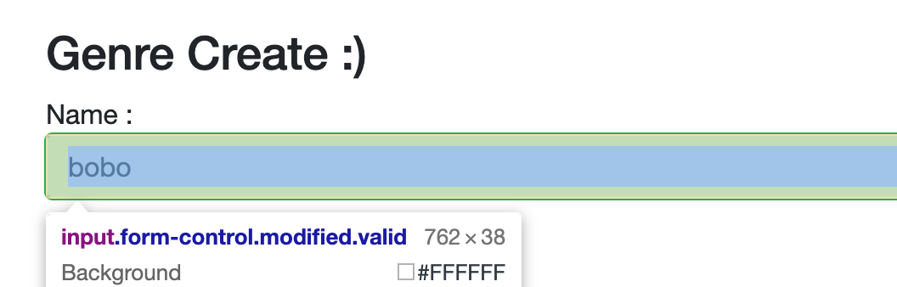

# 03 Validation de formulaire

## Validation des données : `[Annotation]`

Pour créer une validation des données, on peut utiliser les annotations :

```cs
using System.ComponentModel.DataAnnotations;

public class RobotModel
{
  [Required(ErrorMessage = "{0} is required")]
  [MaxLength(25, ErrorMessage = "Max of {0} must be under {1}")]
  [MinLength(3, ErrorMessage = "{0} must be at least {1}")]
  public string Name { get; set; }

  [Required(ErrorMessage = "{0} is required")]
  public string RobotType { get; set; }

  [Range(2, 100, 
         ErrorMessage = "Value for {0} must be between {1} and {2}.")]
  public int Speed { get; set; }
}
```


## `DataAnnotationsValidator`

Cela renseigne sur le type de validation à utiliser : les `Data Annotations`.

```html
<EditForm Model="robotModel" OnValidSubmit="HandleFormSubmit">
    <DataAnnotationsValidator />
```

Une fois ce `tag` en place, le formulaire n'est pas envoyé tant qu'il n'est pas valide.

Lorsque la validation est en place une classe est ajoutée à la balise de formulaire :

```html
<input type="text" id="Name" class="invalid" aria-invalid>
```

On peut ainsi ajouter un style aux élément `invalid` :

On a la classe `modified` qui est ajouté la première fois qu'on "*touche*" à un élément.

De base la classe `valid` est attribuée à l'élément de formulaire.




## `ValidationSummary`

Affiche les messages d'erreur.

```html
<MudAlert Severity="Severity.Error">
  
</MudAlert>
```


## `ValidationMessage`

Affiche le message d'erreur pour un champs particulier.

`For` prend une lambda renvoyant le champ du modèle sur lequel on veut récupérer le message d'erreur de validation.

```html
<div class="red-text text-accent-3">
  <ValidationMessage class="red-text text-accent-3" For="() => robotModel.Name" />
</div>
```


## Règle custom : `IValidatableObject`

On peut définir des règles (en plus des règles de base) grâce à l'implémentation de l'interface de `IValidatableObject` :

```cs
public class Booking : IValidatableObject
{
    public DateTime DateOut { get; set; }
    public DateTime? DateIn { get; set; }
    [Required]
    public virtual Customer? Customer { get; set; }

    public IEnumerable<ValidationResult> Validate(ValidationContext validationContext)
    {
        if (DateIn is not null)
        {
            if (DateIn <= DateOut)
            {
                yield return new ValidationResult(
                    "Date In must be greater than Date Out", 
                    new[] { "DateIn" });
            }
        }
    }
}
```

`ValidationResult` : le premier argument est le message d'erreur de validation, le deuxième argument est un tableau des propriétés sur lesquels la validation s'applique.

