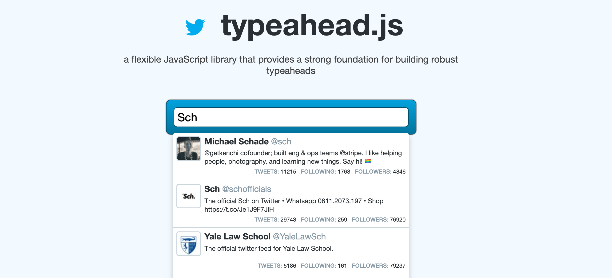

# 05 `Autocomplete` : `Typeahead`




## Composant `CustomTypeahead.razor`

```csharp
@*Modification from Chris Sainty's typeahead component*@

@using System.Timers
@typeparam TItem

<div class="blazored-typeahead">
    <div class="blazored-typeahead__controls">
        <input type="text"
               class="blazored-typeahead__input"
               autocomplete="off"
               placeholder="@Placeholder"
               @bind-value="@SearchText"
               @bind-value:event="oninput"
               @onclick="@ShowSuggestions"
               @onfocusout="onfocusout" />
    </div>
    @if (IsSearching)
    {
        <div class="blazored-typeahead__results">
            <div class="blazored-typeahead__result">
                <span>Loading...</span>
            </div>
        </div>
    }
    else if (ShouldShowSuggestions())
    {
        <div class="blazored-typeahead__results">
            @foreach (var item in Suggestions)
            {
                <div @key="item" class="blazored-typeahead__result"
                     tabindex="0" @onclick="@(() => SelectSuggestion(item))"
                     @onmouseover="OnmouseoverSuggestion" @onmouseout="OnmouseoutSuggestion">
                    @ResultTemplate(item)
                </div>
            }
        </div>
    }
    else if (ShowNotFound())
    {
        <div class="blazored-typeahead__results">
            @if (NotFoundTemplate != null)
            {
                <div class="blazored-typeahead__notfound">
                    @NotFoundTemplate
                </div>
            }
            else
            {
                <div class="blazored-typeahead__notfound">
                    No Results Found
                </div>
            }
        </div>
    }
</div>

@code {
    [Parameter] public string Placeholder { get; set; }
    [Parameter] public int MinimumLength { get; set; } = 3;
    [Parameter] public int Debounce { get; set; } = 300;
    [Parameter] public Func<string, Task<IEnumerable<TItem>>> SearchMethod { get; set; }
    [Parameter] public RenderFragment<TItem> ResultTemplate { get; set; }
    [Parameter] public RenderFragment NotFoundTemplate { get; set; }
    [Parameter] public EventCallback<TItem> ValueChanged { get; set; }

    private bool IsSearching = false;
    private bool IsShowingSuggestions = false;
    private string _searchText = string.Empty;
    private Timer _debounceTimer;
    protected TItem[] Suggestions { get; set; } = new TItem[0];

    protected override void OnInitialized()
    {
        _debounceTimer = new Timer();
        _debounceTimer.Interval = Debounce;
        _debounceTimer.AutoReset = false;
        _debounceTimer.Elapsed += Search;

        base.OnInitialized();
    }

    private bool ShowNotFound()
    {
        return !Suggestions.Any() && IsShowingSuggestions;
    }

    private async Task SelectSuggestion(TItem item)
    {
        SearchText = "";
        await ValueChanged.InvokeAsync(item);
    }

    protected async void Search(Object source, ElapsedEventArgs e)
    {
        IsSearching = true;
        IsShowingSuggestions = false;
        await InvokeAsync(StateHasChanged);

        Suggestions = (await SearchMethod.Invoke(_searchText)).ToArray();

        IsSearching = false;
        IsShowingSuggestions = true;
        await InvokeAsync(StateHasChanged);
    }

    private string SearchText
    {
        get => _searchText;
        set
        {
            _searchText = value;

            if (value.Length == 0)
            {
                IsShowingSuggestions = false;
                _debounceTimer.Stop();
                Suggestions = new TItem[0];
            }
            else if (value.Length >= MinimumLength)
            {
                _debounceTimer.Stop();
                _debounceTimer.Start();
            }
        }
    }

    private bool ShouldShowSuggestions()
    {
        return IsShowingSuggestions && Suggestions.Any();
    }

    private void ShowSuggestions()
    {
        if (Suggestions.Any())
        {
            IsShowingSuggestions = true;
        }
    }

    private void onfocusout()
    {
        if (!IsMouseInSuggestion)
        {
            IsShowingSuggestions = false;
        }
    }

    bool IsMouseInSuggestion = false;

    private void OnmouseoverSuggestion()
    {
        IsMouseInSuggestion = true;
    }

    private void OnmouseoutSuggestion()
    {
        IsMouseInSuggestion = false;
    }
}
```


## Utilisation

```cs
<CustomTypeahead searchMethod="SearchMethod">
    <ResultTemplate>
        @context
    </ResultTemplate>
</CustomTypeahead>
  
@code {
  async Task<IEnumerable<string>> SearchMethod(string searchText)
  {
    await Task.Delay(2000);
    if(saerchText == "test")
    {
      return Enumerable.Empty<string>();
    }
    
    return new List<string>() { "Unikar", "Hukar"};
  }
}  
```


## `CSS`

```css
.blazored-typeahead__controls {
    position: relative;
    cursor: text;
    display: flex;
}

.blazored-typeahead__input {
    width: 100%;
    border: 1px solid #bfbfbf;
    padding: .5rem;
}

.blazored-typeahead__input-hidden {
    display: none;
}

.invalid {
    border-color: red !important;
}


.blazored-typeahead__input-mask-wrapper {
    display: flex;
    width: 100%;
}

.blazored-typeahead__input-mask {
    flex: 1;
    border-radius: 5px 0 0 5px;
    border-top: 1px solid #bfbfbf;
    border-bottom: 1px solid #bfbfbf;
    padding: .5rem;
    border-left: 1px solid #bfbfbf;
}

.blazored-typeahead__clear {
    width: 40px;
    display: flex;
    border-top: 1px solid #bfbfbf;
    padding: .5rem;
    align-items: center;
    justify-content: center;
    border-bottom: 1px solid #bfbfbf;
    border-right: 1px solid #bfbfbf;
    cursor: pointer;
}

.blazored-typeahead__input__icon {
    width: 40px;
    display: flex;
    border-radius: 0 5px 5px 0;
    border-top: 1px solid #bfbfbf;
    border-left: 0;
    border-right: 1px solid #bfbfbf;
    border-bottom: 1px solid #bfbfbf;
    padding: .5rem;
    cursor: pointer;
    background: none;
}

    .blazored-typeahead__input__icon:hover {
        background-color: #f5f5f5;
    }


.blazored-typeahead__results {
    box-shadow: 0 5px 10px rgba(0,0,0,.2);
    padding-top: .5rem;
    min-height: 2rem;
    max-height: 30rem;
    overflow-y: auto;
}

.blazored-typeahead__result,
.blazored-typeahead__notfound,
.blazored-typeahead__results-footer {
    padding: .5rem;
}

    .blazored-typeahead__result-selected, .blazored-typeahead__result:hover, .blazored-typeahead__result:focus {
        outline: -webkit-focus-ring-color auto 1px;
        background-color: #f5f5f5;
        cursor: pointer;
    }

.blazored-typeahead__loader {
    width: 24px;
    height: 24px;
    background-color: #333;
    border-radius: 100%;
    -webkit-animation: sk-scaleout 1.0s infinite ease-in-out;
    animation: sk-scaleout 1.0s infinite ease-in-out;
}

@-webkit-keyframes sk-scaleout {
    0% {
        -webkit-transform: scale(0)
    }

    100% {
        -webkit-transform: scale(1.0);
        opacity: 0;
    }
}

@keyframes sk-scaleout {
    0% {
        -webkit-transform: scale(0);
        transform: scale(0);
    }

    100% {
        -webkit-transform: scale(1.0);
        transform: scale(1.0);
        opacity: 0;
    }
}
```

