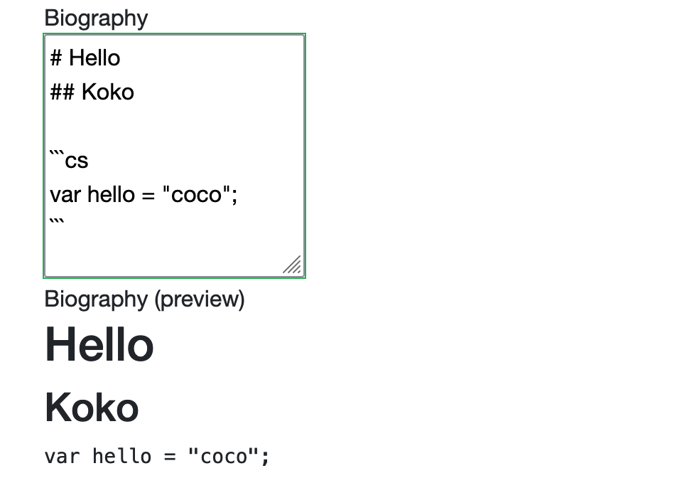
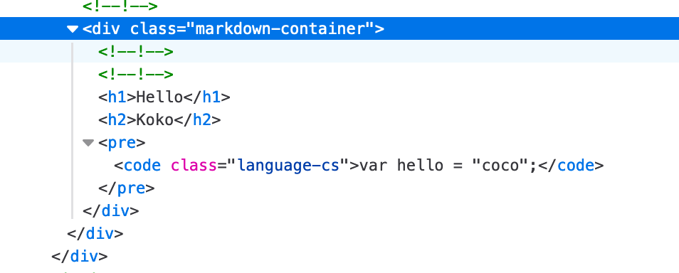

# 06 Un composant `Markdown`

## Création de `InputMarkdown.razor`

```cs
@inherits InputTextArea
@using System.Linq.expressions
@typeparam TValue
  
<div>
  <label>@label</label>
  <div>
  	<InputTextArea @bind-Value="CurrentValue" />
  	<ValidationMessage For="For" />
  </div>
</div> 
<div>
  <label>@Label (preview)</label>
  <div class="markdown-container">
    <RenderMarkdown MarkdownContent="@CurrentValue"/>
  </div>  
</div> 
    
@code {
    [Parameter] public Expression<Func<TValue>> For { get; set; }
    [Parameter] public string Label { get; set; }
  }    
```

`Expression<Func<TValue>` est en fait la lambda :

 `(ObjectFromModel o) => o.SelectedProperty ` qui permet d'obtenir le message de validation.

`@typeparam TValue` permet de créer un composant générique. `TValue` peut être une `Person`, un `Genre`, un `Movie`, ...

L'utilisation de `CurrentValue` demande d'hérité de `InputTextArea` :

```cs
@inherits InputTextArea
```


## Création de `RenderMarkdown.razor`

Il faut installer le `nuget package` : `Markdig` dans le projet `Client`.

```cs
dotnet add package Markdig --version 0.26.0
```

```cs
@using Markdig
  
@if(HTMLContent is not null)
{
  @((MarkupString)HTMLContent)
}
  
@code {
  [Parameter] pubklic string? MarkdownContent { get; set; }
  private string? HTMLContent;
    
  protected override void OnParameterSet()
  {
    if(!String.IsNullOrEmpty(MarkdownContent))
    {
      HTMLContent = Markdown.ToHtml(MarkdownContent);
    }
  }
}  
```

Par défaut les balises `HTML` sont échappées, il faut les *caster* avec `MarkupString`.


## Utilisation dans un `formulaire`

```cs
<div class="form-group form-markdown">
  <InputMarkdown
  		@bind-Value="Person.Biography"
  		Label="Biography"
  		For="() => Person.Biography" />
</div>  
```

On doit maintenant écrire le `css` pour les classes `form-markdown` et `markdown-container`.





On voit le `HTML` généré par `Markdig`, on peut lui ajouter notre propre `css`.

Dans `wwwroot/css/app.css`

```css
.form-mardown {
  display: flex;
}
.form-markdown textarea {
  width: 500px;
  height: 500px;
  margin-right: 15px;
}
.form-markdown .markdown-container {
  width: 500px;
  height: 500px;
  border: 1px dashed black;
}
```

