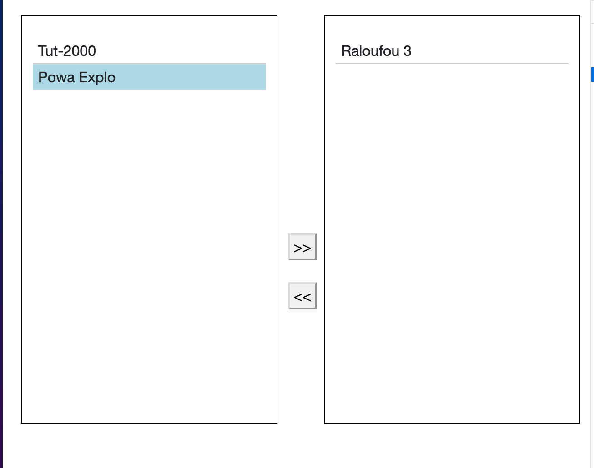

# 08 Multiple Select List



## Composant `Multiple`

```cs
<div class="row">
    <div class="col box">
        <ul>
            @foreach(var AddOn in NotSelectedAddOn)
            {
                <li class="selectable-li" @onclick="() => SelectIt(AddOn)">@AddOn.Brand</li>
            }
        </ul>

    </div>
    <div class="col-1">
        <button style="margin-top:240px;" type="button" @onclick="SelectAll">@selectAllText</button>
        <br>
        <br>
        <button type="button" @onclick="DeselectAll">@deselectAllText</button>
    </div>
    <div class="col box">
        <ul>
            @foreach(var AddOn in SelectedAddOn)
            {
                <li class="selectable-li" @onclick="() => DeselectIt(AddOn)">@AddOn.Brand</li>
            }
        </ul>

    </div>

</div>

@code {
    string selectAllText = ">>";
    string deselectAllText = "<<";

    [Parameter] public List<AddOn> SelectedAddOn { get; set; } = new();
    [Parameter] public List<AddOn> NotSelectedAddOn { get; set; } = new();

    void SelectIt(AddOn addOn)
    {
        SelectedAddOn.Add(addOn);
        NotSelectedAddOn.Remove(addOn);
    }
    void DeselectIt(AddOn addOn)
    {
        SelectedAddOn.Remove(addOn);
        NotSelectedAddOn.Add(addOn);
    }


    void SelectAll()
    {
        SelectedAddOn.AddRange(NotSelectedAddOn);
        NotSelectedAddOn.Clear();
    }

    void DeselectAll() 
    {
        NotSelectedAddOn.AddRange(SelectedAddOn);
        SelectedAddOn.Clear();
    }
}
```

L'idée est d'avoir deux listes `SelectedItem` et `NotSelectedItem`.


## Utilisation Dans un formulaire

```cs
<EditForm Model="Robot" OnValideSubmit="OnValidSubmit">
    <MultipleSelect SelectedAddOn="selected" NotSelectedAddOn="notSelected" />
</EditForm>

@code {
    [Parameter] public Robot Robot { get; set; } = new();
    [Parameter] public EventCallback OnValidSubmit { get; set; }

    List<AddOn> selected = new() {
            new() {
                Id = 1,
                Brand = "Tut-2000",
            },
            new() {
                Id = 1,
                Brand = "Powa Explo",
            },
            new() {
                Id = 1,
                Brand = "Raloufou 3",
            },
        };

    List<AddOn> notSelected = new();
}
```

En cas d'une modification, il faudra calculer `selected` et `notSelected` depuis la propriété du `Model` correspondante :

```cs
protected override void OnInitialized()
{
  selected = Model.ListOfItem;          

  notSelected = AllItem; // db.Items par exemple
  foreach(var item in selected)
  {
    notSelected.Remove(item);
  }
}
```

