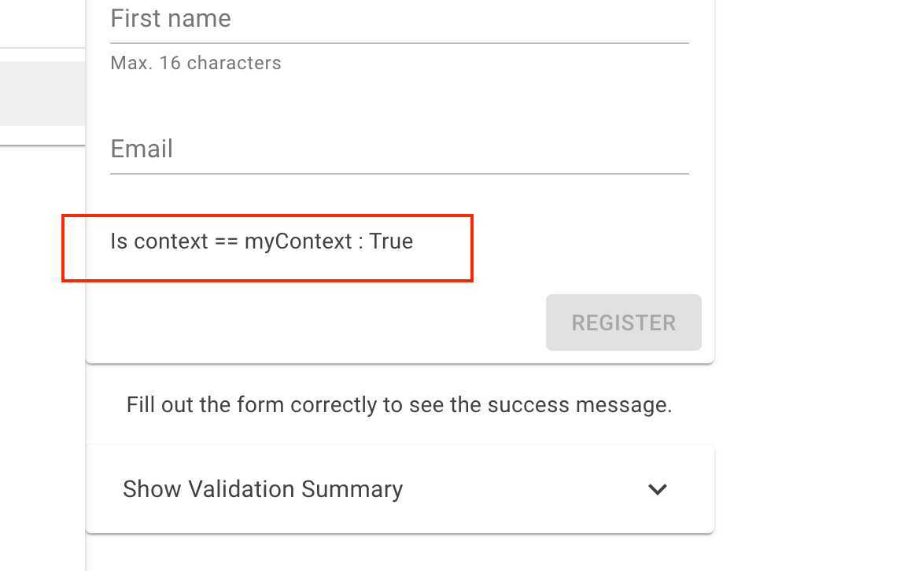

# 09 Bouton `Disabled`

Il n'est pas si facile de rendre le bouton de formulaire `Disabled`.

Voici un exemple avec `MudBlazor` :

```cs
<EditForm Model="model">
  <!-- ... -->
  
  <MudButton 
  ButtonType="ButtonType.Submit" 
  Variant="Variant.Filled" 
  Color="Color.Primary" 
  Class="ml-auto"
  Disabled="@(!context.IsModified() || !context.Validate())">
  Register</MudButton>
```

Il y a une variable `context` mise automatiquement à disposition dans un `EditForm`.

Cela malgré le fait d'utiliser `Model` plutôt que `EditContext`.


## Expérience pour savoir si `context` est bien `EditContext`

```cs
<EditForm EditContext="myContext" OnValidSubmit="OnValidSubmit">
  
  <MudCardContent>
  	Is context == myContext : @(context == myContext)
	</MudCardContent>
   
  <!-- ... -->  
    
@code {    
    Person model = new();
    EditContext? myContext;
    
    protected override void OnInitialized()
    {
        myContext = new(model);
       // ...
```

