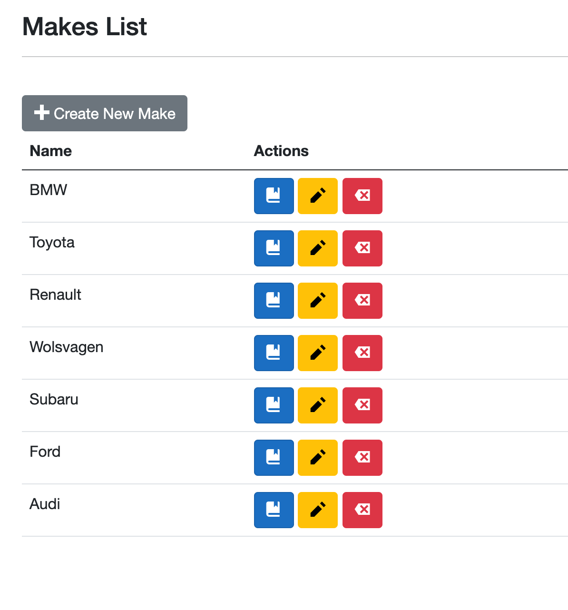

# AA Exemple de formulaire `CRUD`

## Composant formulaire

On va d'abord créer un composant formulaire qui sera utilisable en `Create` et `Edit`.

`FormComponant.razor`

```cs
<EditForm Model="Model" OnValidSubmit="OnValidSubmit">
    <DataAnnotationsValidator />
    <ValidationSummary />

    <label>Name :</label>
    <InputText @bind-Value="Model!.Name" />
    <ValidationMessage For="@(() => Model.Name)" />

    <button>@ButtonText</button>
</EditForm>

@code {
    [Parameter] public ModelDto Model { get; set; }
    [Parameter] public string ButtonText { get; set; } = "Save";
    [Parameter] public EventCallback OnValidSubmit { get; set; }
}
```

`ModelDto` peut-être n'importe quel type représenté par le formulaire.

Dans l'exemple `ModelDto` contient une propriété `Name`.


## Formulaire de création `Create`

On peut maintenant utiliser notre `FormComponent` dans une page dédiée à la création.

`Create.razor`

```cs
@page "/items/create"

@inject HttpClient httpClient
@inject NavigationManager navigationManager

<h3>Create New Item</h3>

<FormComponent Model="Item" ButtonText="Create New Item" OnValidSubmit="CreateItem" />

@code {
    private Item Item = new();

    private async Task CreateItem()
    {
        await httpClient.PostAsJsonAsync(Endpoints.ItemsEndpoint, Item);
        // retoure à la liste de tous les items
        navigationManager.NavigateTo("/items");
    }
}
```

`Endpoints.ItemsEndpoint` contient l'`URL` où poster `Item`.


## Formulaire d'édition `Update`

`Edit.razor`

```cs
@page "/items/edit/{Id:int}"

@inject HttpClient httpClient
@inject NavigationManager navigationManager

<h3>Edit Item</h3>

    <FormComponent 
    	Model="Item" ButtonText="Update Item" OnValidSubmit="UpdateItem" />

@code {
    Item? Item = new();
    [Parameter] public int Id { get; set; }

    protected async override Task OnParametersSetAsync()
    {      
        Item = await httpClient.GetFromJsonAsync<Item>($"{Endpoints.ItemsEndpoint}/{Id}");
    }   

    async Task UpdateItem()
    {
        await httpClient.PutAsJsonAsync($"{Endpoints.ItemsEndpoint}/{Id}", make);
        navigationManager.NavigateTo("/items");
    }
}
```

On utilise `OnParametersSetAsync` pour charger les données quand on passe `Item` à `FormComponent`.

#### ! Il faut bien initialiser `Item` avec `new()` pour éviter une erreur (avant que l'objet ne soit remplis).


### Champs de formulaire uniquement pour l'`Update`

Certain champs de formulaire n'ont de sens que lors de l'`Update` et pas pour la partie `Create`.

Tester l'`Id` du `model` est un bon moyen pour savoir si on est en `Create` (`Id == 0`) ou en `Update` (`Id` attribuée par le système et `> 0`).

```html
@if(Booking.Id > 0)
{
<div class="mb-3">
    <label class="form-label">Date In:</label>
    <InputDate @bind-Value="Booking.DateIn" />
    <ValidationMessage For="() => Booking.DateIn" />
</div>
}
```

Par exemple ici on a un champs pour la date d'entrée d'une location qui n'a de sens que en `Update` et n'apparaît pas en `Create`.


## Lister les `Items` : `Read` et `Delete`

C'est la liste des `Items` qui contient des liens vers les page `Create` et `Edit`.

On peut aussi supprimer un `Item` directement depuis la liste.



`Index.razor`

```cs
@page "/items"
@inject HttpClient httpClient
@inject IJSRuntime js
@attribute [Authorize]

<h3>Items List</h3>

<a href="/items/create">+ Create New Item</a>

@if(Items == null)
{
<div>Loading Items ...</div>
}
else
{
<table>
    <thead>
        <tr>
            <th>Name</th>
            <th>Actions</th>
        </tr>
    </thead>
    <tbody>
        @foreach(var item in Items)
        {
        <tr>
            <td>@item.Name</td>
            <td>
                <a href="/items/view/@item.Id" class="btn btn-primary">
                    <span class="oi oi-book"></span>
                </a>
                <a href="/items/edit/@item.Id" class="btn btn-warning">
                    <span class="oi oi-pencil"></span>
                </a>
                <button 
                        class="btn btn-danger" 
                        @onclick="@(() => Delete(item.Id))">
                    <span class="oi oi-delete"></span>
                </button>
            </td>
        </tr>
        }
    </tbody>
</table>
}


@code {
    private List<Item>? Items;

    protected async override Task OnInitializedAsync()
    {
        Items = await httpClient.GetFromJsonAsync<List<Item>>(Endpoints.ItemsEndpoint);
    }

    private async Task Delete(int itemId)
    {
        var make = Items!.First(q => q.Id == itemId);

        if(await js.InvokeAsync<bool>("confirm", $"Do you want to delete {itemId}"))
        {
            await httpClient.DeleteAsync($"{Endpoints.ItemsEndpoint}/{itemId}");
            // Reload the list
            await OnInitializedAsync(); 
        }
    }
}
```

Une fois un `Item` supprimé, il faut recharger la liste en appelant `OnInitializedAsync` par exemple.


## `View` : Voire un `Item`

On veut pouvoir avoir les infos sur un seul `Item`.

On peut réutiliser le `Form` avec quelques modifications :

### Modification du `Form`

`Form.razor`

```cs
<EditForm Model="Item" OnValidSubmit="OnValidSubmit">
    <DataAnnotationsValidator />
    <ValidationSummary />

    <fieldset disabled="@Disabled">
        
        <!-- ici les différents champs -->

    </fieldset>

    @if(Disabled == false)
    {
        <div class="d-grid">
            <button class="btn btn-success">@ButtonText</button>
        </div>
    }
    
</EditForm>

@code {
    [Parameter] public bool Disabled { get; set; }
    [Parameter] public Item? Item { get; set; }
    [Parameter] public EventCallback OnValidSubmit { get; set; }
    [Parameter] public string ButtonText { get; set; } = "Save";

    protected override void OnInitialized()
    {
        Console.WriteLine($"Disabled : {Disabled}");
    }
}
```

Trois modifications :

1. Ajouter une propriété `Disabled` pouvant être fournie par le `Form`, la valeur par défaut d'un `bool` est `false`.
2. Pour facilement passer plusiseurs champs à `disabled`, le plus simple est de les imbriquer dans un `fieldset` et mettre celui-ci à `disabled="true"`.
3. Encadrer le bouton du `Form` avec un `@if(Disabled == false)`.


### Création de la page `View`

`View.razor`

```cs
@page "/items/view/{Id:int}"

@inject HttpClient httpClient

<h3>View</h3>
@if(Item is not null)
{
    <ItemFormComponent Item="Item" Disabled="true" />
}
else
{
    <div class="alert alert-info">Item is loading ...</div>
}

@code {
    [Parameter] public int Id { get; set; }
    Item? Item;

    protected async override Task OnParametersSetAsync()
    {
        Item = await httpClient.GetFromJsonAsync<Item>($"{Endpoints.ItemsEndpoint}/{Id}");
    }
}
```

On ajoute un `attribut` au composant : `Disabled="true"`.

Comme l'`Item` n'est chargé qu'avec `OnParametersSetAsync`, il faut ajouter un `@if(Item is not. null)`.