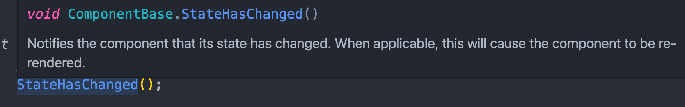
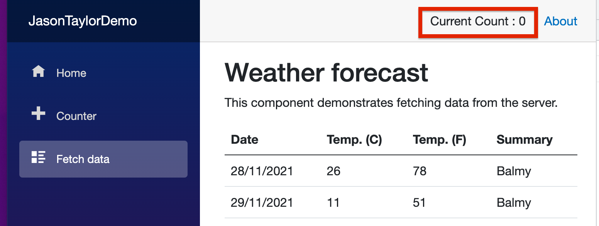

# 09 App `State`

On va utiliser les `CascadingValue` pour mettre en place un `state` pour toute l'application.

## `AppState.razor` : `<CascadingValue>`

On crée un composant `AppState` :

```cs
<CascadingValue Value="this">
    @ChildContent
</CascadingValue>

@code {
    [Parameter] public RenderFragment ChildContent { get; set; }

    private int _currentCount;

    public int CurrentCount{
        get {
            return _currentCount;
        }

        set {
            _currentCount = value;
            StateHasChanged();
        }
    }
}
```

#### Il utilise `RenderFragment` pour pouvoir encadrer toute l'application.

Il se passe lui même comme valeur : `Value="this"`, cela évite de créer une classe `state` supplémentaire.

Ici le `state` est représenté par les propriété de `AppState` directement.

On ajoute dans le `setter` : `StateHasChanged()` qui lance un rendu de l'application.



## Mise en place : `App.razor`

En encadrant `App.razor` avec notre `AppState` on est sûr d'accéder à toute l'application :

```cs
<AppState>
    <Router AppAssembly="@typeof(App).Assembly">
        <Found Context="routeData">
          // ...
        </Found>
        <NotFound>
            // ...
        </NotFound>
    </Router>
</AppState>
```


## Utilisation : `[CascadingParameter]`

dans `MainLayout` on va placer notre `AppState` pour surveiller une valeur :

```cs
<span>Current Count : @AppState!.CurrentCount</span>

@code {
  [CascadingParameter] public AppState? AppState { get; set; }
}
```




### Dans le composant `Counter`

```cs
@page "/counter"

<PageTitle>Counter</PageTitle>

<h1>Counter</h1>

<p>Current count: @AppState!.CurrentCount</p>

<button @onclick="IncrementCount">Click me</button>

@code {
    [CascadingParameter] public AppState? AppState { get; set; }
    private void IncrementCount()
    {
        AppState!.CurrentCount++;
    }
}
```

Le `state` est ainsi persistant aux changements de page.

Bien entendu il n'est pas persistant aux rafraîchissements 🍸.


## Persistance à la navigation

`HTML 5` implémente deux types de stockage dans le navigateur.

`Session Storage` le stockage est relatif à l'onglet du navigateur. Deux onglets on deux stockages différents.

`Local Storage` le stockage est relatif à un site quelque soit les onglets le stockage est le même.

### Utilisation de l'intéropérabilité `js`

On injecte le `runtime js` :

```cs
@inject IJSInProcessRuntime JS
@* @inject IJSRuntime *@
```

`IJSInProcessRuntime` est la version synchrone de `IJSRuntime`.

On peut alors utiliser `InvokeVoid` plutôt que `InvokeVoidAsync`.

On doit ajouter le `service` dans `Program.js` :

```cs
builder.Services.AddSingleton<IJSInProcessRuntime>(
	services => (IJSInProcessRuntime)services.GetRequiredService<IJSRuntime>()
);
```

Et on doit écrire notre petite bibliothèque `js` :

`wwwroot/scripts/blazorDemo.js`

```js
var BlazorStorage = {
    getSessionStorage(key) {
        return sessionStorage.getItem(key)
    },
    
    setSessionStorage(key, value){
        sessionStorage.setItem(key, value)
    }
}
```

On doit référencer notre `script js` dans `index.html` :

```html
	<!-- ... -->
	<script src="_framework/blazor.webassembly.js"></script>
  <script src="scripts/blazorDemo.js"></script>
</body>
```


Toujours dans `AppState.razor` on a :

```cs
protected override void OnInitialized()
{
  var value = JS.Invoke<string>("BlazorStorage.getSessionStorage", "CurrentCount");
  int.TryParse(value, out _currentCount);
}
```

Pour éviter les `magic string`, on va créer une classe `JsInteropConstants` dans un dossier `Utilities` :

```cs
namespace JasonTaylorDemo.Client.Utilities;

public class JsInteropConstants
{
  private const string FuncPrefix = "BlazorDemo";
  public const string GetSessionStorage = $"{FuncPrefix}.getSessionStorage";
  public const string SetSessionStorage = $"{FuncPrefix}.setSessionStorage";
}
```

> Un champs déclaré `const` est par déafut aussi `static`.

On obtient donc :

```cs
protected override void OnInitialized()
{
  var value = JS.Invoke<string>(JsInteropConstants.GetSessionStorage, nameof(CurrentCount));
  int.TryParse(value, out _currentCount);
}
```

On veut aussi enregistrer la valeur au changement dans la `session storage` :

```cs
public int CurrentCount
{
  get // ...
    
  set {
    _currentCount = value;
    JS.InvokeVoid(JsInteropConstants.SetSessionStorage, nameof(CurrentCount), value);
    StateHasChanged();
  }
}
```

 