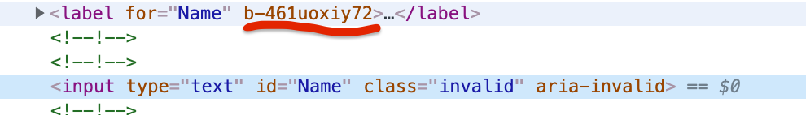
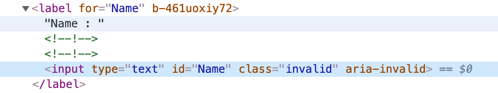
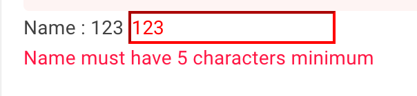

# 10 Gestion des `css`

## Lien du `css` à un `component`: `css` isolation

On peut créer un fichier `MyComponent.razor.css`.

Ce `css` s'appliquera uniquement sur le composant `MyComponent.razor`.

Il sera rassemblé automatiquement dans un fichier `MyApp.style.css`.

Il faut absolument ajouter le lien suivant dans `index.html` :

```html
<link href="PlannerApp.styles.css" rel="stylesheet" />
```


## Accéder à un composant enfant

Dans le cadre de la validation de formulaire, une classe `invalid` est ajoutée automatiquement.

Pour ajouter du style à cette classe on pourrait faire :

`MyFormPage.razor.css`

```css
.invalid {
    border-color: red;
    color: red;
}
```

Si on regarde le `template` :

```html
<label for="Name">Name : @robotModel.Name</label>
<InputText type="text" id="Name" @bind-Value="robotModel.Name" />
```

Cela ne fonctionnera pas car `InputText` est un composant enfant et l'identifiant unique de l'isolation de `css` ne lui sera pas attribué :



On peut ajouter le sélecteur `::deep` pour atteindre un élément enfant et encapsuler le `input` dans le `label` :

```css
::deep .invalid {
    border-color: red;
    color: red;
}
```

```html
<label for="Name">Name : @robotModel.Name
  <InputText type="text" id="Name" @bind-Value="robotModel.Name" />
</label>
```



Si on regarde le `css` généré :

`<MyAssemblyName>.styles.css`

```css
/* /Features/NewRobot/NewRobotPage.razor.rz.scp.css */
[b-461uoxiy72] .invalid {
    border-color: red;
    color: red;
}
```

Et le résultat :




