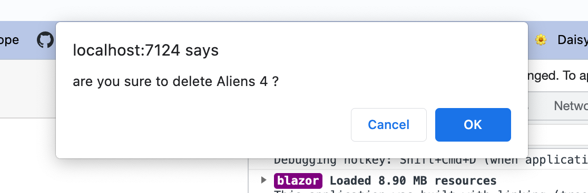

# 11 Interopérabilité avec `javascript`

## `@inject IJSRuntime`

Pour exécuter du `js` dans un composant `razor`, on utilise le service `IJSRuntime`.

```cs
@inject IJSRuntime js
  
  // ...
  
@code {
  async Task DeleteMovie(Movie movie)
  {
    var confirmed = await js.InvokeAsync<bool>("confirm", $"are-you sure you want to delete {movie.Title}?");
    if(confirmed)
    {
      Movies.Remove(movie);
    }
  }
}
```



#### `await js.InvokeAsync<TR>("func", "par1", "par2", ...)`

`TR`  Le type de retour de la fonction.

`func` Un nom de fonction `javascript`.

`par1` `par2` La liste des paramètres passés à la function.


## Encapsulation dans une méthode d'extension

`IJSRuntimeExtensionMethod.cs`

```cs
public static class IJSRuntimeExtensionMethod
{
  public static async ValueTask<bool> Confirm(this IJSRuntime js, string message) 		=> await js.InvokeAsync<bool>("confirm", message);
}
```

Et on écrit dans son composant :

```cs
public async Task DeleteMovie(Movie movie)
{
  var confirmed = await js.Confirm($"are you sure to delete {movie.Title} ?");
```


## `InvokeVoidAsync`

Si la fonction ne renvoie rien on utilise `InvokeVoidAsync` à la place de `InvokeAsync<Type>`.

```cs
await js.InvokeVoidAsync("console.log", "Exemple message");
```


## Exécuter du `js`depuis un fichier de `wwwroot`

On va placer un dossier `js`dans `wwwroot`et dedans un script `js`

`wwwroot`

​	|_`js`

​			|_`myUtilities.js`

```js
function displayMyMessage(message) {
  console.log("my message : " + message)
}
```

On doit référencer notre script `js`dans `wwwroot/index.html` :

```html
		<!-- ... -->
		<script src="_framework/blazor.webassembly.js"></script>
    <script src="/js/myUtilities.js"></script>
	</body>

</html>
```

On ajoute une méthode d'extension pour `IJSRuntime` :

```cs
public static async ValueTask DisplayMyMessage(this IJSRuntime js, string message)
{
  await js.InvokeVoidAsync("displayMyMessage", message);
}
```

Et on peut l'utiliser dans notre composant :

```cs
@inject IJSRuntime js

@code {
  public async Task SomeMethod()
  {
    await js.DisplayMyMessage("Message from utilities"); 
```


## Exécuter du `c#`dans `javascript` : `[JSInvokable]`

On va créer une méthode `static`dans un composant :

```cs
[JSInvokable]
public static Task<int> GetCurrentCount()
{
  return Task.FromResult(currentCountStatic);
}
```

Dans un fichier `js`référencé dans `index.html` on écrit :

```js
function async dotnetStaticInvocation() {
  const result = await DotNet.invokeMethodAsync("Project.Name", "GetCurrentCount")
  
  console.log("count from js " + result)
}
```

`"Project.Name"` est le nom du projet comme `"BlazorMovie.Client"` par exemple.

On exécute alors la fonction dans un composant :

```cs
[Inject] public IJSRuntime? js { get; set; }

private async Task IncrementCount()
{
  // ...
  currentCountStatic++;
  await js!.InvokeVoidAsync("dotnetStaticInvocation");
}
```

 

## `JS` isolation

On veut que certain fichier `js` ne soit disponible que pour certain composant.

On doit pour cela utiliser les modules `javascript` : `export`

`wwwroot/js/Counter.js`

```js
export function displayMessage(message) {
    alert(message)
}
```

Mantenant dans notre composant `Counter` :

```cs
[Inject] public IJSRuntime? js { get; set; }

IJSObjectReference? module;

public async Task IncrementCount()
{
  module = await js!.InvokeAsync<IJSObjectReference>("import", "./js/Counter.js");
  await module.InvokeVoidAsync("displayMessage", "Hey you 🐹");
}
```

 `IJSObjectReference` est le type qui représente un module `javascript`.

Le `javascript`ne sera chargé que lors de l'utilisation de la méthode `IncrementCount` ce qui allège le chargement de départ.


