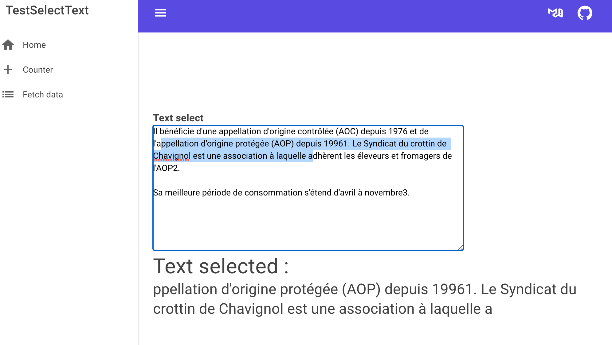

# 11.01 Ajouter un événement `javascript`

Par défaut `Blazor` ne propose pas un objet `EventArgs` pour chaque événement du `DOM`.

On peut ajouter soi-même un `event` qui ferait défaut.


## Ajouter `OnSelect`

`javascript` génère un événement lorsque du texte est sélectionné. Cela peut être utile pour modifier ou manipuler ce texte.

### 1. Ajout du `javascript` nécessaire

Dans le fichier `wwwroot/index.html` on va placer un `script` en fin de `body`.

Ce `script` se trouvera après `<script src="_framework/blazor.webassembly.js">`

```html
// ...	
</div>
<script src="_framework/blazor.webassembly.js"></script>
<script src="_content/MudBlazor/MudBlazor.min.js"></script>
<script>
    Blazor.registerCustomEventType('customselect', {
        browserEventName: 'select',
        createEventArgs: event => {
            return {
                selectedText: event.target.value.substring(event.target.selectionStart, event.target.selectionEnd)
            };
        }
    });
</script>

</body>
```

On enregistre dans `Blazor` un nouveau type d'événement.

`'customselect'` c'est le nom que l'on donne nous-même.

`browserEventName` ici l'événement javascript existant.

`createEventArgs` nous permet de mapper comme on désire l'`event javascript` avec notre propre objet que l'on va définir en `cs`. Ici je ne récupère que le texte.


### 2. Création de notre `custom EventArgs`

On crée une classe `CustomSelectEventArgs` :

`CustomSelect.cs`

```cs
using Microsoft.AspNetCore.Components;

namespace TestSelectText
{

    
    [EventHandler("oncustomselect", typeof(CustomSelectEventArgs),
        enableStopPropagation: true, enablePreventDefault: true)]
public static class EventHandlers
    {
    }

    public class CustomSelectEventArgs : EventArgs
    {
        public string? SelectedText { get; set;  }
    }
}
```

Le nom `customselect` devient `oncustomselect`.

La propriété javascript `customSelect` devient `CustomSelect` dans une classe héritant de `EventArgs`.


### 3. Utilisation dans un composant `razor`

`TextSelect.razor`

```cs
@page "/textselect"

<h3>Text select</h3>
<form>
    <textarea @oncustomselect="SelectText">Entre your text ...</textarea>
    <hr />
    <MudText Typo="Typo.h4">Text selected :</MudText>
    <MudText Typo="Typo.h5">@textSelected</MudText>

</form>

@code {
    string textSelected = "Nothig is selected .... ";

    public void SelectText(CustomSelectEventArgs evt)
    {
        textSelected = evt.SelectedText ?? "null argument occure";
    }
}
```



L'événement provoque un rafraîchissement automatique de l'affichage.

> à chaque fois qu'une méthode est appelée avec `@on[some event]` la vue est re-rendue comme si on utilisait `StateHasChanged()`.