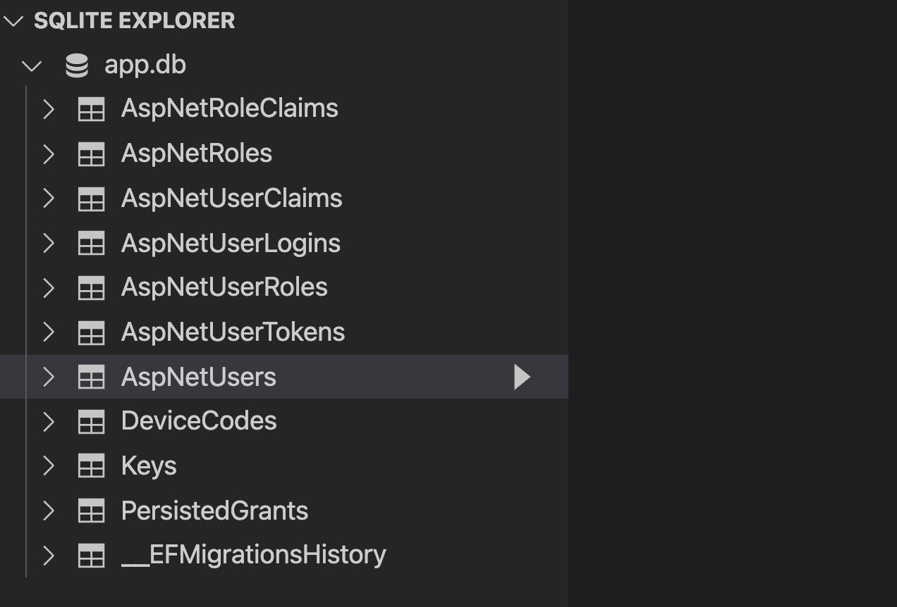
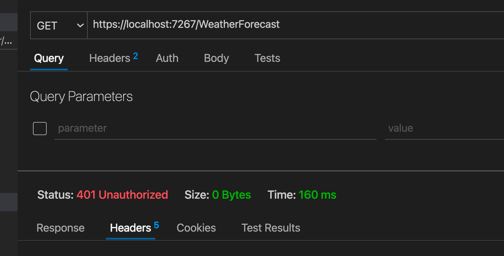

# 12 authentification

> Password : T@t@1999

On travaille ici avec une application `--hosted` incluant une partie `server`.

On peut ajouter dès le dépert l'`authentification` au template avec :

```bash
dotnet new blazorwasm -h -au Individual ...
```

On obtient un composant `LoginDisplay.razor`.


## `IdentityUser`

Dans la partie `server` on a le service `AddDefaultIdentity` qui donne accès à l'utilisateur par défaut : `IdentityUser`.

```cs
builder.Services
    .AddDefaultIdentity<ApplicationUser>(options => options.SignIn.RequireConfirmedAccount = true)
    .AddEntityFrameworkStores<ApplicationDbContext>();
```

Pour ajouter des propriété à celle de base de `IdentityUser` (`UserName`, `PhoneNumber`, `Email`, ... ) on créé une classe `ApplicationUser` (déjà créée mais vide dans le `template`).

```cs
// CarRentManagement.Server.Models

public class ApplicationUser : IdentityUser
{
  // other properties here
}
```

`options.SignIn.RequireConfirmedAccount` cette option implique la confirmation par email, par facilité on peut la mettre à `false`.

On peut réécrire comme ceci s'il n'y a pas d'option :

```cs
builder.Services
    .AddDefaultIdentity<ApplicationUser>()
  // ...
```

`AddEntityFrameworkStores<ApplicationDbContext>` `EF Core` est ajouté par défaut dans le `template` et on ajoute `ApplicationUser` au `DbContext`.


## `IdentyServer`

```cs
builder.Services.AddIdentityServer()
    .AddApiAuthorization<ApplicationUser, ApplicationDbContext>();
```

C'est un ensemble de librairie basé sur les standards `open ID` qui apporte les contrôles d'accès.


## `IdentyServerJwt`

```csharp
builder.Services.AddAuthentication()
    .AddIdentityServerJwt();
```

Utilisation de `Json Web Token`.


## Utlisation

Pour utiliser tous ces services dans `Program.cs` on a aussi des `middleware` :

```cs
app.UseIdentityServer();
app.UseAuthentication();
app.UseAuthorization();
```

Les deux derniers reposant sur le premier `UseIdentityServer()`.


## `Register` et `Login`

Par défaut `blazor --hosted` a une `DB` `sqlite` et enregistre les utilisateurs.

On retrouve le `connexion string` dans `appsettings.json` :

```json
{
  "ConnectionStrings": {
    "DefaultConnection": "DataSource=app.db"
  },
```

De base `IdentityServer` crée plusieurs tables pour gérer les utilisateurs et les authorisations :




## Modification de `ApplicationUser`

On ajoute le `FirstName` et le `LastName` à notre `IdentityUser` :

```cs
public class ApplicationUser : IdentityUser
{
    public string FirstName { get; set; } = String.Empty;
    public string LastName { get; set; } = String.Empty;
}
```

Maintenant on veut modifier la `DB` en créant une migration et en l'appliquant :

```bash
dotnet tool update --global dotnet-ef
```


```bash
dotnet ef migrations add AddPropertyToApplicationIdentity
dotnet ef database update
```


## Ajouter des rôle côté serveur

Grâce aux possibilités de `seeding` d'`EF Core`, on peut dès le dépert ajouter des rôles à l'application.

On place par souçi d'organisation, le configuration du `seeding` dans le dossier `Configurations/Entities` :

`IdentityRoleSeedConfiguration.cs`

```cs
using Microsoft.AspNetCore.Identity;
using Microsoft.EntityFrameworkCore.Metadata.Builders;

namespace Server.Configurations.Entities;
public class IdentityRoleSeedConfiguration : IEntityTypeConfiguration<IdentityRole>
{
    public void Configure(EntityTypeBuilder<IdentityRole> builder)
    {
        builder.HasData(
            new IdentityRole 
            {
                Id = Guid.NewGuid().ToString(),
                Name = "User",
                NormalizedName = "USER"
            },
            new IdentityRole
            {
                Id = Guid.NewGuid().ToString(),
                Name = "Administrator",
                NormalizedName = "ADMINISTRATOR"
            }
        );
    }
}
```

Puis dans notre `ApplicationDbContext` :

```cs
protected override void OnModelCreating(ModelBuilder builder)
{
  base.OnModelCreating(builder);
  
  builder.ApplyConfiguration(new IdentityRoleSeedConfiguration());
```


## `[Authorize]`

Dans le contrôleur c'est l'attribut `[Authorize]` qui empêche une personne non identifiée à accéder à la ressource :

```cs
[Authorize]
[ApiController]
[Route("[controller]")]
public class WeatherForecastController : ControllerBase
{
  // ...
```




## Côté `Blazor`

### `@attribute [Authorize]`

On place en haut de la page (du `component`) la directive `@attribute`.

Elle permet de placer l'attribut `[Authorize]` comme sur un `controller`.

Il faut ajouter les `@using` dans `_Imports.razor` :

```cs
@using Microsoft.AspNetCore.Authorization
@using Microsoft.AspNetCore.Components.WebAssembly.Authentication
```


## Menu d'authentification

```csharp
@using Microsoft.AspNetCore.Components.Authorization
@using Microsoft.AspNetCore.Components.WebAssembly.Authentication

@inject NavigationManager Navigation
@inject SignOutSessionStateManager SignOutManager

<AuthorizeView>
    <Authorized>
        <NavLink class="nav-link" href="authentication/profile" Match="NavLinkMatch.All">
            <span class="oi oi-person" aria-hidden="true"></span>
            Hello, @context.User.Identity?.Name!
        </NavLink>
        <NavLink class="nav-link" href="#" @onclick="BeginSignOut" Match="NavLinkMatch.All">
            <span class="oi oi-account-logout" aria-hidden="true"></span>
            Log out
        </NavLink>

    </Authorized>
    <NotAuthorized>
        <NavLink class="nav-link" href="authentication/register" Match="NavLinkMatch.All">
            <span class="oi oi-person" aria-hidden="true"></span> 
            Register
        </NavLink>
        <NavLink class="nav-link" href="authentication/login" Match="NavLinkMatch.All">
            <span class="oi oi-account-login" aria-hidden="true"></span>
            Log in
        </NavLink>
    </NotAuthorized>
</AuthorizeView> 

@code {
    private async Task BeginSignOut(MouseEventArgs args)
    {
        await SignOutManager.SetSignOutState();
        Navigation.NavigateTo("authentication/logout");
    }
}
```


## Récupérer le `user`

Pour enregistrer l'`Audit` on veut récupérer les infos du `User` connecté.

```cs
public async Task Save(HttpContext httpContext)
{
    var userId = httpContext.User.FindFirst(ClaimTypes.NameIdentifier).Value;
    var user = await _userManager.FindByIdAsync(userId);
    // ...
```

Les `Claims` (`Proclamation`) sont les infos passées (via `jwt` certainement ?) à l'application contenant les `credentials`.


## Mise en place des fichiers `scaffold` d'`Identity`

https://docs.microsoft.com/en-us/aspnet/core/security/authentication/scaffold-identity?view=aspnetcore-6.0&tabs=netcore-cli

Utilisation de la `CLI` :

```bash
dotnet tool install -g dotnet-aspnet-codegenerator
# ou
dotnet tool update -g dotnet-aspnet-codegenerator
```

Ajout des `packages`

```bash
dotnet add package Microsoft.VisualStudio.Web.CodeGeneration.Design
dotnet add package Microsoft.EntityFrameworkCore.Design
dotnet add package Microsoft.AspNetCore.Identity.EntityFrameworkCore
dotnet add package Microsoft.AspNetCore.Identity.UI
dotnet add package Microsoft.EntityFrameworkCore.SqlServer
dotnet add package Microsoft.EntityFrameworkCore.Tools
```

`scaffold` des fichiers :

```bash
dotnet aspnet-codegenerator identity --force 
```

`--force` permet d'écraser ce qui est déjà présent.

Il faut aussi supprimer le dossier `wwwroot` en conflie avec celui de la partie `client`.
