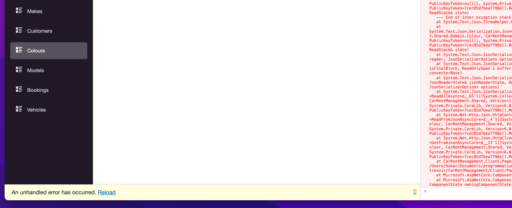
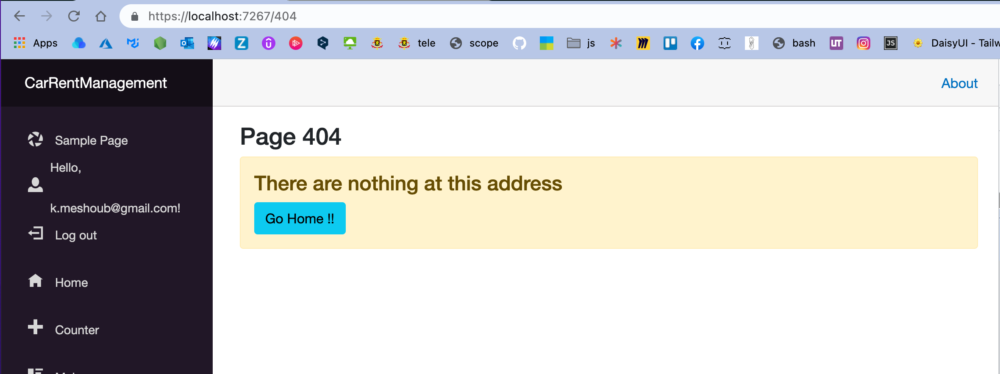

# 13 Gestion des erreurs

Plutôt que de mettre des `try and catch` partout dans le code, on va essayer de gérer les erreurs de manière globale.

Par défaut une barre jaune apparaît en cas d'erreurs non attrapées en bas de l'écran, ce n'est pas ce qu'on veut pour les utilisateurs.




## Utilisation du package `HttpClientInterceptor`

```bash
dotnet add package Toolbelt.Blazor.HttpClientInterceptor --version 10.0.0
```

On va enclencher l'`interceptor` dans `Program.cs` :

```cs
using Toolbelt.Blazor.Extensions.DependencyInjection;
// ...

builder.Services.AddHttpClient("CarRentManagement.ServerAPI", (sp, client) => {
    client.BaseAddress = new Uri(builder.HostEnvironment.BaseAddress);
    client.EnableIntercept(sp);
})
.AddHttpMessageHandler<BaseAddressAuthorizationMessageHandler>();

// ...
builder.Services.AddScoped(sp => sp.GetRequiredService<IHttpClientFactory>().CreateClient("CarRentManagement.ServerAPI"));

// REGISTER SERVICE INTERCEPTOR
builder.Services.AddHttpClientInterceptor();
```

Le rôle de `HttpClientInterceptor` est d'intercepter les codes erreurs d'appelles `HTTP`.

On va pouvoir monitoire proprement les différents code erreur (`400`, `500`) reçu par l'application.


## `HttpInterceptorService`

Dans un nouveau dossier `Services` on va créer une nouvelle classe :

`HttpInterceptorService.cs`

```cs
#pragma warning disable

using System;
using System.Collections.Generic;
using System.Linq;
using System.Net;
using System.Threading.Tasks;
using Microsoft.AspNetCore.Components;
using Toolbelt.Blazor;

namespace CarRentManagement.Client.Services;
public class HttpInterceptorService
{
    private readonly HttpClientInterceptor _httpClientInterceptor;
    private readonly NavigationManager _navigationManager;
    
    public HttpInterceptorService(HttpClientInterceptor httpClientInterceptor, NavigationManager navigationManager)
    {
        _navigationManager = navigationManager;
        _httpClientInterceptor = httpClientInterceptor;
    }

    public void MonitorEvent() => _httpClientInterceptor.AfterSend += InterceptResponse;

    private void InterceptResponse(object sender, HttpClientInterceptorEventArgs e)
    {
        string message = String.Empty;

        if(e.Response.IsSuccessStatusCode == false)
        {
            var responseCode = e.Response.StatusCode;

            switch(responseCode)
            {
                case HttpStatusCode.NotFound:
                    _navigationManager.NavigateTo("/404");
                    message = "The requested resource was not found";
                    break;
                case HttpStatusCode.Unauthorized:
                case HttpStatusCode.Forbidden:
                    _navigationManager.NavigateTo("/unauthorized");
                    message = "You are not authorized to access this resource";
                    break;
                default:
                    _navigationManager.NavigateTo("/500");
                    message = "something went wrong, please contact administrator";
                    break;
            }

            // throw new Exception(message);
            Console.WriteLine($"message d'erreur : {message}");
        }
    }
    
    public void DisposeEvent() => _httpClientInterceptor.AfterSend -= InterceptResponse;
}
```

On enregistre maintenant le `Service` dans `Program.cs` :

```cs
builder.Services.AddHttpClientInterceptor();
builder.Services.AddScoped<HttpInterceptorService>();
```

On a trois méthode :

### `MonitorEvent`

```cs
public void MonitorEvent() => _httpClientInterceptor.AfterSend += InterceptResponse;
```

Pour enregistrer l'`Interceptor`

On utilise `AfterSend` car on veut le `StatusCode` de la réponse.

Il existe aussi `BeforeSend` ainsi que les version `async` si besoin `BeforeSendAsync` et `AfterSendAsync` (si notre méthode `InterceptResponse` est `async`).


### `InterceptResponse`

```cs
private void InterceptResponse(object sender, HttpClientInterceptorEventArgs e) { /* ... */ }
```

Pour gérer la logique des erreurs `HTTP`.


### `DisposeEvent`

```cs
public void DisposeEvent() => _httpClientInterceptor.AfterSend -= InterceptResponse;
```

Pour dés-enregistrer l'`Interceptor`.


## Utilisation dans un `Component Partial`

On doit implémenté l'interface `IDisposable` dans le `Component` :

```cs
using CarRentManagement.Client.Services;

public partial class Index : IDisposable
{
    [Inject] HttpClient? httpClient { get; set; }
    // ici
    [Inject] HttpInterceptorService? httpInterceptorService { get; set; }

    private List<Colour>? Colours;

    protected async override Task OnInitializedAsync()
    {
        httpInterceptorService!.MonitorEvent(); // <= ici
        Colours = await httpClient!.GetFromJsonAsync<List<Colour>>("errors" + Endpoints.ColoursEndpoint);
    }

    public void Dispose()
    {
        httpInterceptorService!.DisposeEvent(); // <= ici
    }
}

```

1. On importe notre `Service` avec `[Inject]`
2. On utilise `MonitorEvent` avant un appelle `HTTP`
3. On dés-enregistre notre `Interceptor` dans `Dispose` avec `DisposeEvent`


## Utilisation dans un `Component` classique

```cs
@page "/colours/create"

@using CarRentManagement.Client.Services

@inject HttpClient httpClient
@inject NavigationManager navigationManager
@inject HttpInterceptorService httpInterceptorService // <= ici

@implements IDisposable // <= ici

<!-- Template -->

<BackToList Target="colours" /> 
 
@code {
    Colour Colour = new();

    async Task CreateNewColour()
    {
        httpInterceptorService.MonitorEvent(); //<= lance le monitoring
        await httpClient.PostAsJsonAsync(Endpoints.ColoursEndpoint, Colour);
        navigationManager.NavigateTo("/colours");
    }

    void Dispose()
    {
        httpInterceptorService.DisposeEvent(); // <= dispose
    }
}
```

`@implements` permet d'implémenter des interfaces.


## Création d'une page `404.razor`

Pour tester on peut créer une page `404` :

`404.razor`

```cs
@page "/404"

<h3>Page 404</h3>

<div class="alert alert-warning">
    <h4>There are nothing at this address</h4>
    <a class="btn btn-info" href="/">Go Home !!</a>
</div>
```




## Plusieurs appels `HTTP` dans la même méthode

Apparemment plusieurs appels dans la même méthode ne nécessite qu'un seul enregistrement avec `MonitorEvent` :

```cs
protected async override Task OnParametersSetAsync()
    {
        httpInterceptorService.MonitorEvent();
        Colour = await httpClient.GetFromJsonAsync<Colour>($"{Endpoints.ColoursEndpoint}/{Id}");

        Colour2 = await httpClient.GetFromJsonAsync<Colour>($"{Endpoints.ColoursEndpoint}/{Id + 4}");
    }
```

Si l'erreur vient de `Colour2`, je suis quand même redirigé vers la page `404.razor`.

On a besoin que d'un seul `MonitorEvent` par composant sauf si deux méthodes sans lien chronologique l'utilise (car on ne peut prédir laquelle sera exécutée en première).

