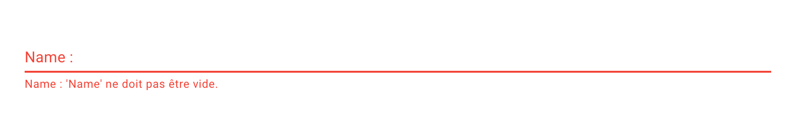
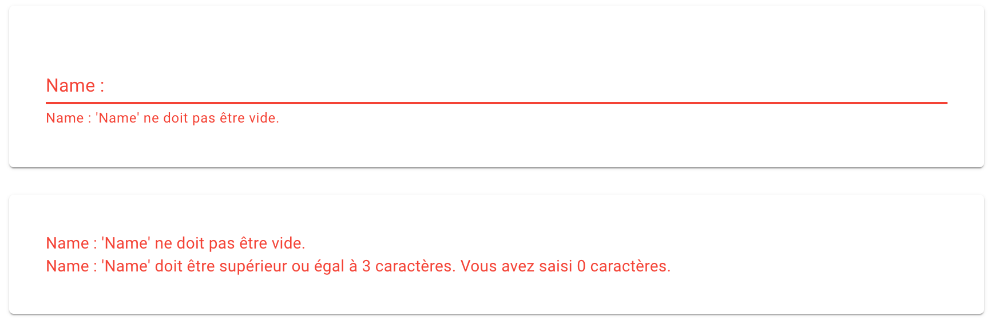

# 14.01 `MudForm`

# Nouvelles Méthode

On définit un `validator` :

```cs
namespace BlazorServerTestIis.Application.Commands;

public class RobotValidator : AbstractValidator<Robot>
{
    public RobotValidator()
    {
        RuleFor(r => r.Code)
            .NotEmpty()
            .NotEqual("AAA")
            .MinimumLength(5);

        RuleFor(r => r.Power)
            .GreaterThanOrEqualTo(0)
            .Must(nb => nb % 2 == 0).WithMessage("Must be even")
            .LessThan(5000);

        RuleFor(r => r.CyberBrain)
            .NotNull();
    }  
```

On ajoute une méthode `ValidateValue` qui renvoie une `Func` :

```cs
public Func<object, string, Task<IEnumerable<string>>> ValidateValue => async (model, propertyName) =>
{
    var result = await ValidateAsync(ValidationContext<Robot>.CreateWithOptions((Robot)model, x => x.IncludeProperties(propertyName)));
    if (result.IsValid)
        return Array.Empty<string>();
    return result.Errors.Select(e => e.ErrorMessage);
};
```

La `Func` retournée prend un modèle (`object`) et un nom de propriété (`string`) pour retourné un `IEnumerable<string>` contenant les erreurs de validation.

Cette partie compliquée est donnée sur le site de `MudBlazor`.

Le reste est plus simple :

```csharp
@using Application.Commands
@using FluentValidation
    
@inject ISnackbar snackbar

<MudPaper>
    <MudForm @ref="form" Model="robotModel" Validation="robotValidator.ValidateValue">
        <MudTextField 
    		@bind-Value="robotModel.Code" 
    		For="() => robotModel.Code" 
    		Immediate="true" 
    		Label="Code" />
        <MudTextField 
    		@bind-Value="robotModel.Power" 
    		For="() => robotModel.Power" 
    		Immediate="true" 
    		Label="Power" />
    </MudForm>
    <MudCardActions>
        <MudButton Variant="Variant.Filled" Color="Color.Primary" Class="ml-auto"
            OnClick="async () => await Submit()">Order</MudButton>
    </MudCardActions>
</MudPaper>

@code {

    Robot robotModel = new();
    MudForm form;
    RobotValidator robotValidator = new RobotValidator();

    private async Task Submit()
    {
        await form.Validate();

        if (form.IsValid)
        {
            snackbar.Add("Submited!");
        }
    }
}
```

La validation est passée directement au `MudForm` et il suffit de renseigner le `For` pour chaque champ de formulaire.


# Anciennes Méthodes

## `Validation`


```cs
<MudTextField 
  @bind-Value="robo.Name" 
  T="string" 
  Label="Name :"  
  Validation="@(new Func<string, IEnumerable<string>>(NameValidation))"/>
```

L'attribut `Validation` accepte un `Delegate` prenant un objet à valider et retournant un `IEnumerable<string>` d'erreurs.

```cs
IEnumerable<string> NameValidation(string name)
{
  // Validation logic
```

Si la collection est vide, c'est compris comme `Valid` sinon les `string` d'erreurs sont envoyés à `MudForm.Errors`.


#### ! l'objet à valider en paramètre est obligatoire même s'il n'est pas utilisé pour la validation.


Par défaut le premier message est affiché sous le composant de formulaire :



### `@using FluentValidation`

On doit ajouter le service dans `Program.cs`

```cs
builder.Services.AddSingleton<MyValidator>();
```

Et dans son composant :

```cs
@inject LetterValidator validator
// ou
[Inject] public LetterValidator? validator { get; set; }
```


C'est obligé pour utiliser une variante de `Validate` prenant une lambda en deuxième arguments.

`FluentValidation` ajoute des méthodes d'extension.

```cs
IEnumerable<string> NameValidation(string name)
{
  // FluentValidation is used     
  var result = roboValidator!
    .Validate(robo, options => options.IncludeProperties(x => x.Name));

  return result.Errors.Select(er => $"{er.PropertyName} : {er.ErrorMessage}");
}
```

`new Func<string, IEnumerable<string>>(MyMethodValidation)` : cette syntaxe permet d'éviter un `warning` sur type accepté par l'attribut `Validation`.


#### ! La fonction de validation prends `obligatoirement` la valeur du champ en paramètre


 On peut aussi pour allèger l'écriture utiliser une `directive` dans le fichier `.csproj` :

```cs
<PropertyGroup>
  <NoWarn>CS8974</NoWarn>
</PropertyGroup>
```

On peut donc écrire plus lisiblement :

```cs
<MudTextField 
  @bind-Value="robo.Name" 
  T="string" 
  Label="Name :"  
  Validation="NameValidation"/>
```


## Une fonction de validation générale

En se servant du paramètre optionnel de la méthode `.Validate` de `FluentValidation`, on peut lancer une validation ciblée comme on le souhaite :

```cs
IEnumerable<string> MyValidation(string property)
{
  var result = myValidator!
    .Validate(Model!, options => options.IncludeProperties(property));

  return result.Errors.Select(er => er.ErrorMessage);
}
```

On l'appelle de cette manière :

```cs
<MudTextField 
   @bind-Value="State.Letter.Title"
   Validation="@((string title) => ValidateByProperty("Title"))"
```

Il faut absolument ajouter le type `(string title) =>` et pas juste `title =>`.

## Afficher les erreurs : `@bind-Errors`

On peut *binder* tous les messages pour ensuite les afficher :

```cs
<MudForm @bind-Errors="@errors">
```

```cs
@code
{
  string[] errors = {};
```

Puis pour les afficher :

```cs
<MudPaper class="pa-8 ma-6">
    @foreach(var error in errors)
    {
        <MudText Typo="Typo.body2" Color="Color.Error">@error</MudText>
    }
</MudPaper>
```



On remarque que le composant n'affiche qu'une seule erreur de validation alors qu'il y en a deux pour ce champs.


## `@ref="form"`

Nous permet d'avoir une référence sur le formulaire pour utiliser dans la partie code certaine de ses méthodes (`Validate`) ou propriété (`IsValid`) :

```cs
<MudForm @ref="form">

// ...
@code {
	MudForm? form;
	
	// ...
	void SubmitForm()
    {
        form!.Validate();

        if(form!.IsValid)
        { // ...
```


### `form.validate()`

Lance la validation sur tous les champs possédant un attribut `Validation`.


### `form.IsValid`

`true` si aucun message d'erreur n'est présent (`errors.Count == 0`).


### `form.IsTouched`

Porte un peu mal son nom car reste `false` si on se contente de *toucher* un élément de formulaire (`focus in => focus out`).

Devient `true` seulement si on entre une donnée et reste `true`même si toutes les données sont éffacées.


### `form.Reset()`

Remet à zéro le formulaire (`validation`  et valeurs entrées).

Remet aussi `IsTouched` à `false`.
