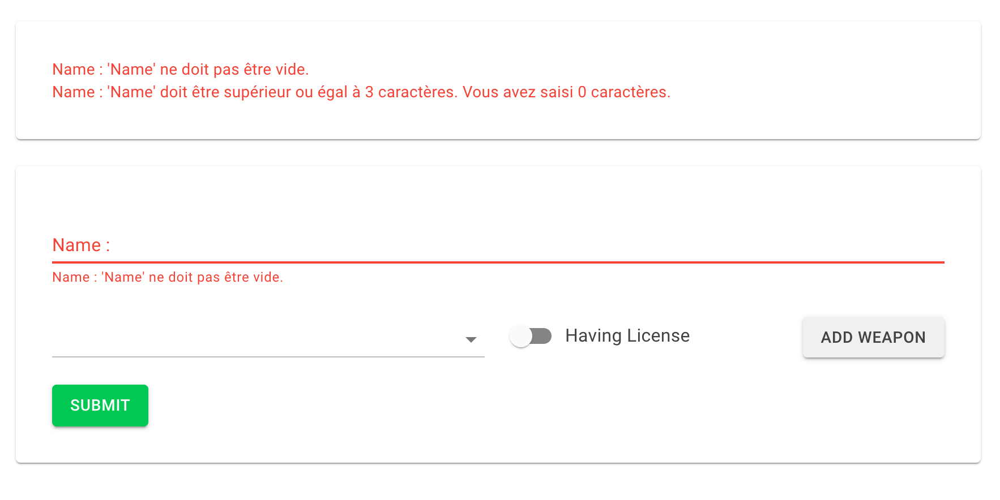
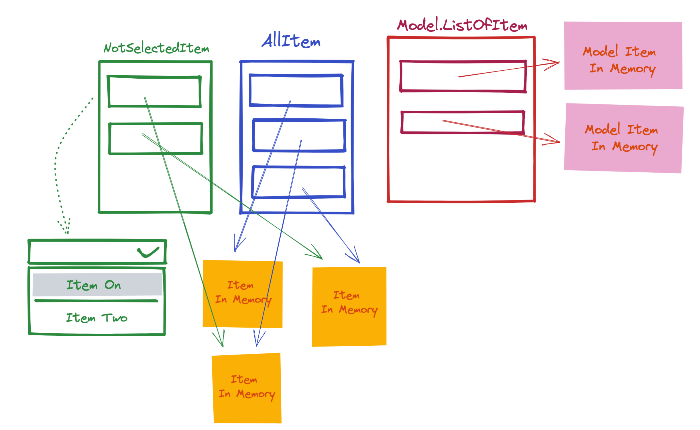
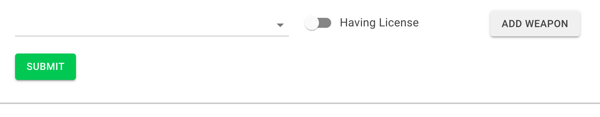
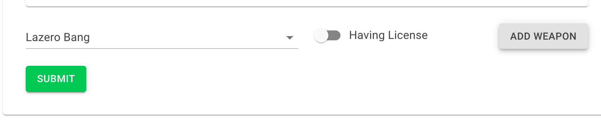
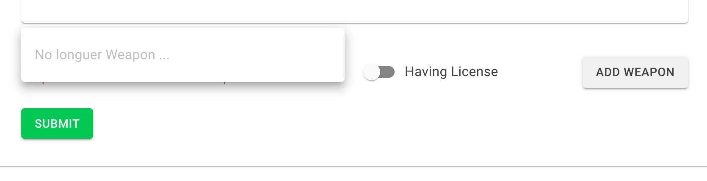

# 14.10 Les listes Dynamiques

Le problème est de pouvoir ajouter un objet à une liste avec une cardinalité `*-n`.

`n` n'ayant comme limite que le nombre d'éléments disponible.

## Exemple `Robo` et `Weapon` 

Ici un `Robo` possède au moins une arme et maximum toutes les armes disponibles.

Chaque arme est unique, pas de doublon possible.

Autre contrainte, au moins une des armes doit avoir une `license`.


## `MudForm`

Pour avoir le plus de souplesse, `MudForm` n'est pas lié avec un `Model`.

Cela permet de gérer la validation parfois complexe de manière plus fine.

`FluentValidation` est utilisé pour la validation.


## `Model` et `Validator`

`Robo.cs`

```cs
public class Robo
{
    public int Id { get; set; }
    public string Name { get; set; } = String.Empty;
    public List<Weapon> Weapons { get; set; } = new();
}
```

`RoboValidator.cs`

```cs
public class RoboValidator : AbstractValidator<Robo>
{
    public RoboValidator()
    {
        RuleFor(r => r.Name)
            .NotEmpty()
            .MinimumLength(3);

        RuleFor(r => r.Weapons)
            .Must(ListNotEmpty).WithMessage("You need almost one weapon")
            .Must(HavingAlmostOneWeaponWithLicense).WithMessage("You need almost have one weapon with a license");

        RuleForEach(r => r.Weapons)
            .SetValidator(new WeaponValidator());
    }

    bool ListNotEmpty(List<Weapon> weapons)
    {
        return weapons.Count != 0;
    }

    bool HavingAlmostOneWeaponWithLicense(List<Weapon> weapons)
    {
        return weapons.Count == 0 || weapons.Any(w => w.HavingLicense == true);
    }
}
```

### `.Must`

`.Must` permet de créer un `Custom Validator`, il prend une méthode renvoyant `true` ou `false` et prenant le champ à valider en paramètre.

```cs
RuleFor(x => x.MySuperList)
  .Must(DoSomethingSuper);

bool DoSomethingSuper(SuperList mySuperList)
{
  // ...
}
```

### `RuleForEach`

Permet d'associer une règle de validation à chaque élément d'une collection.


### `.SetValidator`

Permet d'associer un `Validator` déjà existant pour chaque élément d'une collection.

---

`Weapon.cs`

```cs
public class Weapon
{
    public int Id { get; set; }
    public string Title { get; set; } = String.Empty;
    public int Damage { get; set; }
    public bool HavingLicense { get; set; }

    public static List<Weapon> List()
    {
        return new() {
            new() { Id = 0, Title = "Bang Bang", Damage = 400 },    
            new() { Id = 1, Title = "Lazero Bang", Damage = 600 },    
            new() { Id = 2, Title = "Gun Shoot Red Blood", Damage = 800 },    
        };
    }
}
```

La liste est ici en dur.

`WeaponValidator.cs`

```cs
using System.Text.Json;
using FluentValidation;

namespace EditFormWithList.Model;

public class WeaponValidator : AbstractValidator<Weapon>
{
    public WeaponValidator()
    {
        RuleFor(w => w)
          .Must(WeaponIsInWeaponList)
          .WithMessage("Weapon must be existing in Weapon List");
    }
    
    bool WeaponIsInWeaponList(Weapon weapon) => 
      Weapon
				.List()
       .Exists(w => w.Id == weapon.Id && w.Title == weapon.Title);
}
```

### `Exists`

Reçoit un predicat est renvoie `true` si au moins un élément est trouvé.

Équivalent à `.Any`.


## `MudForm` de base


Le code est nettoyé des éléments de mise en page pour mettre l'accent sur la logique.

```cs
@page "/manual-validation"
@using FluentValidation

<MudText>Manual Validation</MudText>
<MudPaper>
    @foreach(var error in errors)
    {
        <MudText>@error</MudText>
    }
</MudPaper>


<MudForm @ref="form" @bind-Errors="@errors">
  <MudTextField 
    @bind-Value="robo.Name"
    T="string" 
    Label="Name :"  
    Validation="@(new Func<string, IEnumerable<string>>(NameValidation))"/>

  <AddWeapon Robo="robo" RoboWeapons="robo.Weapons" />

  <MudButton OnClick="SubmitForm">Submit</MudButton>
</MudForm>


@code {
    [Inject] public RoboValidator? roboValidator { get; set; }
    MudForm? form;

    string[] errors = {};

    Robo robo = new();
    
    IEnumerable<string> NameValidation(string name)
    {
        var result = roboValidator!
                        .Validate(robo, options => options.IncludeProperties("Name"));

        return result.Errors.Select(er => $"{er.PropertyName} : {er.ErrorMessage}");
    }

    void SubmitForm()
    {
        form!.Validate();

        if(form!.IsValid)
        {
            // HTTP sending JSON ...
        }
    }   
}
```

### `@using FluentValidation`

C'est obligé pour utiliser une variante de `Validate` prenant une lambda en deuxième arguments.

`FluentValidation` ajoute des méthodes d'extension.


### `@bind-Errors="@errors"`

Cette liaison de `MudForm` permet d'enregistrer toutes les erreurs dans un `string[]` pour pouvoir les utiliser (afficher).

```cs
@foreach(var error in errors)
{
  <MudText>@error</MudText>
}

<MudForm @bind-Errors="@errors">
  // ...
    
@code {
   string[] errors = {}; 
```


### `@ref="form"`

Nous permet d'avoir une référence sur le formulaire pour utiliser dans la partie code certaine de ses méthodes (`Validate`) ou propriété (`IsValid`) :

```cs
<MudForm @ref="form">

// ...
@code {
	MudForm? form;
	
	// ...
	void SubmitForm()
    {
        form!.Validate();

        if(form!.IsValid)
        { // ...
```


### `form.validate()`

Lance la validation sur tous les champs possédant un attribut `Validation`.


### `form.IsValid`

`true` si aucun message d'erreur n'est présent (`errors.Count == 0`).


### `Validation="@(new Func<string, IEnumerable<string>>(NameValidation))`

Permet de gérer "manuellement" la validation d'un champ en lui fournissant une fonction de validation renvoyant un `IEnumerable` de texte d'erreurs.

L'étarnge écriture `new Func<string, IEnumerable<string>>( ... )` est nécessaire pour éviter un `warning` de `cast` mais on pourrai écrire simplement :

```cs
Validation="NameValidation"
```

La fonction de validation prends le type du champ en paramètre et retourne un `IENumerable<string>` ou juste un `string` d'erreur.s.

```cs
@using FluentValidation

<MudTextField 
    @bind-Value="robo.Name"
    T="string"  
    Validation="@(new Func<string, IEnumerable<string>>(NameValidation))"/>
  
  // ...
@code {
  IEnumerable<string> NameValidation(string name)
    {
        var result = roboValidator!
                        .Validate(robo, options => options.IncludeProperties("Name"));

        return result.Errors.Select(er => $"{er.PropertyName} : {er.ErrorMessage}");
    }
```


### `.Validate(Entity, o => o.IncludeProperties("One", "Two", ...))`

Nécessite `@using FluentValidation` en haut du fichier.

Cette méthode du `Validator` retourne un résultat que l'on peut *mapper* en collection d'erreurs grâce à `result.Errors.Select(er => er.ErrorMessage);`

`IncludeProperties` permet de ne valider qu'un champ en particulier.

Avec `Validation` le message est envoyé en interne à un `ValidationMessage`.

Il est aussi lié au tableau `errors` grâce à `@bind-Errors`.




## Composant `AddWeapon.cs`



On a trois listes :

- 2 pour gérer les éléments disponible dans le composant `MudSelect`
  Ces deux listes partages les mêmes objets en mémoire.
  `AllItem` permet de récupérer un `item` à tout moment pour l'ajouter aux `item` disponible de `NotSelectedItem`.
- 1 pour le `Model`, ses `item` peuvent être plus complexe et sont enregistrés séparément en mémoire (pas d'effets de bord avec le `MudSelect`).

---

Version nettoyé de la mise en forme

```html
@using FluentValidation

@if(RoboWeapons!.Count > 0)
{
	<MudText>Weapons Selected</MudText>
  @foreach(var weapon in RoboWeapons!)
  {
  	@weapon.Title @weapon.Damage @weapon.HavingLicense
  	<MudIconButton OnClick="() => RemoveWeapon(weapon.Id)" />
  }
}


<MudSelect
   @ref="mudselect" 
   ToStringFunc="w => w.Title"
   ValueChanged="(Weapon w) => OnSelectChange(w)"
   Validation="@(new Func<Weapon, IEnumerable<string>>(WeaponValidation))">
  @if(NotSelectedWeapons.Count > 0)
  {
    @foreach(var weapon in NotSelectedWeapons!)
    {
      <MudSelectItem Value="weapon">
        @weapon.Title     
      </MudSelectItem>   
    }
  }
  else
  {
    <MudSelectItem Value="@(InitializedWeapon())" Disabled="true">
      No longuer Weapon ...
    </MudSelectItem>
  }
</MudSelect>

<MudSwitch @bind-Checked="weapon.HavingLicense" />

<MudButton OnClick="AddWeaponToList">Add Weapon</MudButton>      
```
```cs
@code {
    [Inject] public RoboValidator? roboValidator { get; set; }
    
    [Parameter] public List<Weapon>? RoboWeapons { get; set; }
  // For the validation
    [Parameter] public Robo? Robo { get; set; }
        
    MudSelect<Weapon>? mudselect;    
        
    // No Weapon registred with this Id
  	// Is the Model of this component
    Weapon weapon = new() { Id = -1 }; 
        
  	// Is the reference list of all selectable weapons
    List<Weapon> AllWeapons { get; set; } = Weapon.List();
    List<Weapon> NotSelectedWeapons { get; set; } = new();

    protected override void OnInitialized()
    {
        NotSelectedWeapons.AddRange(AllWeapons);
    }

    IEnumerable<string> WeaponValidation(Weapon w)
    {
        var result = roboValidator!
                        .Validate(Robo!, options => options.IncludeProperties("Weapons"));

        return result.Errors.Select(er => $"{er.PropertyName} : {er.ErrorMessage}");
    }    

    void OnSelectChange(Weapon weaponSelected)
    {
      	// set the Model  
      	weapon.Id = weaponSelected.Id;
        weapon.Title = weaponSelected.Title;
        weapon.Damage = weaponSelected.Damage;
    }

    void AddWeaponToList()
    {
        var weaponInList = AllWeapons.Find(w => w.Id == weapon.Id);

        if(weaponInList is not null)
        {           
            NotSelectedWeapons.Remove(weaponInList);
            RoboWeapons!.Add(weapon);

            weapon = InitializedWeapon();
            mudselect!.Reset();
            mudselect.Validate();
        } 
    }

    Weapon InitializedWeapon() =>  new() { Id = -1};

    void RemoveWeapon(int id)
    {
        var weaponToRemove = AllWeapons.Find(x => x.Id == id);
        if(weaponToRemove is not null)
        {
            RoboWeapons!.RemoveAll(x => x.Id == id);
            NotSelectedWeapons.Add(weaponToRemove);

            mudselect!.Validate();
        }
    }   
}        
```


### `<MudSelect @ref="mudselect"`

On prend une référence sur `MudSelect` pour pouvoir utiliser `Validate()`.

Cette méthode lance la validation sur le composant `MudSelect` uniquement.

Cela sert après un `AddWeaponToList` et un `RemoveWeapon` pour radraîchir le message de `validation`.

On utilise aussi `mudselect.Reset()` pour remettre le `MudSelect` à l'état initial :



et non comme ça :




### `ToStringFunc="w => w.Title"`

```cs
<MudSelect ToStringFunc="w => w.Title"
```

Permet de définir quelle propriété va définir l'affichage de chaque `MudSelectItem`.


### `ValueChanged` et `Validation`

Ces deux attributs vont permettre de maitriser très finement le comportement du `MudSelect`.

```cs
<MudSelect
  ValueChanged="(Weapon w) => OnSelectChange(w)"
  Validation="WeaponValidation">
```

#### `ValueChanged`

Va être déclenché à chaque changement de valeur du `MudSelect`.

On utilise une `lambda` pour pouvair passer la `weapon` à la méthode `OnSelectChange`.

Va prendre la valeur de l'attribut `Value` du `MudSelectItem` :

```cs
<MudSelect ValueChanged="(Weapon w) => OnSelectChange(w)">	
	<MudSelectItem Value="weapon"> @weapon.Title </MudSelectItem> 
```

On doit spécifier le type et utiliser une `lambda` pour ne pas avoir d'erreur de conversion.

---

```cs
<MudSelectItem Value="@(InitializedWeapon())" Disabled="true">
  No longuer Weapon ...
</MudSelectItem>
```

`InitializedWeapon`

```cs
Weapon InitializedWeapon() =>  new() { Id = -1};
```

L'`Id` de `-1` ne correspond à aucune `weapon` dans la liste `AllWeapon`.

Un test d'existence comme dans `AddWeaponToList` ou `RemoveWeapon` :

```cs
void AddWeaponToList()
{
  var weaponInList = AllWeapons.Find(w => w.Id == weapon.Id);

  if(weaponInList is not null)
  { 
```

renverra donc `null` et ne permettra pas d'enregistrer la weapon.

Pour résumé `-1` signifie `weapon non choisie`.

Cette partie permet d'afficher un message lorsqu'il n'y a plus de `weapon disponible `:



