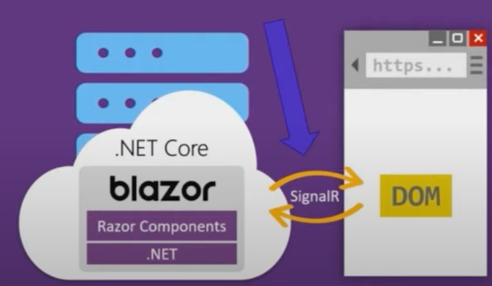
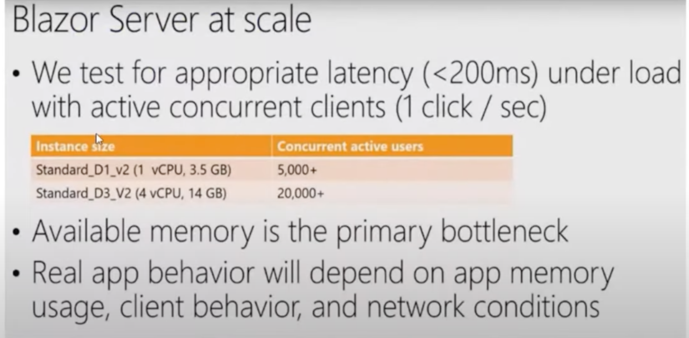
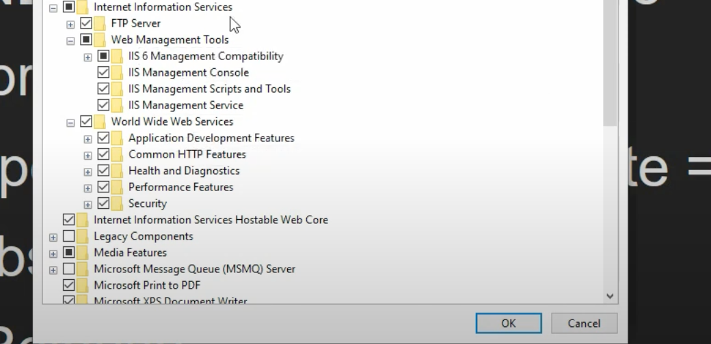
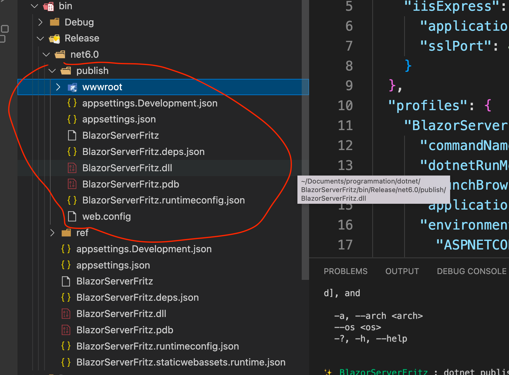
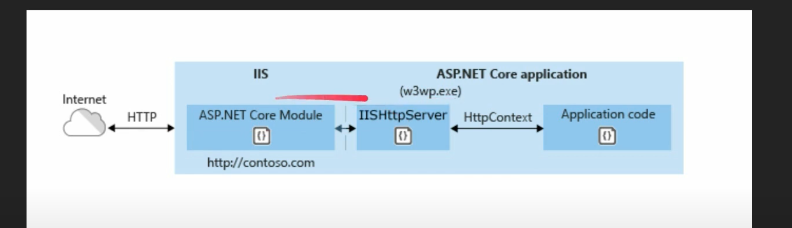

# 15 Déploiement d'unz application `Blazor`

## `Blazor Server`




### `SignalR`

- Bi-Directionnel (connexion persistente)
- Multi Utilisateur
- Full Duplex (communication simultanée dans les deux sens)
- Asynchrone


### Test de performance




## Déploiement `Blazor Server` sur `IIS`

### 1. Installer `IIS` : Modules nécessaire




### 2. Installer le `Runtime`

Il faut ensuite installer sur le serveur :

Windows Hosting Bundle

https://dotnet.microsoft.com/en-us/download/dotnet/thank-you/runtime-aspnetcore-6.0.4-windows-hosting-bundle-installer


### 3. Publier le projet dans un dossier

```bash
dotnet publish -c Release [-o ../Publish/Release]
```

`-c` configuration défaut `Debug`

`Balzor Server` l'`App` est publié dans `/bin/Release/{TARGET FRAMEWORK}/publish` si on ne précise pas le dossier.

C'est ce dossier qu'il faut déployer sur le serveur.




### 4. Changer le port du site par défaut

`80` => `90`


### 5. Créer un site web avec le port 80

Créer le Website sur `IIS` et copié le dossier `publish` dedans.


#### Schéma de fonctionnement classique



Le serveur `IISHttpServer` transforme la requête en un objet `HttpContext` qu'il envoie à l'application (`asp.net`).


#### Schéma pour `Blazor Server`


