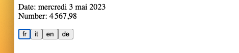
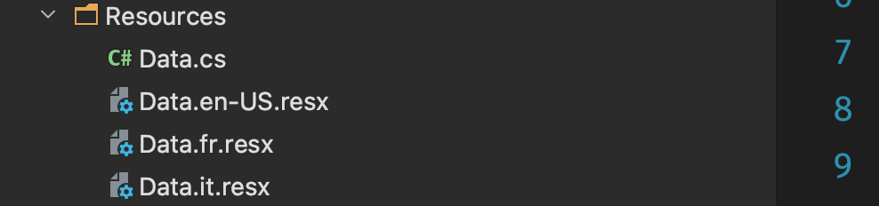
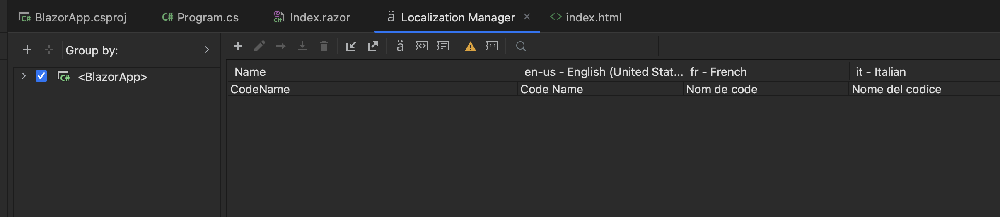
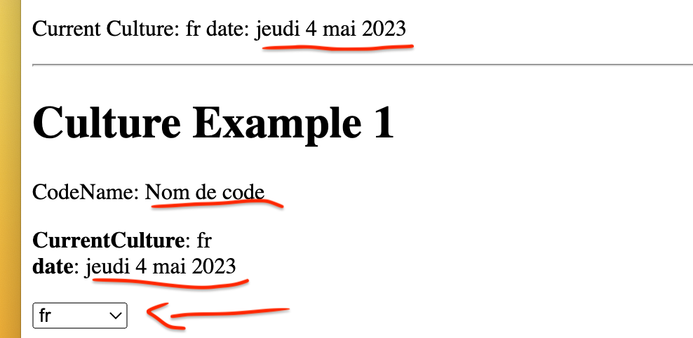

# 16 `Localization`


## `CultureInfo`

Si on tente de changer la `culture` avant le démarrage de l'application dans une application `Blazor Wasm`:

`Program.cs`

```cs
// ...
builder.Services.AddScoped(sp => new HttpClient { BaseAddress = new Uri(builder.HostEnvironment.BaseAddress) });

CultureInfo.DefaultThreadCurrentUICulture = new CultureInfo("id"); // <- ici
CultureInfo.DefaultThreadCurrentCulture = new CultureInfo("id"); // <- ici

await builder.Build().RunAsync();
```

On obtient cette erreur:


Pour changer dynamiquement la `culture` pendant le démarrage, il faut ajouter `<BlazorWebAssemblyLoadAllGlobalizationData>`  dans le fichier `.csproj` et le mettre à `true`.

```xml
<PropertyGroup>
  <BlazorWebAssemblyLoadAllGlobalizationData>true</BlazorWebAssemblyLoadAllGlobalizationData>
</PropertyGroup>
```


## Sélection de la `culture`

```html
@page "/"
@using System.Globalization

<p>
    Date: @DateTime.Now.ToLongDateString()<br/>
    Number: @(number.ToString("N2"))
</p>

<p>
    @foreach (var lang in new[] { "fr", "it", "en", "de" })
    {
        <button @onclick="@(() => ChangeLang(lang))">@lang</button>
    }
</p>
```

```cs
@code {
    double number = 4567.98;

    void ChangeLang(string lang)
    {
        CultureInfo.DefaultThreadCurrentCulture = new CultureInfo(lang);
        CultureInfo.DefaultThreadCurrentUICulture = new CultureInfo(lang);
    }
}
```



## Ce qui fonctionne

- `IStringLocalizer` et `IStringLocalizer<T>`
- `.resx`


## Ce qui ne fonctionne pas

- `IHtmlLocalizer` et `IViewLocalizer`
- `Localizing Data Annotations`


## `Localization` avec `LocalStorage`

### Mise en place

`IStringLocalizer` fait partie du package `Microsoft.Extensions.Localization`. Ce `package` n'est pas par défaut dans `Blazor Wasm`, il faut l'ajouter:

```bash
dotnet add package Microsoft.Extensions.Localization
```

Il faut ensuite l'ajouter au conteneur de `services` dans `Program.cs`:

```cs
builder.Services.AddLocalization();
```

> ## Remarque
>
> Il ne semble pas nécessaire de donner le chemin vers le dossier où se trouve les fichiers de traduction, il ne semble pas non plus que son nom ait une importance (ici je l'appellle `Resources` par simplicité).


### Fichiers `.resx`

Il faut ensuite créer les fichiers de resources `.resx`, un par langue:



On obtient un tableau d'affichage de nos traductions ici dans `Rider`:



> ## Remarque
>
> Il faut créer une `Dummy Class` : `Data.cs` pour le type `T` de `IStringLocalizer<T>`.
>
> Cette classe doit aussi être importé avec un `@using` dans un composant.


### Créer un `selecteur`

```html
<select @bind="Culture">
    @foreach (var c in supportedCultures)
    {
        <option value="@c">@c.DisplayName</option>
    }
</select>
```

```cs
CultureInfo[] supportedCultures = new[]
{
    new CultureInfo("fr"),
    new CultureInfo("en-US"),
    new CultureInfo("it"),
};

public CultureInfo Culture
{
    get => CultureInfo.CurrentCulture;
    set
    {
        if (CultureInfo.CurrentCulture != value)
        {
            CultureInfo.DefaultThreadCurrentCulture = value;
            CultureInfo.DefaultThreadCurrentUICulture = value;
        }
    }
}
```


Si la date s'affiche correctement (`Globalization`), la traduction de `CodeName` n'est pas chargée (`Localization`) et le composant plus haut ne reçoit pas ces changements.

Pour avoir les traductions **il est obligé de rechargé la page**.

Pour cela on doit stocker la valeur de langue sélectionnée en dehors de l'application : `LocalStorage`.


### `JSInterop` et créer notre `LocalStorage`

On ajoute un script dans `index.html`, s'il était plus grand on pourrait le mettre dans un fichier séparé.

```html
<script>
	window.blazorCulture = {
        get: () => window.LocalStorage['BlazorCulture'],
        set: (value) => window.LocalStorage['BlazorCulture'] = value
    }
</script>
```

On va l'utiliser dans notre composant:

```cs
[Inject]
public NavigationManager NavigationManager { get; set; } = default!;
[Inject]
public IJSRuntime JSRuntime { get; set; } = default!;

// ...


public CultureInfo Culture
{
    get => CultureInfo.CurrentCulture;
    set
    {
        if (CultureInfo.CurrentCulture != value)
        {
            var js = (IJSInProcessRuntime)JSRuntime;
            js.InvokeVoid("blazorCulture.set", value.Name);

            NavigationManager.NavigateTo(NavigationManager.Uri, forceLoad:true);
        }
    }
}
```

Le changement à proprement parlé de la culture se fait maintenant dans `Program.cs` (qui sera rechargée avec `forceload:true`)

```cs
// ...
CultureInfo culture;

var js = app.Services.GetRequiredService<IJSRuntime>();
var result = await js.InvokeAsync<string>("blazorCulture.get");

if (result != null)
{
    culture = new CultureInfo(result);
}
else
{
    culture = new CultureInfo("it");
    await js.InvokeVoidAsync("blazorCulture.set", "it");
}

CultureInfo.DefaultThreadCurrentCulture = culture;
CultureInfo.DefaultThreadCurrentUICulture = culture;

await app.RunAsync();
```



Maintenant tout fonctionne correctement.


